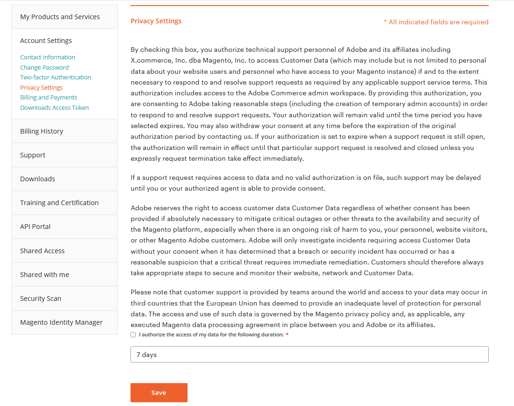

# Adobe支持客户数据访问和隐私

Adobe技术支持可能需要访问您的Adobe Commerce相关数据才能提供支持。 如果主要的Adobe Commerce帐户持有人选择这样做，则他们只能在其Adobe Commerce帐户隐私设置中提供授权。 在创建支持请求之前允许进行此访问将有助于确保可以正确调查问题和/或帮助提高解决速度。 请注意，Adobe Commerce Cloud项目的“项目所有者”可能不是Adobe Commerce的主要帐户所有者。

>[!NOTE]
>
>“隐私设置”选项卡将仅对拥有与付费/已购产品相关联的支持权利的用户以及直接获得授权的主要MageID的用户可用/可见；此选项卡不可用于通过共享访问委派给其他用户。 授予访问权限后，所有内部Adobe系统可能需要5 - 10分钟才能更新。 如果在提交票证之前未授予访问权限，则主帐户所有者需要以明确的数据访问同意更新票证。

要授权访问，请执行以下操作：

1. [登录](https://account.magento.com/customer/account/login) 作为授权主用户的支持人员。
1. 在 **[!UICONTROL My Account]** 页面> **[!UICONTROL Account Settings]**，确保您已完成 [帐户配置文件](https://account.magento.com/customer/account/edit) 并单击 **[!UICONTROL Save]**.
1. 在 **[!UICONTROL My Account]** 页面> **[!UICONTROL Account Settings]** > **[!UICONTROL Privacy Settings]**. 您将看到一份同意表单，用于授予Adobe技术支持人员访问您的数据的权限。
1. 查看有关隐私设置的信息后，选择是否选中旁边的复选框 **我授权在以下持续时间内访问我的数据：**.
1. 在持续时间下拉列表中，选择您希望Adobe技术支持人员有权访问您的客户数据的时段。 您可以选择7天、30天、一年或无限期。
1. 单击 **[!UICONTROL Save]**. 这将会更新页面底部在下面的开始和结束日期 **您已同意以下持续时间** （屏幕快照）。 获得同意后，授权的主要用户将在屏幕底部看到撤回同意的选项。
   

您可以单击 **撤回同意** 随时撤回您对Adobe支持人员访问您数据的同意。
