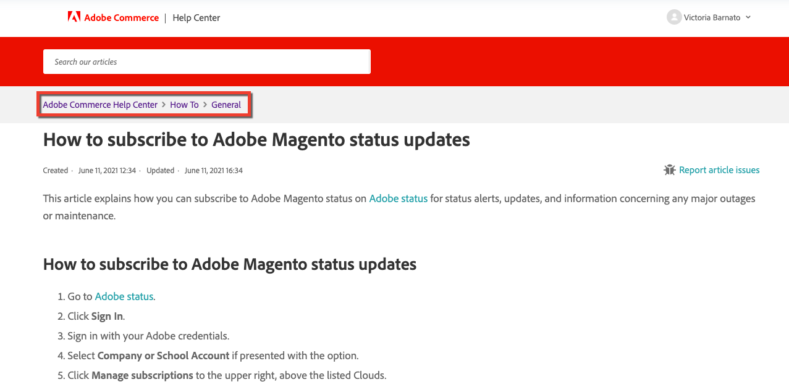

# Adobe Commerce支持知识库开始接受投稿

从6月15日开始，Adobe Commerce支持知识库团队开始接受外部Adobe Commerce社区通过 [magento/知识库](https://github.com/magento/knowledge-base) github存储库！

是否注意到我们的一篇文章中有打字错误，或者故障排除步骤不完整？
您现在可以自己修复它并获得贡献点数！

## Contribute

我们欢迎各种投稿，从较小的拼写错误更正到完整的故障排除文章。 向此存储库投稿可以获得奖励积分，与向Adobe Commerce代码和我们的开发人员文档投稿类似。 请参阅 [贡献奖励积分](https://github.com/magento/knowledge-base/blob/main/docs/contribution-points.md) 以了解详细信息。

### 常规贡献流

1. 创建分支存储库。
1. 对分支存储库进行编辑。
1. 将拉取请求(PR)提交到此存储库。
1. 运行测试：
   * AdobeCLA — 确保已签署Adobe开源参与者许可协议。
   * Markdown Linting测试 — 确保Markdown语法正确。
   * 文件结构验证测试 — 确保提交是根据 [所需的文件结构](https://github.com/magento/knowledge-base/blob/main/.github/CONTRIBUTING.md#file_structure).
1. PR审批流程：
   1. 支持知识库(KB)作者可在几天的时间范围内查看PR并添加标签。
   1. 知识库编写器可以批准/拒绝/请求更改。
   1. 如果获得批准，知识库作者会添加与PR中提供的输入级别对应的标签，内部主题专家(SME)将审阅PR。
   1. SME可以批准/拒绝/请求更改。
1. 完成所有更正后（如果有任何请求），并且知识库编写器和SME都批准该PR，则知识库编写器会将内容导入内部存储库并在内部合并内容。
1. 此 [magento/知识库](https://github.com/magento/knowledge-base) repo会在20分钟内与内部repo同步。
1. 在存储库同步后，您的PR即会关闭，并且您会收到 [贡献点](#contribution-points).

有关贡献流的详细信息，请参阅 [投稿人指南](https://github.com/magento/knowledge-base/blob/main/.github/CONTRIBUTING.md).
有关模板、风格指南和格式设置指南，请参阅 [文档](https://github.com/magento/knowledge-base/tree/main/docs).

### 在Github上查找支持知识库文章文件

在支持知识库(KB)中，文章以节的形式组织，节以类别的形式排列。

例如， [如何订阅AdobeMagento状态更新](/help/how-to/general/how-to-subscribe-to-adobe-magento-status-updates.md) 文章属于操作方法类别中的常规部分。

您可以在文章页面的痕迹导航路径中查看部分和类别名称，请参阅下图：

文章文件的组织方式与中的相同 [magento/知识库](https://github.com/magento/knowledge-base) 存储库。
所有内容都存储在 `src` 文件夹，其中包含类别文件夹和节的嵌套文件夹；文件名与文章标题一致或相似。

您还可以使用支持知识库文章中的一段文本作为搜索字符串在存储库中进行搜索。 当搜索返回包含此字符串的文件时，请确保选择属于右侧部分和类别的文件。

### 贡献点数

此 [magento/知识库](https://github.com/magento/knowledge-base) repo与Magento社区工程集成，用于贡献点和支持。

请参阅 [贡献点数](https://github.com/magento/knowledge-base/blob/main/docs/contribution-points.md) 文档，以了解积分的奖励方式。
