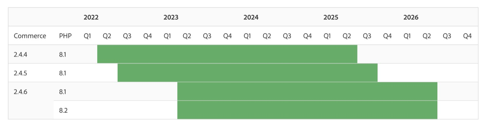

# 2024和2023年Adobe Commerce发布战略和生命周期策略的常见问题解答

## 2024和2023发布战略和更新的生命周期政策

### Adobe Commerce软件生命周期政策在2023年和2024年有何变化？

为了满足Adobe Commerce客户的任务关键型需求，我们将Adobe Commerce 2.4.4及更高版本的支持窗口扩展到 **自版本开始3年 [!DNL GA] 日期**. 支持包括 **安全和质量补丁程序**.

### 这些更改将如何使客户受益？

较长的支持窗口认识到我们的客户在全球多个站点运营时面临的复杂性，并使他们能够从每次部署中获得更多价值。 客户可以在版本上停留更长时间，从而降低总拥有成本，腾出资源以专注于添加新功能或自定义购买体验来推动更快的增长。

### 客户可在何处找到我们当前的生命周期政策？

此 [Adobe Commerce软件生命周期政策](https://www.adobe.com/content/dam/cc/en/legal/terms/enterprise/pdfs/Adobe-Commerce-Software-Lifecycle-Policy.pdf) 可在线获取。

### 根据这项新政策，2.4.4、2.4.5和2.4.6上的客户何时会终止支持？

Adobe Commerce 2.4.4+上的客户将从该版本中接收3年的安全和质量修复 [!DNL GA] 日期，如下面的时间轴所示。 请参阅 [已发布版本](https://experienceleague.adobe.com/docs/commerce-operations/release/versions.html) 第页 [!DNL Experience League] 指定支持终止日期。

### Adobe Commerce发布计划有何变化？

为了加快创新并降低总体拥有成本，每年将发布一个核心应用程序修补程序，并提供可组合的新功能 [!DNL SaaS] 可以随时添加的服务。 今年计划发布的安全补丁数量也从三个增加到四个，以帮助客户保持更安全。 其他 [!DNL beta] 2024年核心应用程序补丁版本(2.4.7)的发行版本也将在今年提供，以帮助合作伙伴和客户为下一个版本做好准备。

### 新的发布时间表如何使客户受益？

以可组合的方式提供新功能 [!DNL SaaS] 服务使客户能够更快地访问有助于提高销售的新工具。 您可以随时使用功能，而无需升级核心Adobe Commerce应用程序。 而且，Adobe可以不断地更新这些服务，以提供功能和性能方面的最新改进。 每年发布一个核心应用程序修补程序有助于降低升级成本，更容易规划升级，并为自定义和优化商业体验提供更多时间。 其他轻量级安全修补程序可帮助客户保持更安全的状态。

### 什么是预发行版访问？

在2023年，客户可以在正式发布前大约两周访问Adobe Commerce修补程序版本。

从2024年开始，Adobe不再提供对修补程序的“预发布”访问。 而对于2.4.7及更高版本，客户可以使用 [Beta版本](https://experienceleague.adobe.com/docs/commerce-operations/release/beta.html) 访问正式发布之前的可用性代码以进行测试和开发。 以下2023年版本仍计划提供预发行版访问：

* 2023年8月8日预发行版访问权限为2023年7月25日
* 2023年10月10日预发行版访问将于2023年9月26日进行

### Adobe Commerce发布计划发布于何处？

查看 [Adobe Commerce发行计划](https://experienceleague.adobe.com/docs/commerce-operations/release/planning/schedule.html) 日期 [!DNL Experience League] 以了解更多详细信息。

### 计划中包含哪些不同类型的版本？

* **核心应用程序修补程序版本**：核心应用程序升级，包括安全性、性能和高优先级质量修复。
* **[!DNL Beta]版本修补程序版本**：非[!DNL General Availability] 对核心Adobe Commerce应用程序的代码更新，包括安全性、合规性、性能和高优先级质量修复。 在发布修补程序之前，它留出了额外的时间来查看代码和受影响的组件 [!DNL GA].
* **可扩展性、基础架构和服务版本**：作为可组合服务交付的新增功能和功能更新的版本，与修补程序版本不同。 示例包括如下服务 [!DNL Product Recommendations] 和 [!DNL Live Search]，独立模块，如 [!DNL PWA Studio] 和 [!DNL Inventory Management] (MSI)，以及我们的云服务和基础架构的更新。
* **安全修补程序版本**：发布了核心应用程序的仅安全更新，以确保客户的安全性和合规性。

### 客户从何处获得高质量的修补程序？

质量修补程序是一种分发单个质量问题的修复程序的方法。 客户可以联系Adobe支持或使用 [[!DNL Quality Patch Tool]](https://experienceleague.adobe.com/docs/commerce-knowledge-base/kb/announcements/commerce-announcements/magento-quality-patches-released-new-tool-to-self-serve-quality-patches.html) 以查找高质量的修补程序。

### 哪些资源可用于帮助进行总体规划、预算和升级？

可用资源包括全面的2.4升级指南、技术升级研讨会记录以及 [!DNL Upgrade Compatibility Tool]. 可在上找到资源的完整列表 [Experience League](https://experienceleague.adobe.com/docs/commerce-operations/upgrade-guide/resources/recommended-reading.html).

### 作为Managed Services客户，客户工程部如何帮助我升级到2.4.4+?

Managed Services客户可以与我们的客户工程团队合作，在升级过程的多个组件上获得帮助，包括analysis、升级云服务、质量和用户验收测试([!DNL QA] 和 [!DNL UAT])，以及生产发布。

## 扩展支持选项

### 是否为版本2.3.7和2.4.0 - 2.4.3的客户提供了扩展支持选项？

虽然我们鼓励客户尽快升级，但可根据以下条件提供付费扩展支持计划： [!DNL PHP] 7.4（客户使用2.3.7和2.4.0 - 2.4.3）。 这些计划包括核心应用程序的质量补丁和安全补丁程序，以及 [!DNL PHP] 最多一年。

* 对2.3.7的延长支持从2022年9月8日开始，可接收到2023年9月8日。
* 对2.4.0-2.4.3的延长支持从2022年11月28日开始，可接收到2023年11月28日。

### 扩展支持能否确保 [!DNL PCI] 合规性？

在长期的支持下，我们的客户工程团队将继续提供与往常相同的质量和安全修补程序，而不会出现任何范围降级。 但是，客户需要采取其他措施来留下来 [!DNL PCI]如果底层第三方技术(如 [!DNL MySQL]，可终止支持。 Adobe不支持已终止支持的第三方技术 **除了 [!DNL PHP] 支持的版本 [!DNL PHP] 由符合支持服务或扩展支持条件的Adobe Commerce版本使用**. Adobe建议客户与其 [PCI评估器](https://www.pcisecuritystandards.org/assessors_and_solutions/qualified_security_assessors) 以确保法规遵从性。 请参阅 [Adobe Commerce系统要求](https://experienceleague.adobe.com/docs/commerce-operations/installation-guide/system-requirements.html) 有关经过测试和受支持的第三方技术的完整列表。

