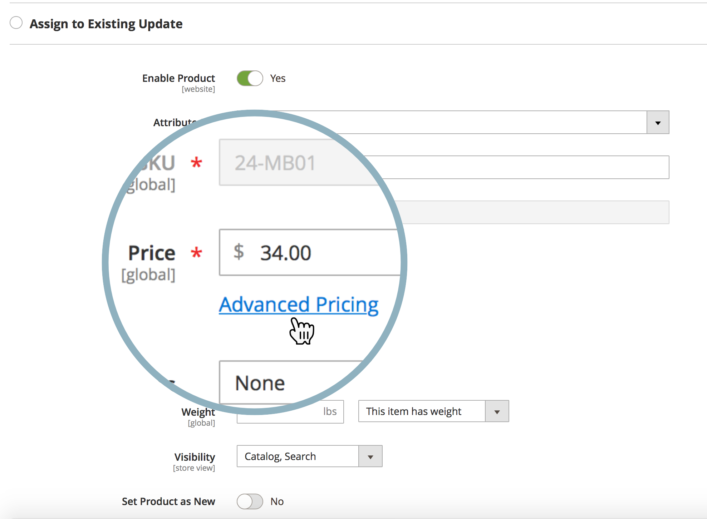
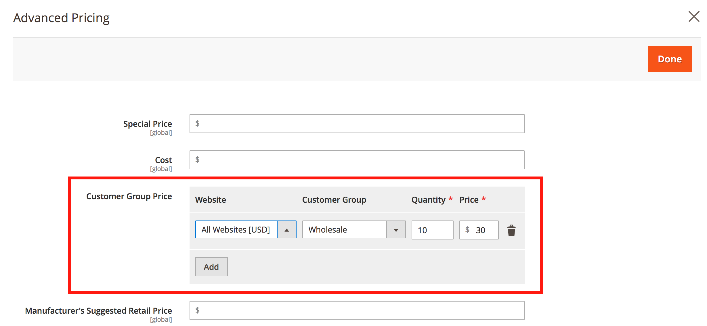

# 我是否可以为共享目录中的价格计划内容暂存更新？

Adobe Commerce不提供计划价格更新的功能([内容暂存](https://experienceleague.adobe.com/docs/commerce-admin/content-design/staging/content-staging.html))。

这意味着您不能直接从 **设置定价和结构** Commerce管理面板的菜单(没有 **计划新更新** 按钮)。

但是，您可以使用替代方法并计划以下项目的价格更新：

* 客户组
* 产品的基本价格

## 客户组的计划价格更新

1. 开始 [计划新产品更新](https://experienceleague.adobe.com/docs/commerce-admin/content-design/staging/content-staging-scheduled-update.html).
1. 向下滚动到 **价格** 字段并单击 **高级定价**.

   {width="600"}

1. 在 **客户组价格部分**，选择所需的客户组并设置更新的价格。

   {width="700"}

1. 照常完成更新计划。

在此工作流中，您只能更新单个产品的价格；批量价格更新不可用。

请记住：共享目录利用客户组定价。

**相关文档**

* [计划更新（内容暂存）](https://experienceleague.adobe.com/docs/commerce-admin/content-design/staging/content-staging-scheduled-update.html) 在我们的用户指南中。
* [高级定价](https://experienceleague.adobe.com/docs/commerce-admin/catalog/products/pricing/pricing-advanced.html) 在我们的用户指南中。

## 基准价格的计划价格更新

请参阅相关文章： [基础价格更改对共享目录价格有何影响？](/help/faq/general/base-price-change-affect-on-shared-catalog-price.md) 在我们的支持知识库中。
