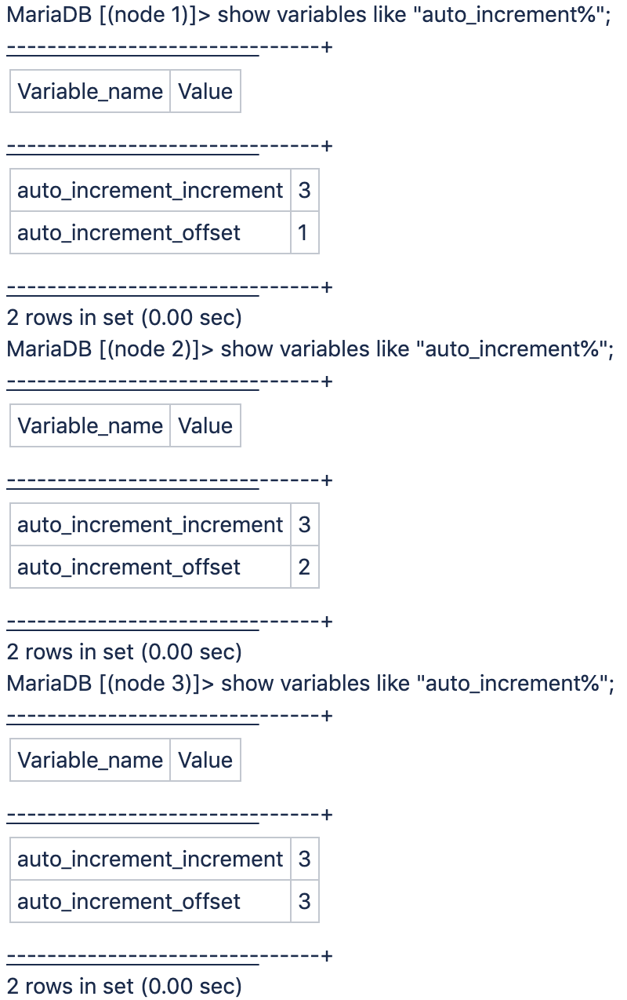

# 在我们的云专业架构上，将数据库auto_increment增量变量设置为“3”Adobe Commerce

这是Adobe Commerce在云基础架构上的预期行为。专业版计划架构解决方案，因为采用3节点架构，因此无法修改。

使用Galera数据库群集，该群集是一个数据库群集，每个节点有一个MariaDB MySQL数据库，每个数据库的唯一ID的自动增量设置为3。

<u>为什么在Pro群集上使用的增量ID并不总是以3分隔/递增？</u>

由于Galera的工作方式，在群集上使用的增量ID并不总是分隔/增加3。

这三台服务器中的每台服务器都管理自己的ID空间，所使用的增量取决于哪台是MySQL主数据库服务器（取决于相对负载），因此差距各不相同。
如果您通过SSH连接到每个节点，并使用端口3307连接到该节点上运行的本地MySQL实例（而不是代理到标准端口3306上的“主”），您将看到以下图片：

例如，如果所选的主节点是节点1，其中 `auto_increment_offset = 1`，ID将以1为单位递增。 然后，如果稍后选择一个新的主节点，例如，节点3 `auto_increment_offset = 3`，将改为增加3。

## 有用的链接

请参阅我们的开发人员文档中的：

* [Cloud for Adobe Commerce >专业体系结构>备份和灾难恢复](https://devdocs.magento.com/cloud/architecture/pro-architecture.html#backup-and-disaster-recovery)
* [适用于Adobe Commerce的Cloud >安装先决条件：数据库](https://devdocs.magento.com/cloud/before/before-workspace-magento-prereqs.html#database)
