# Adobe Commerce帮助中心用户指南

在本指南中，了解如何将支持票证提交到 [Adobe Commerce帮助中心](https://support.magento.com/hc/en-us) 并提供对Magento帐户的共享访问权限。

>[!NOTE]
>
>Adobe Commerce帮助中心的知识库部分已迁移到Adobe Experience League门户。 在创建支持工单时，将向您推荐相关的知识库文章，以及来自Adobe Experience League的其他相关Adobe Commerce文档。

**主要更新：** 2022年10月14

**[Adobe Commerce帮助中心是什么？](#what-is)**

**[支持票证](#support-tickets)**

* [登录到帮助中心](#login)
* [提交支持服务单](#submit-ticket)

   * [帮助中心起始页](#submit-ticket-help-center-start-page)
   * [“Magento帐户”页](#submit-ticket-magento-account-page)
   * [云控制台](#submit-ticket-magento-cloud-account-page)
   * [支持票证中的信息](#info-in-support-ticket)
   * [Adobe Commerce帮助中心起始页上未显示“提交票证”链接](#no-submit-link)
   * [*“请验证您的电子邮件地址”*](#verify-email-address)
   * [票证提交表单：商家未显示在“组织”下拉列表中](#merchant-not-displayed)

* [跟踪您的票证](#track-tickets)
* [Adobe Commerce P1热线（需要登录）](#P1-hotline)
* [Adobe Commerce分担责任运营模型（需要登录）](#shared-responsibility-operational-model)
* [支持票证字段说明](#ticket-fields-explained)
* [票证状态：如何处理您的请求](#ticket-status)
* [票证中的对话](#conversation-in-ticket)
* [解析您的票证](#resolve-ticket)
* [打开跟进票证](#follow-up)

**[共享访问：授予其他用户访问您帐户的权限](#shared-access)**

* [谁可以提供共享访问权限](#who-can-provide-shared-access)
* [提供共享访问](#provide-shared-access)
* [撤销（删除）共享访问权限](#revoke-shared-access)

   * [如何删除通过Cloud项目被授予共享访问权限的用户？](#remove-cloud-shared-access-users)

* [访问共享帐户（切换帐户）](#switch-accounts)
* [共享访问疑难解答](#troubleshooting-shared-access)

**[Adobe Commerce的计费常见问题解答](#billing-faq)**

**[MagentoU现在是ADOBE数字学习服务的一部分](#magento-u)**

## 什么是ADOBE COMMERCE帮助中心？ {#what-is}

此 [Adobe Commerce帮助中心](https://support.magento.com/hc/en-us) 是Adobe Commerce的支持门户，符合条件的客户可以在其中提交和管理支持工单。 您还可以在该处查看故障排除文章。

## 支持票证 {#support-tickets}

Adobe Commerce Ticketing System允许使用支持工单来解决您在使用Adobe Commerce时遇到的特定问题 — 适用于所有Adobe Commerce产品。

## 登录到帮助中心 {#login}

登录允许您提交、更新和响应工程师有关支持票证的问题。

要登录Adobe Commerce帮助中心，请执行以下步骤：

1. 访问帮助中心，网址为 <https://support.magento.com>.
1. 单击 **登录** 在右上角。

使用您的Magento帐户凭据登录。 有关更多信息，请参阅 [您的Magento帐户](https://experienceleague.adobe.com/docs/commerce-admin/start/commerce-account/commerce-account-create.html) 在我们的用户指南中。

### <strong>提交支持服务单</strong> {#submit-ticket}

成功登录后，您可以使用“帮助中心”起始页、“Magento帐户”页和“Magento云帐户”页提交支持票证。

* 如果您是 **帐户所有者** 请按照以下步骤操作。
* 如果您是 **共享访问用户，必须先切换帐户** [访问共享帐户（切换帐户）](#switch-accounts)然后，您可以继续执行以下步骤。

#### 帮助中心起始页 {#submit-ticket-help-center-start-page}

要使用Adobe Commerce帮助中心的起始页提交新的支持工单，请执行以下步骤：

1. 转到 [Adobe Commerce帮助中心](https://support.magento.com/hc/en-us).
1. 单击 **提交票证** 在右上角。

   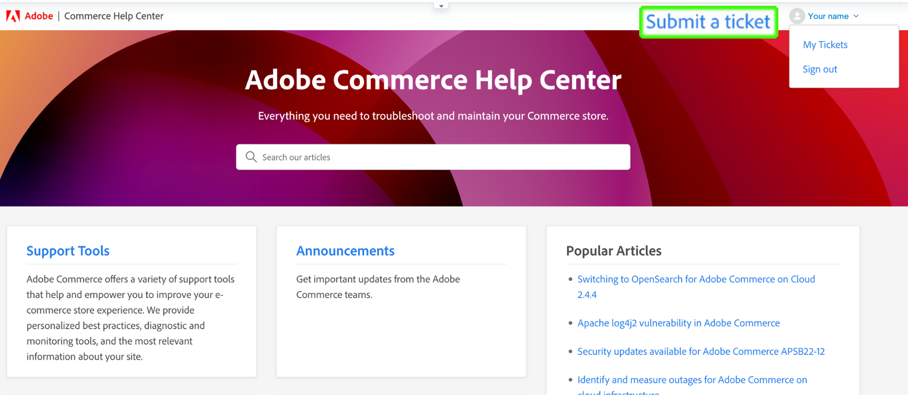{width="800"}

1. 填写字段。
1. 单击 **提交**.

您 *必须具有* https://account.adobe.com和https://account.magento.com上的帐户，然后使用您的Adobe Commerce帐户登录到帮助中心以提交支持票证。 在您登录之前， [该 **提交票证** 按钮将不显示](#no-submit-link).

>[!NOTE]
>
>如果您已在https://account.magento.com上拥有帐户，但无法登录，则可能尚未在https://account.adobe.com上注册帐户（自2022年8月起，必须注册）。
>
>要解决此问题：
>1. 在https://account.adobe.com上使用与您的广告ID相同的电子邮件地址创建一个帐户。
>1. 转到https://account.magento.com ，将您的Adobe ID与MAG ID关联起来。

#### “Magento帐户”页 {#submit-ticket-magento-account-page}

要使用“Magento帐户”页提交新的支持服务单，请执行以下步骤：

1. 登录到您的Magento帐户。 请参阅 [详细说明](https://experienceleague.adobe.com/docs/commerce-admin/start/commerce-account/commerce-account-create.html?lang=en#create-a-commerce-account) 在我们的用户指南中。
1. 单击 **支持** 选项卡。

   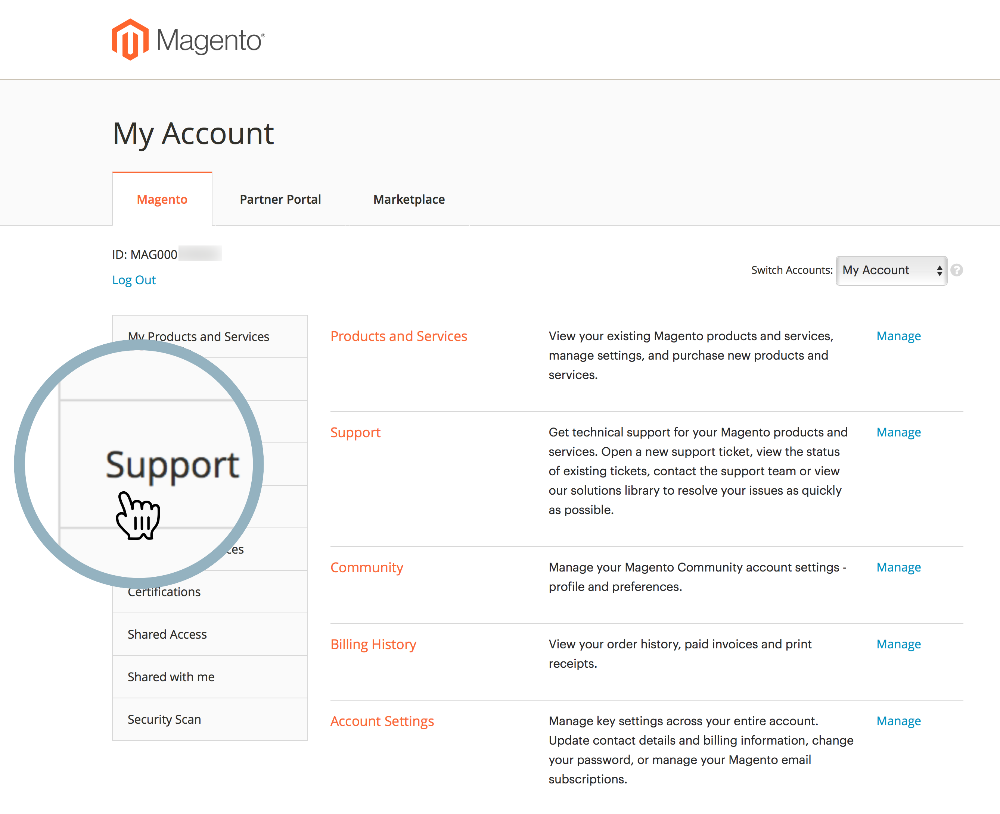{width="800"}

1. 将为您加载“帮助中心”起始页。
1. 单击 **提交票证** 在右上角。
1. 填写字段。
1. 单击 **提交**.

#### 云控制台 {#submit-ticket-magento-cloud-account-page}

要使用Cloud Console提交新的支持工单，请执行以下步骤：

1. 登录到 [云控制台](https://console.adobecommerce.com).
1. 选择 **[!UICONTROL Support]** 在用户菜单中。
1. 此 **[!UICONTROL My Tickets]** 页面加载。
1. 单击 **[!UICONTROL Submit a ticket]** 在右上角。
1. 填写字段。
1. 单击 **提交**.
1. 单击 **[!UICONTROL Submit]**.

#### 支持票证中的信息 {#info-in-support-ticket}

标有红色星号( **\*** )，为必填项，且必须填写。 如果将其中任何字段留空，您将无法提交票证。

请参阅 [票证字段说明](#ticket-fields-explained) 下文，以了解更多详细信息。

### Adobe Commerce帮助中心起始页上未显示“提交票证”链接 {#no-submit-link}

#### 问题

您可以访问Adobe Commerce帮助中心并想要提交支持请求，但 **提交票证** 链接未显示在帮助中心起始页上。

#### 原因

原因可能是以下之一：

* 您尚未登录到帮助中心。
* 如果首次使用共享访问，则尚未执行所需的步骤，以确保通过Magento.com中的SSO调用正确配置Adobe Commerce帮助中心。
* 您的帐户无权获得Adobe Commerce支持(例如，您不是付费Commerce客户或您是开源客户)。

#### 解决方案

[登录到帮助中心](/help/help-center-guide/help-center/magento-help-center-user-guide.md#provide-shared-access).

此 **提交票证** 链接只向拥有链接到有效支持协议的电子邮件的客户显示。

#### 使用共享访问帐户

要能够使用共享访问帐户提交支持票证，您需要执行以下操作（只需执行一次）：

1. 接收后 [共享访问](https://support.magento.com/hc/en-us/articles/360052444712#who-can-provide-shared-access)，登录到 [magento.com网站上的Magento帐户](https://account.magento.com/).
1. 在 **切换帐户** 从右上角的下拉字段中，选择共享访问帐户。
1. 单击 **支持** 选项卡。 这样做将确保通过从Magento.com向Adobe Commerce帮助中心发出的SSO调用，正确配置Adobe Commerce帮助中心。

#### 还是看不到 **提交票证** 链接

如果您没有 **共享帐户** 在 **切换帐户** 下拉列表，但是您在为拥有Adobe Commerce许可证的客户端工作，请要求他们授予您共享访问权限。 有关更多详细信息，请查看 [提供对Magento帐户的共享访问权限](/help/help-center-guide/help-center/magento-help-center-user-guide.md#provide-shared-access).

如果您是Adobe Commerce许可证所有者，请验证您是否没有 **待处理付款** 状态。 根据发票付款状态，自动授予或撤消支持权利。

如何检查您的付款状态：

1. 登录 [magento.com](https://support.magento.com/).
1. 单击 **记帐历史记录** 左边。
1. 如果您 **do** 有一张发票 **待处理付款** 状态， **请联系您的Adobe客户团队** 解决付款问题。

我们仅向Adobe Commerce许可证所有者和对具有Adobe Commerce许可证的帐户共享访问权限的帐户提供支持。 如果您需要Magento Open Source版本支持，请利用这些自助技术资源：

* [Adobe Commerce帮助中心](https://support.magento.com/)
* [Adobe Commerce开发人员文档](https://developer.adobe.com/commerce/docs/)
* [Adobe Commerce文档资源](https://experienceleague.adobe.com/docs/commerce.html)
* [Magento论坛](https://community.magento.com/?_ga=2.99592990.1084044056.1559046120-720752292.1551793747)

如果您在登录帐户时遇到问题，或者您认为共享访问设置正确，但仍无法看到 **提交票证** 按钮，请发送电子邮件至 [帮助中心登录问题](mailto:grp-magento-helpcenterloginissues@adobe.com)，我们将很高兴地查看您的帐户设置和支持授权。

>[!NOTE]
>
>如果您在访问云项目时遇到问题，请通过常规渠道提交此问题的票证。 如果能够提交票证，请勿发送电子邮件。

### “Magento帐户”页面上的“请验证您的电子邮件地址”错误 {#verify-email-address}

如果您收到 *请验证您的电子邮件地址* 错误类似于下面的错误 [“Magento帐户”页](https://account.magento.com/).

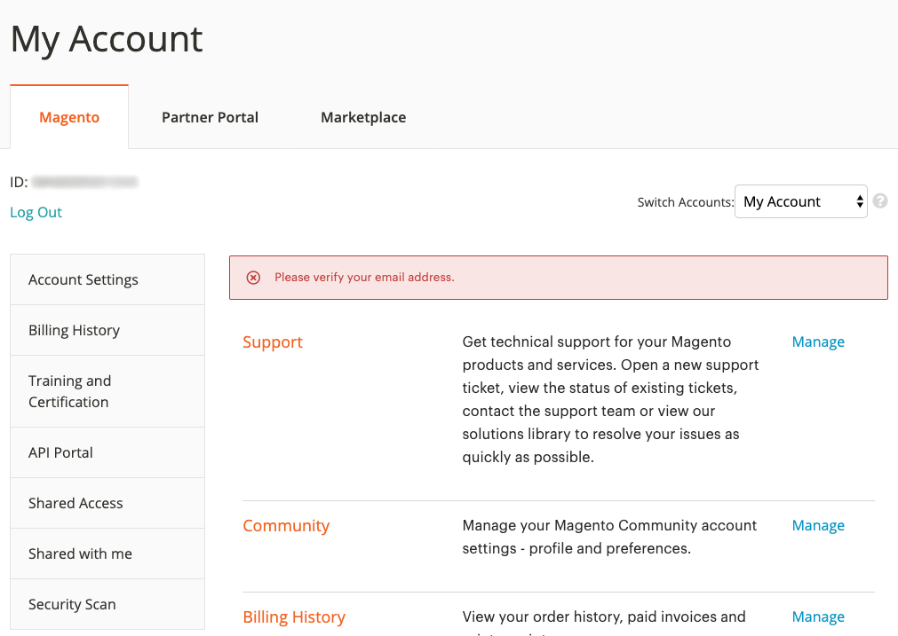{width="800"}

解决方案是验证您的电子邮件地址：

1. 登录到https://account.adobe.com ，并根据需要请求密码。
1. 验证您的Adobe帐户。

>[!NOTE]
>
>这仅适用于来自https://account.magento.com的电子邮件验证链接(“Magento帐户”页面)。

### 票证提交表单：商家未显示在“组织”下拉列表中 {#merchant-not-displayed}

#### 问题

先决条件：您有一个由商家授予的共享访问帐户。

重现问题的步骤：

1. 使用共享帐户登录到帮助中心。
1. 单击 **提交票证** 链接。 此时将打开票证提交表单。
1. 展开 **组织** 下拉字段以选择贸易商。

预期结果：

与共享帐户对应的商家将列在 **组织** 选项。

实际结果：

与已使用共享帐户对应的商家在中不可用 **组织** 选项。

#### 解决方案

从商家获得共享访问权限后，您需要执行以下步骤（只需一次）：

1. 登录 [magento.com网站上的Magento帐户](https://account.magento.com/).
1. 在 **切换帐户** 从右上角的下拉字段中，选择共享访问帐户。
1. 单击 **支持** 选项卡。 这样做将确保通过从Magento.com向Adobe Commerce帮助中心发出的SSO调用，正确配置Adobe Commerce帮助中心。

如果您已经完成此操作，请检查您是否已被授予 *来自多个商家的共享访问权限* 通过单击 [[!UICONTROL Shared with me] 选项卡](https://account.magento.com/grantor/manage/shared/)：
* 如果只有一个 [!UICONTROL Share Name] 列在名单上，也就是你只被一个商人授予了， *您不会看到 [!UICONTROL Organization] 下拉面板*.
* 如果有多个 [!UICONTROL Share Names]，商户的支持权利可能已过期，因为其许可证先前因付款问题而被吊销。

### 跟踪您的票证 {#track-tickets}

你的票是你的：

* 已亲自提交
* 已通过CC（抄送）作为观察者添加到

#### 查看您的票证

要列出所有票证，请单击帮助中心起始页上的配置文件菜单（右上角），然后选择 **我的票**.

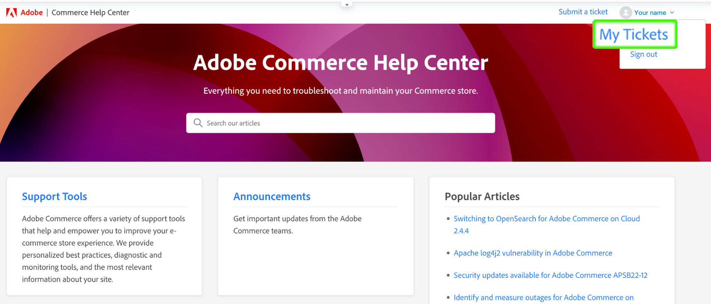{width-&quot;800&quot;}

要在票证和已抄送的票证之间切换，请单击相应的选项卡：

* **我的票**
* **我抄送的票**
* **组织票证** （如果您的帐户与多个组织关联，则可用）

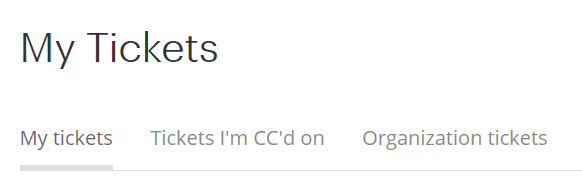

要对票证进行排序，请单击 **已创建** 或 **上一个活动** 列标题。

#### 搜索票证

要查找票证，请在 **搜索票证** 字段并按 *输入* 在键盘上。 选择 [状态](#ticket-status) 以进行其他筛选。

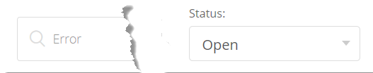

#### 关注组织票证

您可以按照组织成员提交的支持工单进行操作。

当您关注组织票证时，您可以：

* 可以在以下位置查看票证： **组织票证** 选项卡
* 在提交新票证或更改现有票证时接收电子邮件通知

要关注/取消关注组织的票证，请执行以下操作：

1. 转到 **我的票** > **组织票证** 选项卡。
1. 在菜单中选择一个组织，然后单击 **关注/取消关注**.

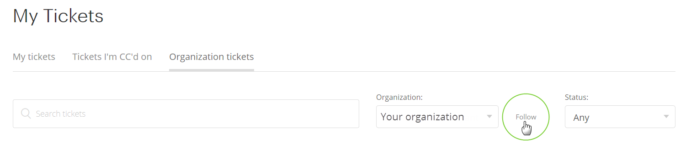

### Adobe Commerce P1热线 {#P1-hotline}

**需要登录** 以访问 [Adobe Commerce P1热线](https://experienceleague.adobe.com/docs/commerce-knowledge-base/kb/how-to/adobe-commerce-p1-notification-hotline.html) 这篇文章提供了在P1事件期间寻求帮助时Adobe Commerce的P1热线号码，并解释了要提供的信息。

### Adobe Commerce共同责任运营模式 {#shared-responsibility-operational-model}

**需要登录** 以访问 [Adobe Commerce共同责任运营模式](https://support.magento.com/hc/en-us/articles/4407700678669) 本文章旨在明确仅针对我们的专业基础设施服务在Adobe Commerce方面的运营职责。

### 支持票证字段说明 {#ticket-fields-explained}

#### 受影响的URL

链接到Adobe Commerce支持团队将能够看到您问题的环境。 确保以“http://”或“https://”启动URL。

#### 附件

附加日志、屏幕截图、录像或任何其他可能更好地说明问题的媒体。

#### Backoffice URL（仅限MOM）

URL必须以“https://”开头。 其格式通常为：商家名称+&quot;.mcom.magento.com/admin/login&quot;，例如“https://luma.mcom.magento.com/admin/login”。

您还可以放置与问题相关的直接链接。

#### 抄送

您想要关注票证的人员的电子邮件(例如， *first@e.mail*)。

您可以添加没有Magento帐户或Zendesk帐户的人员的电子邮件；这些人员仍可以在您的票证中向对话投稿。

要向CC添加多个电子邮件，请执行以下操作：

>[!NOTE]
>
>CC：中的用户必须在https://account.magento.com上拥有现有帐户。 否则，他们必须首先在https://account.adobe.com创建一个帐户，然后使用该帐户登录https://account.magento.com。

1. 输入电子邮件。
1. 按 *空间* 以保存输入的电子邮件。 电子邮件以灰色框架显示。\
   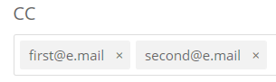
1. 开始键入下一封电子邮件。
1. 通过按保存所有其他电子邮件 *空间*.

要从CC删除电子邮件，请单击 **x** 在一封带框的电子邮件中。

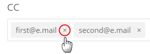

#### 产品

选择您正在使用的Adobe Commerce产品的类型：

* Adobe Commerce： **[!UICONTROL Implementation Type]** 字段将在您选择此选项后显示（请参阅下方了解详细信息）
* Magento Order Management
* Adobe Commerce报表：不包括 [高级报告](https://experienceleague.adobe.com/docs/commerce-admin/config/general/advanced-reporting.html)
* Adobe Commerce [支付服务](https://experienceleague.adobe.com/docs/commerce-merchant-services/payment-services/overview.html)
* Adobe Commerce服务： [渠道管理器](https://experienceleague.adobe.com/docs/commerce-channels/channel-manager/guide-overview.html) 仅限

#### 实施类型

此字段仅在您选择后显示 **[!UICONTROL Product]** = *Adobe Commerce*

请指定您的部署方法：

* Cloud：仅当位于Adobe Commerce上的Cloud Infrastructure上时才选择此选项
* 内部部署： *所有自托管实例以及 [AWS] 基于云的托管* (不包括Adobe Commerce on Cloud)

#### 云项目URL

请提供Cloud Console项目的URL，例如 `https://console.adobecommerce.com/<owner-user-name>/<project-ID>`.

获取项目URL的另一个方法如下：

1. 登录到 [云控制台](https://console.adobecommerce.com).
1. 单击相应的项目。
1. 复制URL。

#### 联系原因

联系原因因产品而异。 选择最适合您遇到的症状的联系原因。 请参阅 [支持票证联系原因描述](/help/faq/general/support-ticket-contact-reason-descriptions.md) 文章，以了解有关您应选择何种联系原因的更多信息。

#### Adobe Commerce环境ID

此字段仅在您选择后显示 **[!UICONTROL Contact Reason]** = *Adobe Commerce Cloud应用程序*，后接 **Adobe Commerce应用程序联系原因** = *[!DNL Live Search]*.
转到 **[!UICONTROL System]** > **[!UICONTROL Services]** > **[!UICONTROL Commerce Services Connector]** > **[!UICONTROL SaaS Identifier]**，并提供 *[!UICONTROL Data Space ID]*.

#### （数据）集成类型(仅限Adobe Commerce报表)

选择您在Adobe Commerce报表中拥有的集成类型。 这将帮助我们的工程师更有效地解决您的问题。

#### 描述

在合理的范围内尽可能多地提供问题的概览和详细信息。

请提供准确的信息和重现步骤(Adobe Commerce本地和云基础架构除外，这两个地方有独立的 [重现问题的步骤](#steps) 字段)，以及您的问题或请求的症状。 请确保包括任何受影响的SKU、相关数据点和任何其他相关链接。

#### 环境(仅限云基础架构上的Adobe Commerce、内部部署的Adobe Commerce、Adobe Commerce Reporting and Shipping)

选择 **环境类型** 你面临的问题：

* 开发(**集成分支**)
* 暂存
* 生产

有关云基础架构环境上的Adobe Commerce的更多信息，请参阅 [专业体系结构](https://experienceleague.adobe.com/docs/commerce-cloud-service/user-guide/architecture/pro-architecture.html) 用户指南中的文章。

#### 受影响的订单数（仅限MOM）

选择受影响的订单范围。

这是一个下拉列表，仅适用于Order Management产品。

#### 组织

指示您希望票证关联的组织 — 如果您使用多个组织。

当您的帐户与多个组织关联时，会显示此字段。

>[!WARNING]
>
>您必须确保选择了正确的组织。 如果您选择了错误的组织，则与组织无关的第三方将能够查看潜在的敏感信息和专有信息。

>[!NOTE]
>
>提交票证后，可以更改组织。 按照以下步骤更改组织。
>
>1. 转到票证的右列。
>1. 找到可用组织的下拉菜单。
>1. 选择相应的组织。
>
>

此外，这将允许我们快速交叉引用过去为此组织提交的类似/重复/相关的票证，并确定可能有助于调查和解决当前票证的线索。

如果您对多个组织具有共享访问权限，但此字段不可用，请参阅 [票证提交表单：商家未显示在“组织”下拉列表中](https://experienceleague.adobe.com/docs/commerce-knowledge-base/kb/help-center-guide/magento-help-center-user-guide.html#merchant-not-displayed)

#### 合作伙伴名称（商家名称）

对于商家： **合作伙伴名称** 是开发组织(Adobe Commerce)的名称 [技术合作伙伴](https://partners.magento.com/portal/directory/?&amp;partner_type=6) 或 [解决方案合作伙伴](https://partners.magento.com/portal/directory/?&amp;partner_type=1))参与开发您的Adobe Commerce应用商店。

对于合作伙伴： **商家名称** 是客户的名称。

#### 项目URL(仅Commerce Cloud)

链接到 [云控制台](https://experienceleague.adobe.com/docs/commerce-cloud-service/user-guide/project/overview.html).

#### 重现步骤(仅限Adobe Commerce内部部署和Adobe Commerce on Cloud基础架构)

提供准确的分步说明以重现您的问题，包括：

* 要复制的步骤
* 预期结果
* 实际结果

*推荐：* 假设您正在为知道这些步骤的人编写这些步骤 **无** 关于Adobe Commerce：

* 提及每一步，即使这看似简单而明显
* 不要指望读者知道你的意思

用简单的语言写作，有简短的句子。

#### 主题

包含问题的简短概述(例如， *所有页面均显示错误404* )。

**建议的文章：** 输入搜索词时，会显示可能与问题相关的Adobe商务文档文章列表。 单击列表中的文章以将其打开。

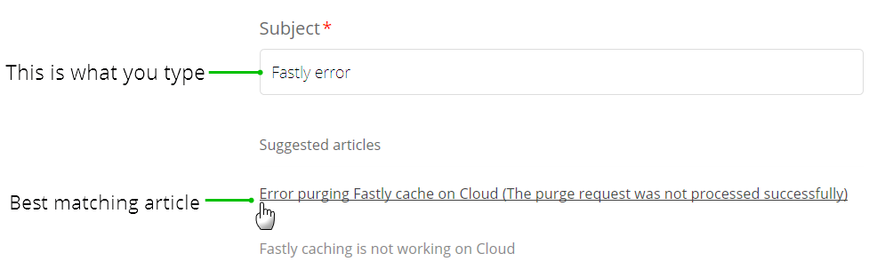

*推荐：* 请仔细考虑建议的文章，它们可能包含您希望Adobe Commerce支持团队提供的解决方案。

#### 版本(Adobe Commerce内部部署，仅云基础架构和航运上的Adobe Commerce)

请选择您正在请求帮助的Adobe Commerce版本。 顶部列出了所有受支持的Adobe Commerce版本。 不支持的版本在底部以括号列出。 如果您正在迁移，请选择最新版本以确保您的版本受支持。

要查找Adobe Commerce（云基础架构）的版本，请向下滚动 [云控制台](https://experienceleague.adobe.com/docs/commerce-cloud-service/user-guide/project/overview.html) 并检查窗口的中下方。

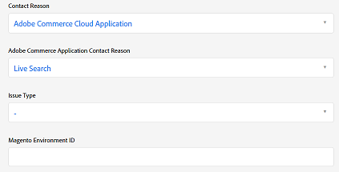

如果您使用 [Elasticsearch](https://experienceleague.adobe.com/docs/commerce-operations/installation-guide/prerequisites/search-engine/overview.html) 或 [OpenSearch](https://experienceleague.adobe.com/docs/commerce-operations/installation-guide/prerequisites/search-engine/aws-opensearch.html)中，请勿选择此选项。

要获取此信息，请在Adobe Commerce管理员中，转到 **营销** > **实时搜索** > **GraphQL游乐场**，向下滚动到页面底部，然后单击 **HTTP头**.

### 票证状态：如何处理您的票证 {#ticket-status}

您的票证可能具有以下三种状态之一。

#### **1. 打开**

您的票证尚未解决，将由Adobe Commerce支持团队处理。 如果您在对话的特定步骤中提供了希望您了解的所有信息，并且下一步需要由Adobe Commerce支持人员执行，则您的票证具有 **打开** 状态。

#### **2. 等待您的回复**

Adobe Commerce支持部门需要您提供信息。

在回复中，您可以指定问题的其他技术详细信息、提供上报详细信息，或声明Adobe Commerce支持提供的解决方案是否已被证明对您的问题有帮助。 确保尽快提供回复，因为Adobe Commerce支持人员无法继续处理您处于 **等待您的回复** 状态。

参考 [Adobe Commerce支持票证生命周期策略更新](/help/help-center-guide/help-center/magento-support-ticket-lifecycle-policy-update.md) 文章以了解有关时间和通知政策的详细信息。

#### **3. 已解决**

Adobe Commerce支持已为您问题提供了解决方案，并且您同意该解决方案对您有所帮助。 是你把票标记为 **已解决**. 如果修复的问题再次出现，您可以重新打开票证，将其状态设置为 **打开**.

### 票证中的对话 {#conversation-in-ticket}

您票证中的对话将统一您或Adobe Commerce支持团队编写的所有注释。 注释按最新（顶部）到最早（底部）顺序显示。

要向对话添加评论，请执行以下步骤：

1. 滚动到票证的底部。
1. 单击 **添加到对话** 开始写入的字段。

   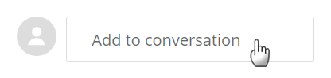

1. 若要向评论中添加人员，请在 **抄送** 注释字段的字段。
   >[!NOTE]
   >
   >CC：中的用户必须在https://account.magento.com上拥有现有帐户。 否则，他们必须首先在https://account.adobe.com创建一个帐户，然后使用该帐户登录https://account.magento.com。

   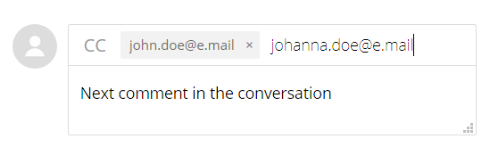

1. 完成评论后，单击 **提交**.

### 解析您的票证 {#resolve-ticket}

要解析票证，请单击 **标记为已解决** 在票证的底部。

### 打开跟进票证 {#follow-up}

打开跟进票证将确保原始问题链接到跟进票证以实现连续性。

要打开跟进票证，请单击“*创建跟进*”链接，您要创建跟进内容。

## 共享访问：授予其他用户访问您帐户的权限 {#shared-access}

您可以为其他Magento帐户持有人授予对您帐户的有限访问权限。 特别是，使用 **共享访问** 功能，您可以向受信任的员工和服务提供商提供使用您的帮助中心帐户的权限，以便他们可以使用您的支持工单。

您可以使用Magento帐户页面提供和管理共享访问权限，该页面位于 [https://account.magento.com](https://account.magento.com/).

### 谁可以提供共享访问权限 {#who-can-provide-shared-access}

只有具有相应权限的帐户所有者（主要帐户所有者）才能为其他用户提供共享访问权限。

管理用户及其访问权限是客户的责任，在共享访问方面尤其如此。 因此，Adobe Commerce支持团队无法代表客户提供对Magento帐户的共享访问权限。 我们鼓励客户自行添加具有共享访问权限的用户，使用 [“Magento帐户”页](https://account.magento.com/).

已被提供共享访问权限的用户不能向其他用户转移或授予此类访问权限。

### 提供共享访问 {#provide-shared-access}

请参阅 [共享您的帐户](https://experienceleague.adobe.com/docs/commerce-admin/start/commerce-account/commerce-account-share.html) Adobe Commerce部分，了解有关设置共享帐户的详细步骤。

为新用户提供共享访问后，可在以下位置找到相关信息： **共享访问** > **管理权限** Magento帐号页面的。

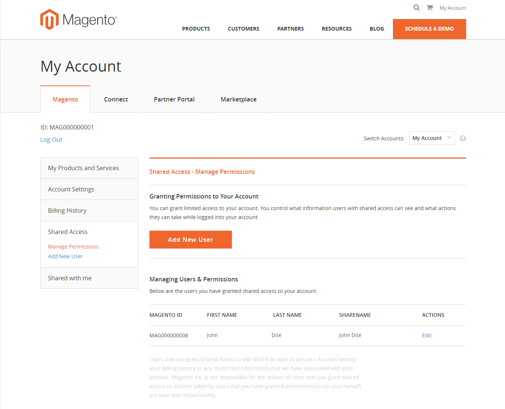{width="800"}

### 撤销（删除）共享访问权限 {#revoke-shared-access}

1. 登录您的Magento帐户： [https://account.magento.com](https://account.magento.com/).
1. 在左侧面板的“共享访问”下，选择 **管理权限。**
1. 找到要撤销其共享访问权限的用户，然后单击 {width="25"} 在用户行中(**操作** 列)。
1. 单击 **删除用户** 以撤销访问权限，或者将X置于顶角以取消撤销。

   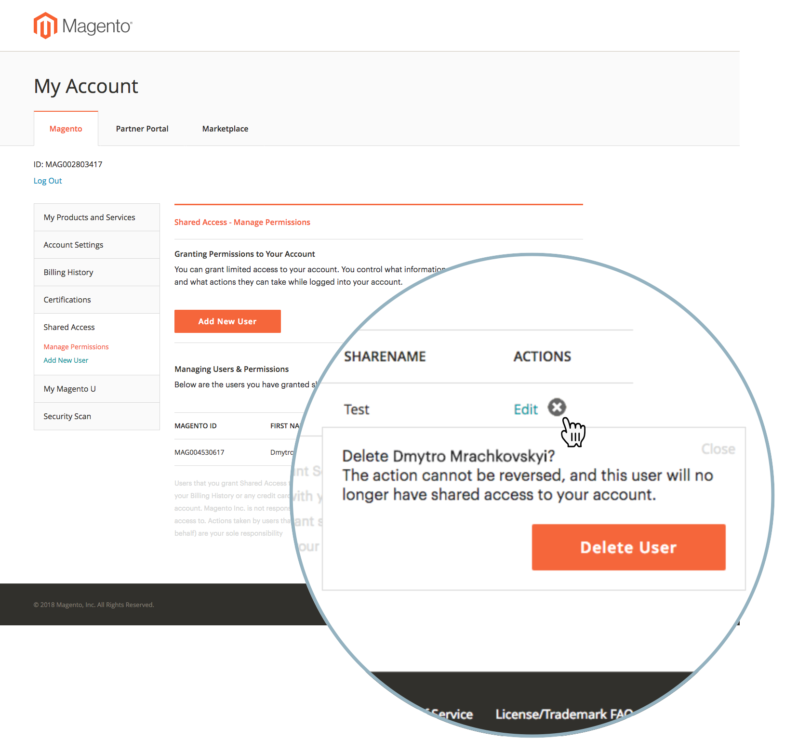{width="800"}

   您还可以使用撤销共享访问权限 **编辑** 菜单：

1. 登录您的Magento帐户，网址为 [https://account.magento.com](https://account.magento.com/).
1. 在左侧面板的“共享访问”下，选择 **管理权限。**
1. 找到要撤销其共享访问权限的用户，然后单击 **编辑** 在用户行中(**操作** 列)。
1. 单击 **删除此用户** 在页面底部。
1. 在确认弹出窗口中，单击 **删除用户** 以撤销访问权限，或者将X置于顶角以取消撤销。

### 如何删除通过Cloud项目被授予共享访问权限的用户？ {#remove-cloud-shared-access-users}

<u>受影响的产品和版本</u>

* Adobe Commerce Cloud（所有版本）

<u>原因</u>

如果您拥有Adobe Commerce Cloud项目，并且在该项目中添加了用户，则他们会自动被授予对项目所有者图像ID的共享访问权限。 这通常在以下内容中说明： **[!UICONTROL Share Name]** 列，显示 *来自MAG的云共享访问[XYZ]*.

如果缺少DELETE链接，则表示通过Commerce Cloud自动授予共享访问权限。

<u>解决方案</u>

无法删除共享名称为的共享访问用户列表 *来自MAG的云共享访问[XYZ]* 如果未在此页面上添加/提供“共享访问”。 保留它们是为了提供信息/进行审核。

但是，一旦您撤销了这些共享访问用户的权限，他们将不再拥有该访问权限。

1. 登录您的Magento帐户，网址为 [https://account.magento.com](https://account.magento.com/).
1. 在左侧的面板中，在 *[!UICONTROL Shared Access]*，选择 **[!UICONTROL Manage Permissions]**.
1. 找到要撤销其共享访问权限的用户，然后单击 **[!UICONTROL Edit]** 在用户行中(*[!UICONTROL Actions]* 列)。
1. 取消选中下的所有资源 *[!UICONTROL Grant Account Permissions]*.

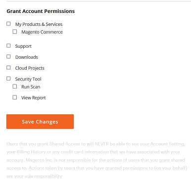{width="800"}

欲知更多信息，请参见 [管理用户访问权限](https://experienceleague.adobe.com/docs/commerce-cloud-service/user-guide/project/user-access.html#manage-users-from-the-project-web-interface) 有关我们的Commerce on Cloud Infrastructure指南的文档。

### 访问共享帐户（切换帐户） {#switch-accounts}

要使用为您提供的共享访问权限，请执行以下步骤：

1. 登录您的Magento帐户： [https://account.magento.com](https://account.magento.com/).
1. 单击 **切换帐户** 并选择一个帐户。

   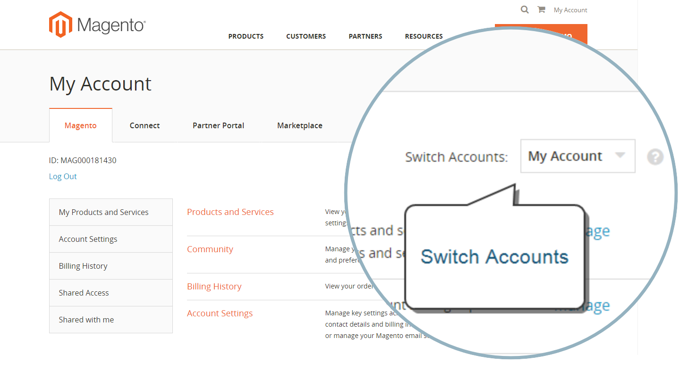{width="800"}

要了解您当前使用的帐户（您自己的本机帐户或共享访问权限），请参阅 **切换帐户** 菜单：显示活动帐户。

### 共享访问疑难解答 {#troubleshooting-shared-access}

请参阅 [共享访问疑难解答文章](/help/troubleshooting/miscellaneous/shared-access-troubleshooting.md) 在我们的支持知识库中。

## Adobe Commerce的计费常见问题解答 {#billing-faq}

商家通常通过信用卡(CC)交易为我们的服务付费，而且 [Adobe Commerce的计费常见问题解答](/help/faq/general/billing-faq-for-adobe-commerce.md) 是在您支付账单时提供帮助的资源。

## MagentoU现在是ADOBE数字学习服务的一部分 {#magento-u}

MagentoU已与 [Adobe数字学习服务(ADLS)](https://learning.adobe.com/).

U ZendeskMagento将被逐步淘汰。
