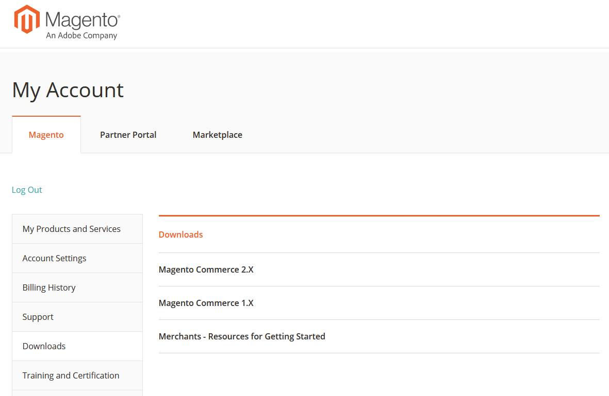

# 访问Adobe Commerce客户支持指南

《Adobe Commerce客户支持指南》介绍了客户支持选项以及如何利用这些选项。 这包括支持关系的最佳实践、收集诊断所需的信息、客户支持优先级、提交支持请求以及资源链接。 本指南可从您的Magento帐户页面的下载部分访问。 要访问：

1. 转到Magento [帐户登录页面。](https://account.magento.com/customer/account/login)
1. 使用您的Magento用户名和密码登录。
1. 在左侧导航栏中，单击 **下载**.
1. 在右窗格中，单击 **商家 — 入门资源**.  
