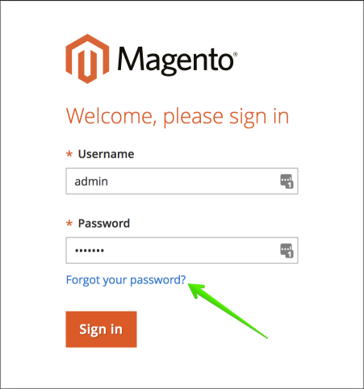

# 在云基础架构上更改Adobe Commerce上的管理员密码

## 方法1：忘记密码（通过电子邮件重置）

阅读 [重置管理员登录的密码部分](https://experienceleague.adobe.com/docs/commerce-admin/start/admin/admin-signin.html#admin-sign-in) 在我们的用户指南中。

以下是关键使用说明。

### 启用传出电子邮件

在使用之前 **忘记密码** 表单， [启用传出电子邮件](https://experienceleague.adobe.com/docs/commerce-cloud-service/user-guide/project/outgoing-emails.html) 使用 [云控制台](https://experienceleague.adobe.com/docs/commerce-cloud-service/user-guide/project/overview.html).

### 检查您的“垃圾邮件”文件夹

如果找不到包含“重置密码”链接的邮件，请检查 *垃圾邮件* 文件夹。 电子邮件的名称为 *管理员用户名的密码重置确认*.

## 方法2：添加新的管理员用户

如果无法恢复或重置现有用户的密码，则可以创建新的管理员用户并设置此用户的密码。 为此，请执行以下步骤：

1. 使用 [使用SSH登录到远程环境](https://experienceleague.adobe.com/docs/commerce-cloud-service/user-guide/develop/secure-connections.html).
1. 运行以下命令： `bin/magento admin:user:create   --admin-user=%user_name% --admin-password=%your_password% --admin-email=%your_email% --admin-firstname=%admin_user_first_name% --admin-lastname=%admin_user_last_name%`
