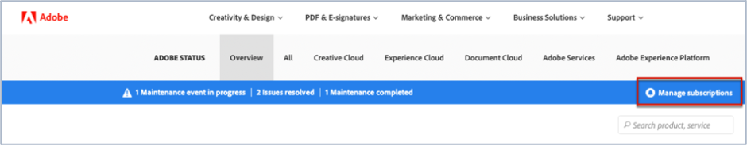

# 如何订阅Adobe Commerce状态更新

## 如何订阅AdobeMagento状态更新

1. 转到 [Adobe状态](https://status.adobe.com).
1. 单击 **登录**.
1. 使用您的Adobe凭据登录。
1. 选择 **公司或学校帐户** 是否显示选项。
1. 单击 **管理订阅** 右上角，所列云的上方。

   
1. 单击 **创建订阅**.

   
1. 您会看到一个窗口，您可以在其中选择产品的通知。 它可能不同于以下屏幕截图，因为某些订阅可能会根据您的个人资料预先选择，或者因为您已设置某些订阅。 单击 **AdobeMagento** 在Experience Cloud下。 如果要接收所有AdobeMagento服务的通知，请选中AdobeMagento复选框。 这将自动选择所有您可以在AdobeMagento部分展开时看到的AdobeMagento服务（请参阅屏幕快照）。

   

   或者，要选择一个AdobeMagento服务，请取消选中其他AdobeMagento服务的复选框。 因此，例如，如果您只想接收订单管理(MOM)通知，请取消选中其它服务，以便仅选中“AdobeMagento”复选框和“订单管理(MOM)”复选框（请参阅屏幕快照）。

   
1. 您会看到一个窗口，您可以在其中为选定的区域和事件选择产品的通知。 如果您希望接收所有产品相同区域和事件类型的通知，请查看 **为所有产品选择区域和事件类型** 复选框（请参阅屏幕快照）。

   

   或者，如果您已订阅了多种产品(而不仅仅是AdobeMagento)，并且希望每个产品都有不同地区和事件类型的通知，请查看 **按产品自定义区域和事件类型** 复选框（请参阅屏幕快照）。

   
1. 单击 **继续**.
1. 此 **确认您的订阅首选项** 窗口随即显示。 检查通知是否反映了您所需的内容。 单击 **完成**.

单击之后 **完成** 您应会看到产品订阅和活动订阅的摘要，并将从Adobe收到一封名为“Subscription to Status email notifications”的电子邮件。 如果要取消订阅和/或更改通知设置，请重复执行第一步到第九步。
