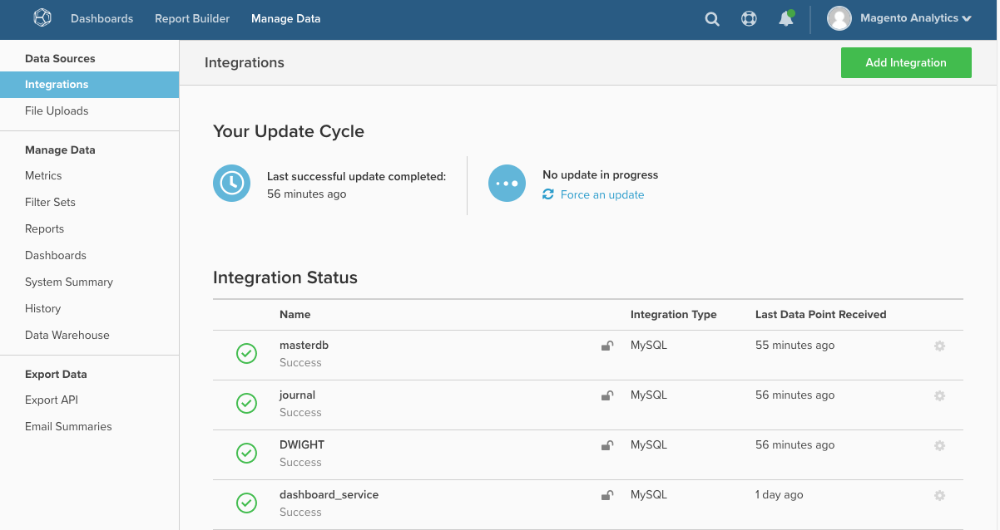

# MBI：重新验证集成

本文提供了重新授权集成以授予Magento Business Intelligence(MBI)从第三方服务拉取数据所需的权限的解决方案。 撤销这些权限时需要重新授权。

## 数据库和SaaS集成

有关数据库和SaaS集成的列表，请参阅 [使用集成连接外部数据](https://docs.magento.com/mbi/data-analyst/importing-data/integrations/integrations.html) 在我们的开发人员文档中。 （打开页面时，使用左侧的目录进行导航）。

## 存在连接问题？

授权集成可授予MBI从第三方服务提取数据所需的权限。 撤销这些权限时需要重新授权。

发生这种情况有多种原因：

* 第三方服务的问题
* 身份验证令牌过期
* 对您的管理帐户所做的更改
* 或MBI中的内部问题

所有集成的状态都位于集成页面上( **管理数据>集成** )：

要重新进行身份验证，您可能需要重新输入帐户凭据。 在某些情况下，您可能需要为问题集成生成新的API密钥。 单击问题集成的名称，开始重新授权过程。

如果问题仍然存在，请 [提交支持服务单](/help/help-center-guide/help-center/magento-help-center-user-guide.md#submit-ticket).
