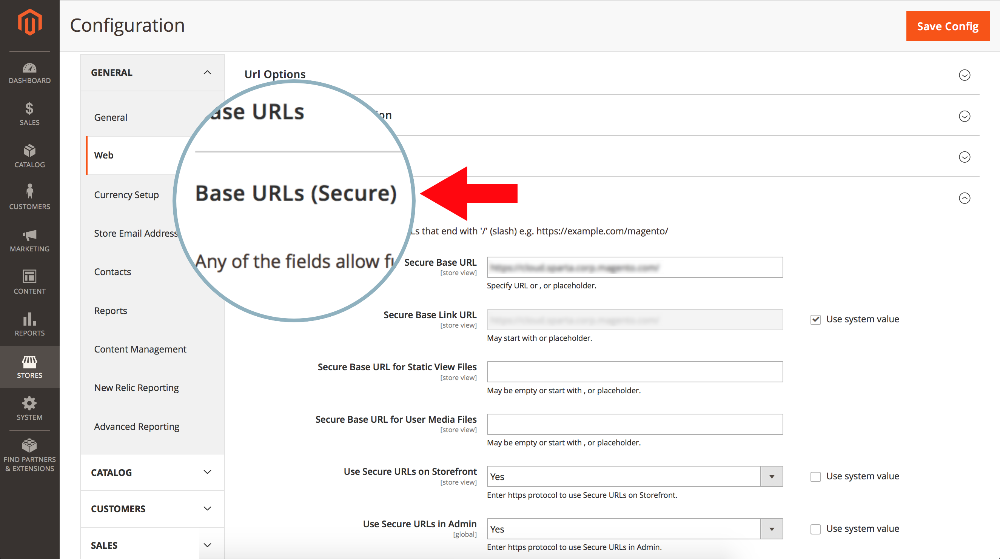
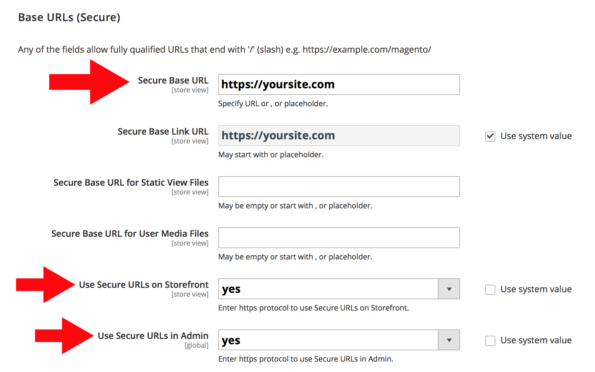
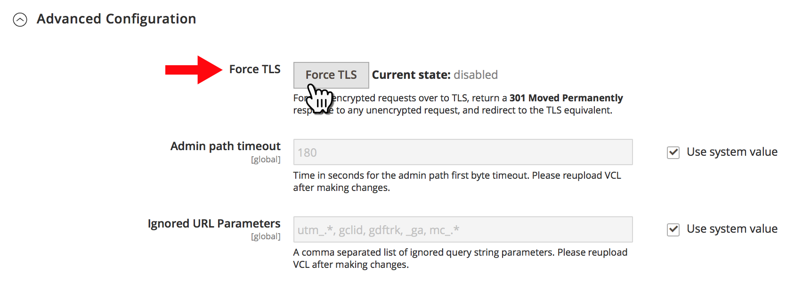
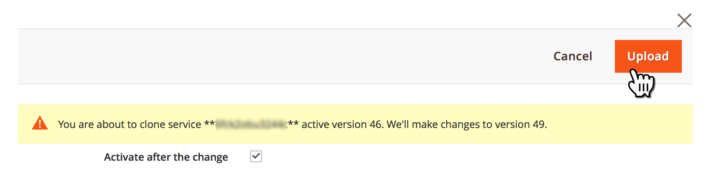
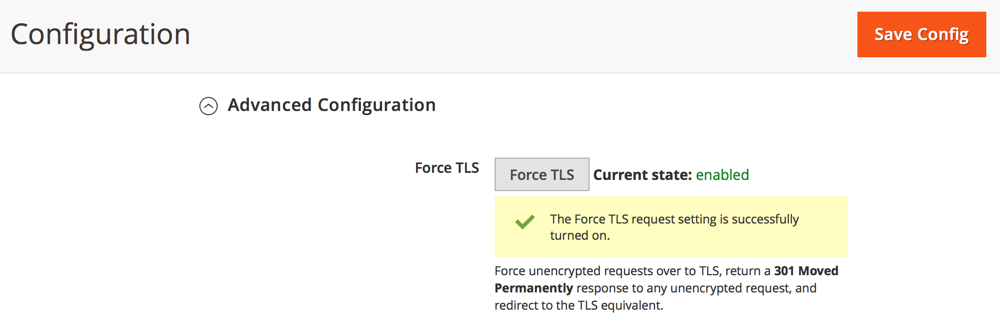

# 对于云基础架构上的Adobe Commerce上的所有页面，将HTTP重定向到HTTPS（强制TLS）

激活飞士地的 **强制TLS** Commerce管理员中的功能，可为云基础架构存储上的Adobe Commerce的所有页面启用全局HTTP到HTTPS重定向。

本文提供详细内容 [步骤](#steps)，快速概述强制TLS功能、受影响的版本和相关文档的链接。

## 步骤 {#steps}

### 步骤1：配置安全URL {#step-1-configure-secure-urls}

在此步骤中，我们为存储定义安全URL。 如果已经完成，请转到 [步骤2：启用强制TLS](#step-2-enable-force-tls).

1. 登录到Commerce管理员。
1. 导航到 **商店** > **配置** > **常规** > **Web**.
1. 展开 **基本URL（安全）** 部分。    
1. 在 **安全基础URL** 字段中，指定存储的HTTPS URL。
1. 设置 **在店面上使用安全URL** 和 **在管理员上使用安全URL** 设置到 **是**.    
1. 单击 **保存配置** 以应用更改。

**用户指南中的相关文档：**   [存储URL](https://docs.magento.com/m2/ee/user_guide/stores/store-urls.html).

### 步骤2：启用强制TLS {#step-2-enable-force-tls}

1. 在Commerce管理员中，导航到 **商店** > **配置** > **高级** > **系统**.
1. 展开 **全页缓存** 部分，然后 **Fastly配置**，则 **高级配置**.
1. 单击 **强制TLS** 按钮。    
1. 在显示的对话框中，单击 **上传**.    
1. 对话框关闭后，确保“强制TLS”的当前状态显示为 **已启用**.    

**相关Fastly文档：**   [强制TLS指南](https://github.com/fastly/fastly-magento2/blob/master/Documentation/Guides/FORCE-TLS.md) 适用于Adobe Commerce 2.

## 关于强制TLS

TLS（传输层安全性）是一种用于安全HTTP连接的协议，它取代了其不太安全的前置协议 — SSL（安全套接字层）协议。

Fastly的Force TLS功能允许您强制将网站页面的所有传入未加密请求发送给TLS。

>>
它的工作方式是返回 *301已永久移动* 对任何未加密请求的响应，它会重定向到等效的TLS。 例如，请求 *http://www.example.com/foo.jpeg* 将重定向到 *https://www.example.com/foo.jpeg*.

[保护通信安全](https://docs.fastly.com/guides/securing-communications/) （Fastly文档）

## 受影响的版本

* **云基础架构上的Adobe Commerce：**
   * 版本：2.1.4及更高版本
   * 计划：Adobe Commerce on cloud infrastructure入门计划架构和Adobe Commerce on cloud infrastructure Pro计划架构（包括Pro Legacy）
* **Fastly：** 1.2.4

## 路由不需要更改.yaml

要启用HTTP到HTTPS的重定向，请执行以下操作 **所有** 页面时，无需将页面添加到 `routes.yaml` 配置文件 — 为整个存储全局启用强制TLS(使用Commerce管理员)就足够了。

## 相关Fastly文档

* [适用于Adobe Commerce 2的Force TLS指南](https://github.com/fastly/fastly-magento2/blob/master/Documentation/Guides/FORCE-TLS.md)
* [强制TLS重定向](https://docs.fastly.com/guides/securing-communications/forcing-a-tls-redirect)
* [保护通信安全](https://docs.fastly.com/guides/securing-communications/)
