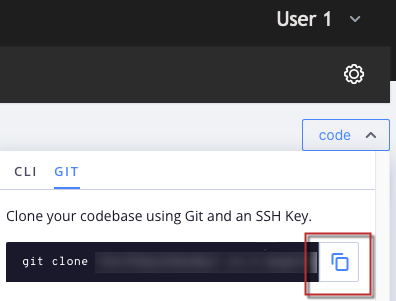
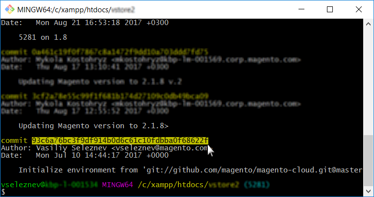

# 回滚没有云快照的环境

本文显示了两种解决方案，它们可以在云基础架构上回滚环境，而无需拍摄您的Adobe Commerce环境快照。

## 受影响的产品和版本

* 云基础架构上的Adobe Commerce， [所有受支持的版本](https://magento.com/sites/default/files/magento-software-lifecycle-policy.pdf)

选择最适合您的具体情况：

* 如果您具有稳定的内部版本，但没有有效的快照 —  [场景1：无快照，构建稳定（可用SSH连接）](#scen2).
* 如果内部版本已损坏，并且您没有有效的快照 —  [场景2：没有快照；构建中断（没有SSH连接）](#scen3).

## 场景1：无快照，构建稳定（可用SSH连接） {#scen2}

此部分说明如何在尚未创建快照但可以通过SSH访问环境时回滚环境。

步骤如下：

1. 禁用配置管理。
1. 卸载Adobe Commerce软件。
1. 重置Git分支。

执行这些步骤后：

* Adobe Commerce安装将返回到其Vanilla状态(数据库已恢复；删除了部署配置；目录位于 `var` 已清除)
* 您的Git分支将会重置为过去的所需状态

请阅读以下详细步骤：

### 步骤0（先决条件）：删除config.php以禁用配置管理 {#disable_config_management}

我们需要禁用配置管理，以便它不会在部署期间自动应用以前的配置设置。

要禁用配置管理，请确保 `/app/etc/` 目录不包含 `config.php` (适用于Adobe Commerce 2.4.x)或 `config.local.php` (适用于Adobe Commerce 2.1.x)文件。

要删除配置文件，请执行以下步骤：

1. [通过SSH连接到环境](https://experienceleague.adobe.com/docs/commerce-cloud-service/user-guide/develop/secure-connections.html).
1. 删除配置文件：
   * 对于Adobe Commerce 2.4：

   ```php
    rm app/etc/config.php
   ```

   * 对于Adobe Commerce 2.1：

   ```php
     rm app/etc/config.local.php
   ```

通过查看以下内容了解有关配置管理的更多信息：

* [减少云基础架构上Adobe Commerce的部署停机时间](/help/how-to/general/magento-cloud-reduce-deployment-downtime-with-configuration-management.md) 在我们的支持知识库中。
* [商店设置的配置管理](https://experienceleague.adobe.com/docs/commerce-cloud-service/user-guide/configure-store/store-settings.html) 在我们的开发人员文档中。

### 步骤1：使用setup：uninstall命令卸载Adobe Commerce软件 {#setup-uninstall}


卸载Adobe Commerce软件将删除并恢复数据库，删除部署配置，并清除以下目录 `var`.

审核 [卸载Adobe Commerce软件](https://experienceleague.adobe.com/docs/commerce-operations/installation-guide/tutorials/uninstall.html) 在我们的开发人员文档中。

要卸载Adobe Commerce软件，请执行以下步骤：

1. [通过SSH连接到环境](https://experienceleague.adobe.com/docs/commerce-cloud-service/user-guide/develop/secure-connections.html).
1. 执行 `setup:uninstall`：

   ```php
     php bin/magento setup:uninstall
   ```

1. 确认卸载。

将显示以下消息以确认卸载成功：

```php
[SUCCESS]: Magento uninstallation complete.
```

这意味着我们已将Adobe Commerce安装（包括DB）恢复到其正版(Vanilla)状态。

### 步骤2：重置Git分支 {#reset-git-branch}

通过Git重置，我们可以将代码还原到过去所需的状态。

1. 将环境克隆到本地开发环境。 您可以在Cloud Console中复制命令：    
1. 访问提交历史记录。 使用 `--reverse` 为了更加方便起见，请按相反顺序显示历史记录：

   ```git
     git log --reverse
   ```

1. 选择已完成的提交哈希。 要将代码重置为其真实状态(Vanilla)，请查找创建分支（环境）的第一次提交。    
1. 应用硬Git重置：

   ```git
     git reset --h <commit_hash>
   ```

1. 将更改推送到服务器：

   ```git
     git push --force <origin> <branch>
   ```

执行这些步骤后，将重置我们的Git分支，并清除整个Git更改日志。 最后一个git推送会触发重新部署，以应用所有更改并重新安装Adobe Commerce。

## 场景2：没有快照；构建中断（没有SSH连接） {#scen3}

本节说明如何在环境处于关键状态时回滚环境：部署过程无法成功构建工作应用程序，从而导致SSH连接不可用。

在这种情况下，您必须首先使用Git重置来恢复Adobe Commerce应用程序的工作状态，然后卸载Adobe Commerce软件（要删除并恢复数据库，删除部署配置等）。 该场景包含与场景1相同的步骤，但步骤顺序不同，并且还有一个额外的步骤 — 强制重新部署。 步骤如下：

[1.重置Git分支。](/help/how-to/general/reset-environment-on-cloud.md#reset-git-branch)

[2. 禁用配置管理。](/help/how-to/general/reset-environment-on-cloud.md#disable_config_management)

[3.卸载Adobe Commerce软件。](/help/how-to/general/reset-environment-on-cloud.md#setup-uninstall)

4个期间；强制重新部署。

执行这些步骤后，您的结果将与方案1中的结果相同。

### 步骤4：强制重新部署

进行提交（这可能是空提交，但我们不建议这样做）并将它推送到服务器以触发重新部署：

```git
git commit --allow-empty -m "<message>" && git push <origin> <branch>
```

## 如果安装：卸载失败，请手动重置数据库

如果执行 `setup:uninstall` 命令因错误而失败，无法完成，我们可以通过以下步骤手动清除数据库：

1. [通过SSH连接到环境](https://experienceleague.adobe.com/docs/commerce-cloud-service/user-guide/develop/secure-connections.html).
1. 连接到MySQL数据库：

   ```sql
   mysql -h database.internal
   ```

1. 放下 `main` 数据库：

   ```sql
   drop database main;
   ```

1. 创建空的 `main` 数据库：

   ```sql
   create database main;
   ```

1. 删除以下配置文件： `config.php`， `config.php` `.bak`， `env.php`、和 `env.php.bak`.

重置数据库后， [将git推送到环境以触发重新部署](https://experienceleague.adobe.com/docs/commerce-cloud-service/user-guide/dev-tools/cloud-cli.html#git-commands) 并将Adobe Commerce安装到新创建的数据库中。 或 [运行重新部署命令](https://experienceleague.adobe.com/docs/commerce-cloud-service/user-guide/dev-tools/cloud-cli.html#environment-commands).

## 相关阅读

在我们的开发人员文档中：

* [在云上恢复快照](https://experienceleague.adobe.com/en/docs/commerce-cloud-service/user-guide/develop/storage/snapshots#restore-a-manual-backup)
* [创建快照](https://experienceleague.adobe.com/en/docs/commerce-cloud-service/user-guide/develop/storage/snapshots#create-a-manual-backup)
* [快照和备份管理](https://experienceleague.adobe.com/en/docs/commerce-cloud-service/user-guide/develop/storage/snapshots)
* [使用Cloud Console管理分支 — 查看日志](https://experienceleague.adobe.com/docs/commerce-cloud-service/user-guide/project/console-branches.html?lang=en#view-logs)
* [组件部署失败](https://experienceleague.adobe.com/docs/commerce-cloud-service/user-guide/develop/deploy/recover-failed-deployment.html)
* [管理您的项目](https://experienceleague.adobe.com/docs/commerce-cloud-service/user-guide/project/overview.html#configure-the-project)
