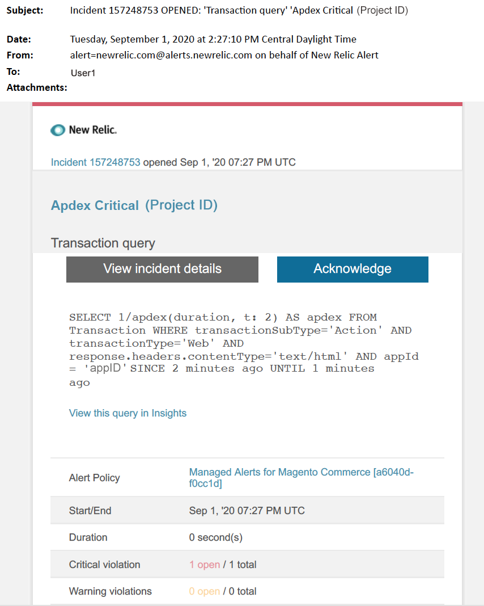

# Adobe Commerce的受管警报：Apdex严重警报

当您在New Relic中收到Adobe Commerce的Apdex严重警报时，本文介绍了故障排除步骤。 Apdex得分衡量用户对Web应用程序和服务的响应时间的满意度。 需要立即采取措施来解决问题。 根据您选择的警报通知渠道，警报将类似于以下内容。

{width="500"}

## 受影响的产品和版本

* Adobe Commerce on cloud infrastructure Pro计划架构
* 云基础架构上的Adobe Commerce入门计划架构

## 问题

如果您已注册，将在New Relic中收到托管警报 [Adobe Commerce的受管警报](/help/support-tools/managed-alerts-for-adobe-commerce/managed-alerts-for-magento-commerce.md) 以及一个或多个警报阈值已超出。 这些警报由Adobe开发，旨在通过支持和工程部门的分析为商家提供一套标准。

<u> **去吧！** </u>

* 中止任何计划的部署，直到清除此警报。
* 如果您的网站处于或完全无响应，请立即将网站置于维护模式。 有关步骤，请参阅 [安装指南>启用或禁用维护模式](https://devdocs.magento.com/guides/v2.4/install-gde/install/cli/install-cli-subcommands-maint.html?itm_source=devdocs&amp;itm_medium=search_page&amp;itm_campaign=federated_search&amp;itm_term=mainten) 在我们的开发人员文档中。 确保将您的IP添加到免除IP地址列表，以确保您仍然能够访问站点进行故障排除。 有关步骤，请参阅 [维护免除IP地址列表](https://devdocs.magento.com/guides/v2.4/install-gde/install/cli/install-cli-subcommands-maint.html?itm_source=devdocs&amp;itm_medium=search_page&amp;itm_campaign=federated_search&amp;itm_term=mainten#instgde-cli-maint-exempt) 在我们的开发人员文档中。

<u>**不要！**</u>

* 启动其他营销活动，这可能会给您的网站带来其他页面查看次数。
* 运行索引器或其他cron，这可能会在CPU或磁盘上造成额外压力。
* 执行任何主要管理任务(即Commerce管理员、数据导入/导出)。
* 清除缓存。

如果您尚未遇到站点中断，则在收到严重警报、尚未对警报原因进行故障排除之前，执行上述操作可能会导致您的站点无响应。

## 解决方案

按照以下步骤确定原因并排除故障。

>[!WARNING]
>
>由于这是严重警报，强烈建议您完成 **步骤1** 在尝试解决问题之前（从步骤2开始）。

1. 检查Adobe Commerce支持票证是否存在。 有关步骤，请参阅 [跟踪您的支持工单](/help/help-center-guide/help-center/magento-help-center-user-guide.md#track-tickets) 在我们的支持知识库中。 支持人员可能已收到New Relic阈值警报，创建了票证并开始处理此问题。 如果不存在票证，请创建一个。 票证应包含以下信息：
   * 联系原因：选择“已收到New Relic严重警报”。
   * 警报的说明。
   * [New Relic事件链接](https://docs.newrelic.com/docs/alerts-applied-intelligence/new-relic-alerts/alert-incidents/view-violation-event-details-incidents). 此内容包含在您的 [Adobe Commerce的受管警报](/help/support-tools/managed-alerts-for-adobe-commerce/managed-alerts-for-magento-commerce.md).
1. 要确定问题的根源，请使用 [New Relic APM的“交易”页](https://docs.newrelic.com/docs/apm/applications-menu/monitoring/transactions-page-find-specific-performance-problems) 要识别具有性能问题的事务处理，请执行以下操作：
   * 按升序Apdex分数对事务排序。 [Apdex](https://docs.newrelic.com/docs/apm/new-relic-apm/apdex/apdex-measure-user-satisfaction) 指用户对Web应用程序和服务的响应时间的满意度。 Apdex得分较低可能表示存在瓶颈（响应时间较长的事务处理）。 通常是数据库、 Redis或PHP。 有关步骤，请参阅New Relic [查看对Apdex满意度最高的交易记录](https://docs.newrelic.com/docs/apm/new-relic-apm/apdex/apdex-measure-user-satisfaction/#dissatisfaction).
   * 按最高吞吐量、最慢的平均响应时间、最耗时的阈值和其他阈值对事务进行排序。 有关步骤，请参阅New Relic [查找特定的性能问题](https://docs.newrelic.com/docs/apm/applications-menu/monitoring/transactions-page-find-specific-performance-problems). 如果您仍在努力找出问题，请使用New Relic APM的“基础架构”页面。
1. 使用 [New Relic APM的基础架构页面](https://docs.newrelic.com/docs/infrastructure/infrastructure-ui-pages/infra-hosts-ui-page/) 确定资源密集型流程。 有关步骤，请参阅New Relic [“基础结构监视主机”页>“进程”选项卡](https://docs.newrelic.com/docs/infrastructure/infrastructure-ui-pages/infra-hosts-ui-page/#processes).
1. 如果Redis或MySQL等服务是内存消耗的最大来源，请尝试以下操作：
   * 检查您是否使用最新版本。 较新版本有时可以修复内存泄漏。 如果您不是最新版本，请考虑升级。 有关步骤，请参阅 [适用于Adobe Commerce的Cloud >服务>更改服务](https://experienceleague.adobe.com/docs/commerce-cloud-service/user-guide/configure/service/services-yaml.html) 在我们的开发人员文档中。
   * 检查是否存在MySQL问题，如长时间运行的查询、未定义主键以及重复的索引。 有关步骤，请参阅 [Adobe Commerce中有关云基础架构的最常见数据库问题](https://experienceleague.adobe.com/docs/commerce-operations/implementation-playbook/best-practices/maintenance/resolve-database-performance-issues.html) 在我们的开发人员文档中。
   * 检查PHP问题。 通过运行复查正在运行的进程 `ps aufx` 在CLI/终端中。 在终端输出中，您将看到当前正在执行的cron作业和进程。 检查进程执行时间的输出。 如果存在执行时间较长的cron，则该cron可能会挂起。 有关疑难解答步骤，请参阅 [性能缓慢、运行速度缓慢且运行时间较长](/help/troubleshooting/miscellaneous/slow-performance-slow-and-long-running-crons.md) 和 [Cron作业停留在“正在运行”状态](/help/troubleshooting/miscellaneous/cron-job-is-stuck-in-running-status.md) 在我们的支持知识库中。

1. 确定源后，通过SSH进入环境以进一步调查。 有关步骤，请参阅 [Cloud for Adobe Commerce >技术和要求> SSH进入您的环境](https://devdocs.magento.com/cloud/env/environments-ssh.html#ssh) 在我们的开发人员文档中。
1. 如果您仍在努力确定源，请查看最新趋势，以确定最近的代码部署或配置更改（例如，新客户组和目录的大幅更改）中存在的问题。 建议您查看过去七天的活动，以了解代码部署或更改中的任何关联。
1. 如果您在合理的时间内找不到解决方案，请请求升级站点，或者将站点置于维护模式（如果尚未这么做）。 有关步骤，请参阅 [如何请求调整临时大小](/help/how-to/general/how-to-request-temporary-magento-upsize.md) 在我们的支持知识库中，以及 [安装指南>启用或禁用维护模式](https://devdocs.magento.com/guides/v2.4/install-gde/install/cli/install-cli-subcommands-maint.html?itm_source=devdocs&amp;itm_medium=search_page&amp;itm_campaign=federated_search&amp;itm_term=mainten) 在我们的开发人员文档中。
1. 如果Upsize使站点恢复正常运营，请考虑请求永久升级(联系您的Adobe客户团队)，或尝试通过运行负载测试和优化查询或在专用暂存中重现问题，或尝试运行降低服务压力的代码。 请参阅 [Cloud for Adobe Commerce >测试部署>负载和压力测试](https://devdocs.magento.com/cloud/live/stage-prod-test.html#loadtest) 在我们的开发人员文档中。
