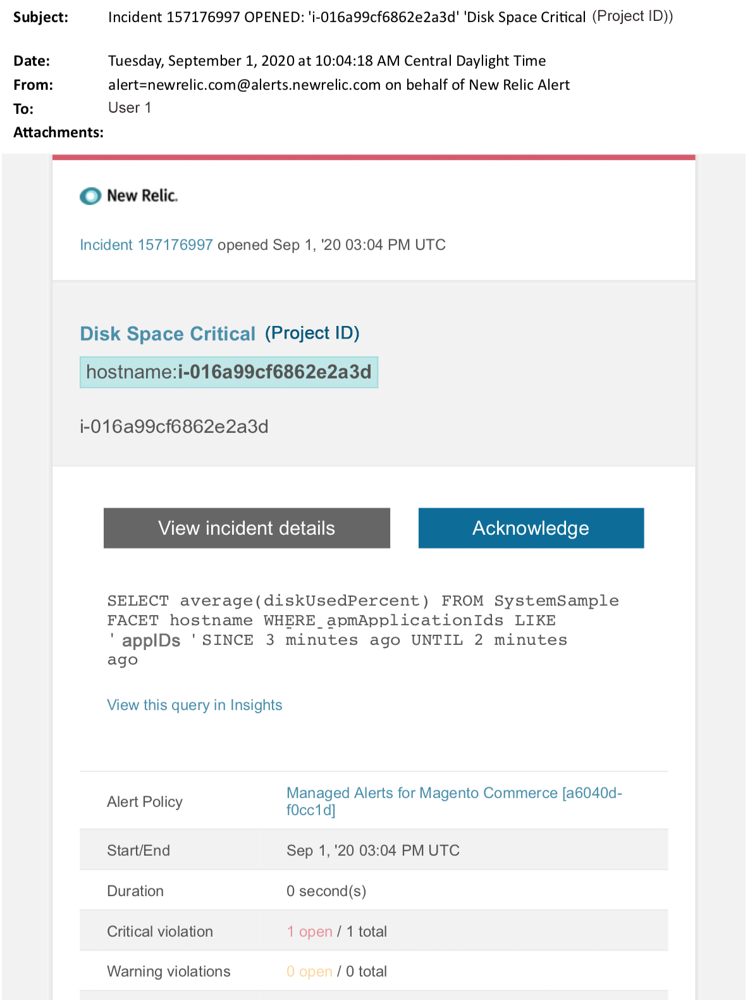

# Adobe Commerce的受管警报：磁盘严重警报

当您在New Relic中收到Adobe Commerce的关键磁盘警报时，本文提供了故障排除步骤。 需要立即采取措施来解决问题。 根据您选择的警报通知渠道，警报将类似于以下内容。

{width="500"}

## 受影响的产品和版本

专业计划架构上的Adobe Commerce云基础架构

## 问题

如果您已注册，将在New Relic中收到通知 [Adobe Commerce的受管警报](/help/support-tools/managed-alerts-for-adobe-commerce/managed-alerts-for-magento-commerce.md) 以及一个或多个警报阈值已超出。 这些警报由Adobe开发，旨在通过支持和工程部门的分析为客户提供一组标准。

<u> **去吧！** </u>

* 中止任何计划的部署，直到清除此警报。
* 如果您的网站处于或完全无响应，请立即将网站置于维护模式。 有关步骤，请参阅 [安装指南>启用或禁用维护模式](https://devdocs.magento.com/guides/v2.4/install-gde/install/cli/install-cli-subcommands-maint.html?itm_source=devdocs&amp;itm_medium=search_page&amp;itm_campaign=federated_search&amp;itm_term=mainten) . 确保将您的IP添加到免除IP地址列表，以确保您仍然能够访问站点进行故障排除。 有关步骤，请参阅 [维护免除IP地址列表](https://devdocs.magento.com/guides/v2.4/install-gde/install/cli/install-cli-subcommands-maint.html?itm_source=devdocs&amp;itm_medium=search_page&amp;itm_campaign=federated_search&amp;itm_term=mainten#instgde-cli-maint-exempt).

**不要！**

* 启动其他营销活动，这可能会给您的网站带来其他页面查看次数。
* 运行索引器或其他cron，这可能会在CPU或磁盘上造成额外压力。
* 执行任何主要管理任务(即Commerce管理、数据导入/导出)。
* 清除缓存。

如果您在调查并解决警报原因之前执行了任何“不响应”操作，则您的网站可能会变得无响应（如果您尚未经历网站中断）。

## 解决方案

按照以下步骤确定原因并排除故障。

>[!WARNING]
>
>由于这是严重警报，强烈建议您完成 **步骤1** 在尝试解决问题之前（从步骤2开始）。

1. 检查Adobe Commerce支持票证是否存在。 有关步骤，请参阅 [跟踪您的支持工单](/help/help-center-guide/help-center/magento-help-center-user-guide.md#track-tickets) 在我们的支持知识库中。 支持人员可能已收到New Relic阈值警报，创建了票证并开始处理此问题。 如果不存在票证，请创建一个。 票证应包含以下信息：
   * 联系原因：选择“已收到New Relic严重警报”。
   * 警报的说明。
   * [New Relic事件链接](https://docs.newrelic.com/docs/alerts-applied-intelligence/new-relic-alerts/alert-incidents/view-violation-event-details-incidents). 此内容包含在您的 [Adobe Commerce的受管警报](/help/support-tools/managed-alerts-for-adobe-commerce/managed-alerts-for-magento-commerce.md).
1. 在New Relic中，查看磁盘以获得最高利用率。 有关步骤，请参阅New Relic上的“存储”选项卡 [“基础结构监视主机”页：](https://docs.newrelic.com/docs/infrastructure/infrastructure-ui-pages/infra-hosts-ui-page/#storage)
   * 如果您在New Relic中看到磁盘使用率的增长缓慢，请尝试以下选项：
   * 通过调整空间分配优化磁盘空间。 有关步骤，请参阅 [管理磁盘空间](https://experienceleague.adobe.com/docs/commerce-cloud-service/user-guide/develop/storage/manage-disk-space.html) 在我们的开发人员文档中。 您可能还需要请求更多磁盘空间(请与您的Adobe帐户团队联系)。
   * 清除MySQL的磁盘空间。 请参阅 [MySQL磁盘空间不足](/help/troubleshooting/database/mysql-disk-space-is-low-on-magento-commerce-cloud.md) 支持知识库中提供的步骤。
   * 如果New Relic显示磁盘使用率快速增加，这可能表示存在导致目录中文件快速增加的问题。 执行以下检查：
1. 在CLI/终端中运行以下命令，检查整体磁盘空间以识别问题： `df -h`
1. 在发现目录异常大且磁盘使用量不断增加后，您需要检查受影响的文件系统。 以下示例说明如何检查文件目录 `pub/media/`. 这是Commerce用于存储日志和大型媒体文件的目录。 但是，您应该对显示意外磁盘使用情况的任何目录运行此命令： `du -sch ~/pub/media/*`

如果终端的输出显示其中某个目录中的文件在磁盘使用量中迅速增加，并且您知道不需要该文件内容，请考虑删除该文件。 如果你不乐意采取这种行动， [提交Adobe Commerce支持票证](/help/help-center-guide/help-center/magento-help-center-user-guide.md#submit-ticket).
