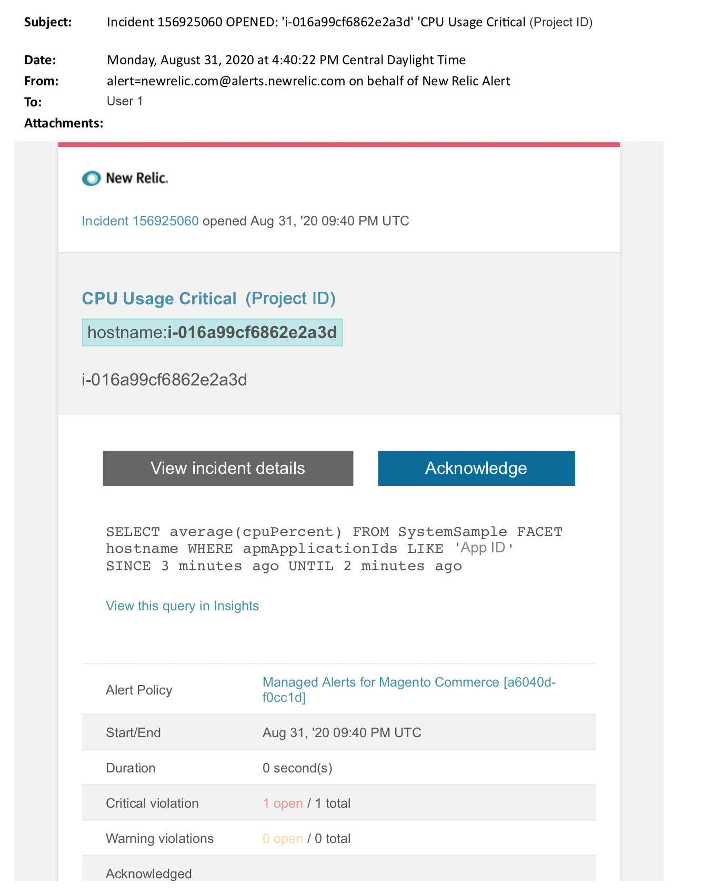

# Adobe Commerce上的托管警报：CPU严重警报

本文提供了在New Relic中收到Adobe Commerce的CPU严重警报时的故障排除步骤。 需要立即采取措施来解决问题。 根据您选择的警报通知渠道，警报将类似于以下内容。

{width="500"}

## 受影响的产品和版本

Adobe Commerce on cloud infrastructure Pro计划架构

## 问题

如果您已注册，将在New Relic中收到托管警报 [Adobe Commerce的受管警报](/help/support-tools/managed-alerts-for-adobe-commerce/managed-alerts-for-magento-commerce.md) 以及一个或多个警报阈值已超出。 这些警报由Adobe Commerce开发，旨在通过支持和工程部门的分析为客户提供一组标准。

<u>**去吧！**</u>：

* 中止任何计划的部署，直到清除此警报。
* 如果您的网站处于或完全无响应，请立即将网站置于维护模式。 有关步骤，请参阅 [安装指南>启用或禁用维护模式](https://devdocs.magento.com/guides/v2.4/install-gde/install/cli/install-cli-subcommands-maint.html?itm_source=devdocs&amp;itm_medium=search_page&amp;itm_campaign=federated_search&amp;itm_term=mainten) 在我们的开发人员文档中。 确保将您的IP添加到免除IP地址列表，以确保您仍然能够访问站点进行故障排除。 有关步骤，请参阅 [维护免除IP地址列表](https://devdocs.magento.com/guides/v2.4/install-gde/install/cli/install-cli-subcommands-maint.html?itm_source=devdocs&amp;itm_medium=search_page&amp;itm_campaign=federated_search&amp;itm_term=mainten#instgde-cli-maint-exempt) 在我们的开发人员文档中。

<u>**不要！**</u>：

* 启动其他营销活动，这可能会给您的网站带来其他页面查看次数。
* 运行索引器或其他cron，这可能会对CPU或磁盘造成额外压力。
* 执行任何主要管理任务(即Commerce管理员、数据导入/导出)。
* 清除缓存。

如果您在调查并解决警报原因之前执行了任何“不响应”操作，则您的网站可能会变得无响应（如果您尚未经历网站中断）。

## 解决方案

按照以下步骤确定原因并排除故障。

>[!WARNING]
>
>由于这是严重警报，强烈建议您完成 **步骤1** 在尝试解决问题之前（从步骤2开始）。

检查Adobe Commerce支持工单是否存在。 有关步骤，请参阅 [跟踪您的支持工单](/help/help-center-guide/help-center/magento-help-center-user-guide.md#track-tickets) 在我们的支持知识库中。 支持人员可能已收到New Relic阈值警报，创建了票证，并开始处理此问题。 如果不存在票证，请创建一个。 票证应包含以下信息：

1. 联系原因：选择“已收到New Relic严重警报”。
1. 警报的说明。
1. [New Relic事件链接](https://docs.newrelic.com/docs/alerts-applied-intelligence/new-relic-alerts/alert-incidents/view-violation-event-details-incidents). 此内容包含在您的 [Adobe Commerce的受管警报](/help/support-tools/managed-alerts-for-adobe-commerce/managed-alerts-for-magento-commerce.md).
1. 使用 [New Relic APM的“交易”页](https://docs.newrelic.com/docs/apm/applications-menu/monitoring/transactions-page-find-specific-performance-problems) 要识别具有性能问题的事务处理，请执行以下操作：
   * 按升序Apdex分数对事务排序。 [Apdex](https://docs.newrelic.com/docs/apm/new-relic-apm/apdex/apdex-measure-user-satisfaction) 指用户对Web应用程序和服务的响应时间的满意度。 A [Apdex得分低](/help/support-tools/managed-alerts-for-adobe-commerce/managed-alerts-for-magento-commerce-apdex-warning-alert.md) 可以指示瓶颈（响应时间较长的事务处理）。 通常，它与数据库、 Redis或PHP有关。 有关步骤，请参阅New Relic [查看对Apdex满意度最高的交易记录](https://docs.newrelic.com/docs/apm/new-relic-apm/apdex/view-your-apdex-score#apdex-dissat).
   * 按最高吞吐量、最慢的平均响应时间、最耗时的阈值和其他阈值对事务进行排序。 有关步骤，请参阅New Relic [查找特定的性能问题](https://docs.newrelic.com/docs/apm/applications-menu/monitoring/transactions-page-find-specific-performance-problems).
1. 如果您仍在努力识别源，请使用 [New Relic APM的基础架构页面](https://docs.newrelic.com/docs/infrastructure/infrastructure-ui-pages/infra-hosts-ui-page) 确定资源密集型服务。 有关步骤，请参阅New Relic [“基础结构监视主机”页>“进程”选项卡](https://docs.newrelic.com/docs/infrastructure/infrastructure-ui-pages/infra-hosts-ui-page/#processes).
1. 如果标识了源，请通过SSH连接到环境以进一步调查。 有关步骤，请参阅 [在云基础架构上将Adobe Commerce的SSH连接到您的环境](https://experienceleague.adobe.com/docs/commerce-cloud-service/user-guide/develop/secure-connections.html) 在我们的开发人员文档中。
1. 如果你还在努力找出问题的根源：
   * 查看最近的趋势，以确定最近的代码部署或配置更改（例如，新客户组和目录的大幅更改）中存在的问题。 建议您查看过去七天的活动，以了解代码部署或更改中的任何关联。
   * 考虑检查和禁用平面目录。 有关步骤，请参阅 [性能缓慢、运行速度缓慢且运行时间较长](/help/troubleshooting/miscellaneous/slow-performance-slow-and-long-running-crons.md) 在我们的支持知识库中。
   * 如果您怀疑正在遭受DDoS攻击，请尝试阻止机器人流量。 有关步骤，请参阅 [如何阻止Adobe Commerce在Fastly级别的云基础架构上的恶意流量](/help/how-to/general/block-malicious-traffic-for-magento-commerce-on-fastly-level.md) 在我们的支持知识库中。
1. 如果问题看起来是暂时性的，请执行缓解步骤（如升级）或将站点置于维护模式。 有关步骤，请参阅 [如何请求调整临时大小](/help/how-to/general/how-to-request-temporary-magento-upsize.md) 在我们的支持知识库和 [安装指南>启用或禁用维护模式](https://devdocs.magento.com/guides/v2.4/install-gde/install/cli/install-cli-subcommands-maint.html?itm_source=devdocs&amp;itm_medium=search_page&amp;itm_campaign=federated_search&amp;itm_term=mainten) 在我们的开发人员文档中。 如果Upsize使站点恢复正常运营，请考虑请求永久升级(联系您的Adobe客户团队)，或尝试通过运行负载测试并优化查询或降低服务压力的代码在专用暂存中重现问题。 有关步骤，请参阅 [测试部署>负载和压力测试](https://devdocs.magento.com/cloud/live/stage-prod-test.html#loadtest) 在我们的Adobe Commerce on cloud infrastructure开发人员文档中。
