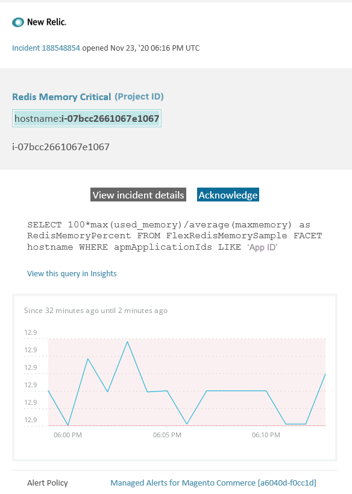

# Adobe Commerce上的托管警报：Redis内存严重警报

本文提供了在New Relic中收到Adobe Commerce的Redis内存严重警报时的故障排除步骤。 需要立即采取措施来解决问题。 根据您选择的警报通知渠道，警报将类似于以下内容。



## 受影响的产品和版本

云基础架构上所有版本的Adobe Commerce Pro规划架构

## 问题

如果您已注册，将在New Relic中收到通知 [Adobe Commerce的受管警报](/help/support-tools/managed-alerts-for-adobe-commerce/managed-alerts-for-magento-commerce.md) 以及一个或多个警报阈值已超出。 这些警报由Adobe开发，旨在通过支持和工程部门的分析为商家提供一组标准警报。

**<u>去吧！</u>**

* 中止任何计划的部署，直到清除此警报。
* 如果您的网站处于或完全无响应，请立即将网站置于维护模式。 有关步骤，请参阅 [安装指南>启用或禁用维护模式](/docs/commerce-operations/installation-guide/tutorials/maintenance-mode.html#enable-or-disable-maintenance-mode-1) 安装指南中的。 确保将您的IP添加到免除IP地址列表，以确保您仍然能够访问站点进行故障排除。 有关步骤，请参阅 [维护免除IP地址列表](/docs/commerce-operations/installation-guide/tutorials/maintenance-mode.html#maintain-the-list-of-exempt-ip-addresses) 安装指南中的。

**<u>不要！</u>**

* 启动其他营销活动，这可能会给您的网站带来其他页面查看次数。
* 运行索引器或其他cron，这可能会在CPU或磁盘上造成额外压力。
* 执行任何主要管理任务(即Commerce管理员中的主要操作，例如数据导入/导出、刷新媒体、保存具有大量已分配产品的类别以及批量更新)。
* 清除缓存。

## 解决方案

按照以下步骤确定原因并排除故障。

**由于这是一个严重警报，强烈建议您在尝试排查问题（从步骤2开始）之前完成步骤1。**

1. 检查Adobe Commerce支持票证是否存在。 有关步骤，请参阅 [跟踪您的支持工单](/help/help-center-guide/help-center/magento-help-center-user-guide.md#track-tickets) 在我们的支持知识库中。 支持人员可能已经收到New Relic阈值警报，创建了票证并开始处理此问题。 如果不存在票证，请创建一个。 票证应包含以下信息：

   * 联系原因：选择“已收到New Relic严重警报”。
   * 警报的说明。
   * [New Relic事件链接](https://docs.newrelic.com/docs/alerts-applied-intelligence/new-relic-alerts/alert-incidents/view-violation-event-details-incidents/). 此内容包含在您的 [Adobe Commerce的受管警报](/help/support-tools/managed-alerts-for-adobe-commerce/managed-alerts-for-magento-commerce.md).

1. 如果不存在支持票证，请转至，检查“Redis Used Memory（已用红色内存）”是增加还是减少 [one.newrelic.com](https://login.newrelic.com) > **基础架构** > **第三方服务** 页面上，选择Redis功能板。 如果它稳定或增加， [提交支持服务单](/help/help-center-guide/help-center/magento-help-center-user-guide.md#submit-ticket) 升级群集，或增加 `maxmemory` 限制到下一级别。
1. 如果您无法确定Redis内存消耗增加的原因，请查看近期趋势以确定近期代码部署或配置更改（例如，新客户组和目录的大幅更改）中存在的问题。 建议您查看过去七天的活动，以了解代码部署或更改中的任何关联。
1. 检查第三方扩展是否存在行为不端：

   * 请尝试查找与最近安装的第三方扩展以及问题开始时间的关联。
   * 查看可能影响Adobe Commerce缓存并导致缓存快速增长的扩展。 例如，自定义布局块、覆盖缓存功能以及在缓存中存储大量数据。

1. 如果没有证据证明延伸部分行为不端， [安装最新修补程序以修复云基础架构上Adobe Commerce的Redis问题](/help/troubleshooting/miscellaneous/install-latest-patches-to-fix-magento-redis-issues.md).
1. 如果上述步骤不能帮助您识别或排除问题的根源，请考虑启用L2缓存以减少应用程序与Redis之间的网络流量。 有关二级高速缓存的一般信息，请参阅 [Adobe Commerce应用程序中的L2缓存](/docs/commerce-operations/configuration-guide/cache/level-two-cache.html) 在我们的开发人员文档中。 要为云基础架构启用二级缓存，请尝试以下操作：

   * 如果版本低于2002.1.2，请升级ECE工具。
   * 使用配置L2缓存 [使用REDIS\_BACKEND变量](/docs/commerce-cloud-service/user-guide/configure/env/stage/variables-deploy.html#redis_backend) 和更新 `.magento.env.yaml` 文件：

   ```yaml
   stage:
       deploy:
           REDIS_BACKEND: '\Magento\Framework\Cache\Backend\RemoteSynchronizedCache'
   ```
