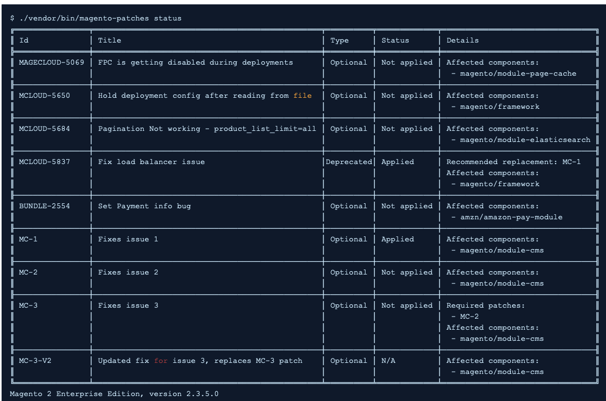

# 使用Quality Patches Tool检查Adobe Commerce问题的修补程序

本文概述了Quality Patches Tool (QPT) ，并提供了资源链接，这些资源说明了如何使用QPT。

## 受影响的产品和版本

* Adobe Commerce内部部署，所有 [支持的版本](https://magento.com/sites/default/files/magento-software-lifecycle-policy.pdf)
* 云基础架构上的Adobe Commerce，全部 [支持的版本](https://magento.com/sites/default/files/magento-software-lifecycle-policy.pdf)

## 什么是质量修补程序工具

此 [Quality Patches工具](https://github.com/magento/quality-patches) (QPT)是由Adobe和Magento Open Source群体开发的各个补丁。

它允许您：

* 将优质补丁程序应用到包
* 还原以前应用的修补程序
* 查看有关适用于已安装的Adobe Commerce版本的质量修补程序的一般信息。

下面是状态表的示例，您可以获得该表以查看可用的修补程序：

该工具旨在让您能够自助提供修补程序，以解决在Adobe Commerce中可能遇到的问题，或轻松应用Adobe Commerce支持人员建议的修补程序。

>[!NOTE]
>
>QPT仅适用于高质量的修补程序。 安全修补程序可在 [Magento安全中心](https://magento.com/security/patches).

## Quality Patches Tool中提供的修补程序

请参阅 [Quality Patches工具](https://devdocs.magento.com/quality-patches/tool.html#patch-grid) ，以获取可用修补程序的列表。

## 如何安装和使用Quality Patches工具

对于云基础架构上的Adobe Commerce内部部署和Adobe Commerce，安装和使用命令有所不同，因为对于云，QPT包包含在ece-tools包中。

### 如何在Adobe Commerce内部部署安装和使用QPT

请参阅 [软件更新指南>修补](https://devdocs.magento.com/guides/v2.4/comp-mgr/patching/mqp.html) ，以了解有关如何安装和使用QPT来应用和还原修补程序的详细信息。

### 如何在云基础架构上安装和使用QPT for Adobe Commerce

请参阅 [适用于Adobe Commerce的Cloud >应用修补程序](https://devdocs.magento.com/cloud/project/project-patch.html) 请参阅我们的开发人员文档，详细了解如何安装和使用QPT在云基础架构上的Adobe Commerce上应用和还原修补程序。

## 相关阅读

* [质量修补程序工具发行说明](https://devdocs.magento.com/quality-patches/release-notes.html) 在我们的开发人员文档中。
* [如何应用Adobe提供的编辑器修补程序](/help/how-to/general/how-to-apply-a-composer-patch-provided-by-magento.md) 在我们的支持知识库中。
