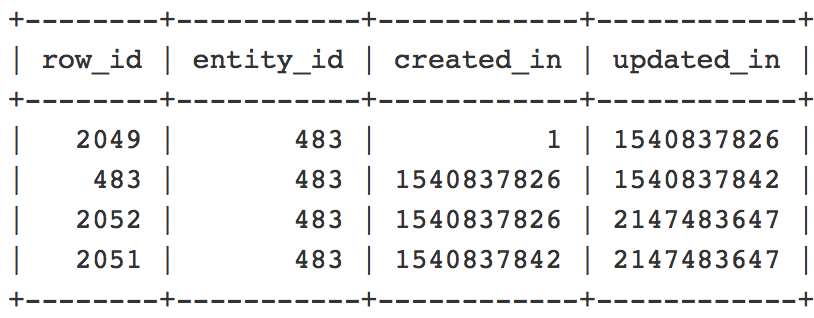

# 同一实体的数据库中的多行

本文为数据库中的同一实体ID存在多行问题提供了解决方案。

## 受影响的产品和版本：

* Adobe Commerce（所有版本）

## 问题

数据库中同一实体ID有多个行。

例如，在运行此查询时收到具有重复实体ID的记录列表后：

```
SELECT * FROM $entityTable WHERE $column = <$entityID> ORDER BY created_in;
```

位置 `$entityID = ID` 类别/产品/购物车价格规则/目录价格规则/CMS页面的。

| 实体 | $entityTable | $column |
|------------------|-----------------------------------|------------------|
| 类别/产品 | catalog_category_entity/catalog_product_entity | entity_id |
| 购物车价格规则/目录价格规则 | salesrule/catalogrule | rule_id |
| CMS页面 | cms_page | page_id |

## 原因

这是预期行为。 多行由内容暂存功能创建：

* 如果指定的开始日期没有结束日期，则至少有两行具有相同的实体/规则/页面ID。 一行将指示实体的原始状态(其中的 `created_in=1`)，有一行表示 *计划更新结束*.

* 如果指定了带有结束日期的开始日期，则至少会有三行具有相同的实体/规则/页面ID。 一行将指示实体的原始状态(其中的 `created_in=1`)，一行将用于 *计划更新的开始*，其中一行将用于 *计划更新结束*.

例如，在此查询中：

```
SELECT row_id, entity_id, created_in, updated_in FROM catalog_product_entity WHERE entity_id = 483 ORDER BY created_in;
```



* 此 `created_in` 和 `updated_in` 值应遵循以下模式： `created_in` 当前行的值等于 `updated_in` 值。 此外，第一行应包含 `created_in = 1` 最后一行应包含 `updated_in = 2147483647`. (如果只有一行，则必须看到 `created_in=1` 和 `updated_in=2147483647`)。

### 为什么第二个数据库条目（以及所有后续条目）会出现在同一实体的数据库中？

* 受影响实体的第二个DB记录（可能还有后续记录）意味着已使用计划了内容暂存更新 `Magento_Staging` 模块，用于对相应表中的实体进行附加记录。

仅当记录的值相同时，才会出现问题 `created_in` 或 `updated_in` 列。

## 解决方案

这是预期行为，仅当行之间存在差异时，才会导致出现问题。

## 相关阅读

* [未保存对类别所做的更改](https://experienceleague.adobe.com/docs/commerce-knowledge-base/kb/troubleshooting/miscellaneous/changes-to-categories-are-not-being-saved.html) 在我们的支持知识库中。
* [编辑计划更新的结束日期后，目录表中出现重复条目](https://experienceleague.adobe.com/docs/commerce-knowledge-base/kb/troubleshooting/known-issues-patches-attached/duplicate-entries-in-the-catalogrule-table-after-editing-the-end-date-of-a-schedule-update.html) 在我们的支持知识库中。
