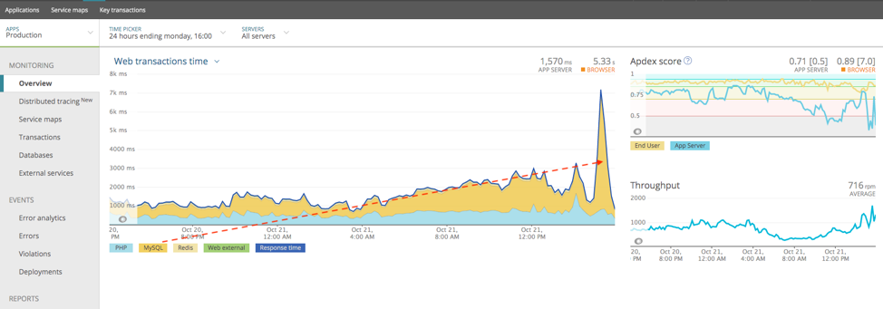
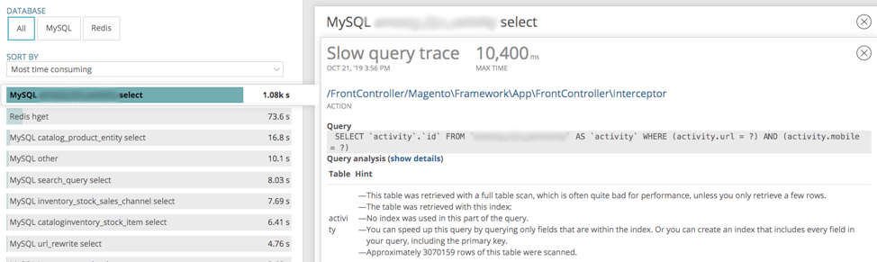
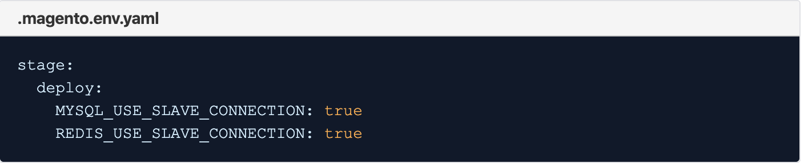

# 云基础架构上Adobe Commerce中的MySQL高负载瓶颈

本主题讨论当MySQL的高负载导致Adobe Commerce在云基础架构上出现性能瓶颈问题的解决方案。

## 受影响的产品和版本

* Adobe Commerce on cloud infrastructure 2.x.x，Pro客户。

### 先决条件

* ECE工具版本2002.0.16及更高版本
* New Relic APM服务(**您的Adobe Commerce on cloud infrastructure帐户包含用于New Relic APM服务的软件** 以及许可证密钥。)

有关New Relic APM服务及其在Adobe Commerce on cloud infrastructure帐户中的设置的更多信息，请访问 [New Relic服务](https://devdocs.magento.com/guides/v2.3/cloud/project/new-relic.html) 和 [New Relic APM简介](https://docs.newrelic.com/docs/apm/new-relic-apm/getting-started/introduction-apm/).

## 问题

<u>查看问题是否影响您的步骤</u>

1. 在New Relic APM概述图表中，检查MySQL是否已变成瓶颈的第一个迹象。 请参阅下面的示例图片，其中MySQL已成为瓶颈，占用了大部分Web事务时间：

   

   请注意图像中的红色虚线如何显示MySQL Web事务时间的明显上升趋势，然后在更高的级别达到峰值。
1. 从此处，您可以转到 **数据库** 可在其中看到高吞吐量或慢吞吐量的第二个指示的屏幕 `SELECT` MySQL中的查询，在以下示例图像中，排序依据时您可以看到 **最耗时**，您的商店（在本例中）运行缓慢。 `SELECT` MySQL查询。

   

在New Relic APM中分析慢速事务。 如果您在MySQL数据库上看到大量查询或压力很大，可以通过启用将负载分散到不同的节点 `SLAVE` 连接。

## 原因

您的云基础架构存储上的Adobe Commerce具有高吞吐量或速度较慢 `SELECT` MySQL查询。

## 解决方案

>[!WARNING]
>
>对于缩放架构（拆分架构），Redis从连接 **不应该** 已启用。 您可以通过转到项目URL来检查您是否采用缩放的架构，例如 `https://console.adobecommerce.com/<owner-user-name>/<project-ID>/<environment-name>`. 单击 **[!UICONTROL SSH]**. 如果存在三个以上的节点，则表示您使用的是可扩展的架构。 如果在缩放的体系结构上启用Redis从属读取，则客户将在无法连接的Redis连接上收到错误。 这与群集如何配置为处理Redis连接有关。 Redis Slaves仍处于活动状态，但不会用于Redis Reads。 我们建议对扩展架构使用Adobe Commerce 2.3.5或更高版本，并实施新的Redis后端配置并为Redis实施L2缓存。

如果遇到这两个指示，启用 `SLAVE` MySQL数据库和Redis的连接有助于将负载分散到不同的节点。

Adobe Commerce可以异步读取多个数据库或Redis。 正在更新 `.magento.env.yaml` 文件（通过将设置为） `true` 值 `MYSQL_USE_SLAVE_CONNECTION` 和 `REDIS_USE_SLAVE_CONNECTION` 使用 **只读** 连接到数据库以在非主节点上接收只读通信。 这通过负载平衡提高了性能，因为只有一个节点需要处理读写通信。 设置为 `false` 要从 `env.php` 文件。

### 步骤

1. 编辑您的 `.magento.env.yaml` 文件，并添加以下内容：

   

   欲知更多详情，请参阅 [在DevDocs中部署变量](https://devdocs.magento.com/cloud/env/variables-deploy.html#mysql_use_slave_connection).

1. 提交更改并推送更改。
1. 推送更改将启动新的部署过程。 成功完成部署后，您应该将云基础架构实例上的Adobe Commerce配置为使用从属连接。

## 常见问题

以下是当您考虑在云基础架构存储上为Adobe Commerce使用从连接功能时可能问到的常见问题。

* 使用从属连接是否存在任何已知问题或限制？ **使用从属连接时，我们没有任何已知问题。 只需确保您使用的是最新更新的ece-tools包。 此处提供了相关说明 [如何更新ece-tools包](https://devdocs.magento.com/cloud/project/ece-tools-update.html).**
* 使用从属连接时是否会有额外的延迟？ *是的，如果实例未过载并且可能承担整个负载，则跨可用区(cross-Availability Zones)延迟会更高，并且会降低Adobe Commerce在云基础架构实例上的性能。 但显然，如果实例过载，则主从节点将负载分散到MySQL数据库或Redis上，从而有助于提高性能。*

  **在非重载群集上** -  **从连接将降低10-15%的性能**，这是不默认的原因之一。

  *但在负载过重的群集上，性能会提高，因为通过流量减少负载可以缓解这10-15%的负载。*
* 我应该为我的商店启用这些设置吗？ *如果MySQL数据库或Redis负载高或预期负载高，则绝对需要启用从属连接。 对于具有平均流量的常规客户，此参数为&#x200B;**非**要启用的最佳设置。*

## 相关阅读

在我们的开发人员文档中：

* [部署变量](https://devdocs.magento.com/cloud/env/variables-deploy.html).
* [设置可选数据库复制](https://devdocs.magento.com/guides/v2.3/config-guide/multi-master/multi-master_slavedb.html).
* [ece-tools包](https://devdocs.magento.com/cloud/reference/ece-tools-reference.html).

>[!NOTE]
>
>我们知道，本文可能仍然包含行业标准的软件术语，有些人可能会认为这些术语具有种族主义、性别歧视或压迫性，并且可能会使读者感到伤害、创伤或不受欢迎。 Adobe正在努力从我们的代码、文档和用户体验中删除这些术语。
