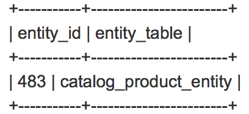
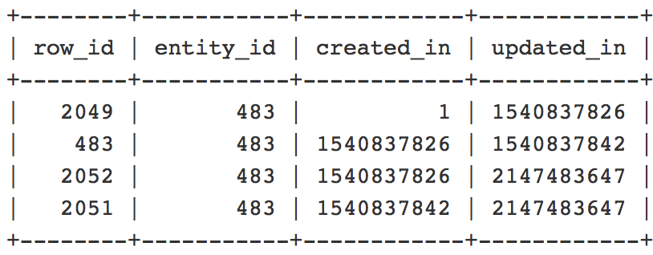

# 编辑计划更新的结束日期后，目录表中出现重复条目

本文为已知的Adobe Commerce 2.2.3问题提供了一个修补程序，在该问题中，编辑目录价格规则计划更新的结束日期或时间会导致将重复条目添加到 `catalogrule` 表和中的错误 `catalogrule_rule` （目录规则产品）索引器重新索引。

## 问题

当您更改现有目录价格规则计划更新的终止日期或时间时，系统会在以下位置创建重复条目： `catalogrule` 数据库表。 因此， `catalogrule_rule` 重新索引失败，异常日志中出现以下错误： *已存在具有相同ID的项目*.

<u>重现问题的步骤</u>：

先决条件： `catalogrule_rule` 索引器设置为 *[按计划更新](https://experienceleague.adobe.com/docs/commerce-operations/implementation-playbook/best-practices/maintenance/indexer-configuration.html)* 模式。

1. 在Commerce管理员中，通过以下方式创建新的目录价格规则： **营销** > **促销活动** > **目录价格规则**.
1. 在 **目录价格规则** 网格，单击 **编辑**，并计划新的更新和设置 **状态** 到 *活动。*
1. 单击 **查看/编辑** ，然后将结束日期更改为更早的时间。
1. 保存更新。
1. 运行reindex命令 `catalogrule_rule` 索引器。

<u>预期结果</u>：

此 `catalogrule_rule` 索引器已成功重新索引。 中无重复条目 `catalogrule` 表格。

<u>实际结果</u>：

重新索引失败，出现以下错误： *已存在具有相同ID的项目*，因为中存在重复条目 `catalogrule` 表格。

## 解决方案

要解决此问题，您需要应用附加的修补程序并删除现有的重复条目。 请参阅 [删除重复条目](#remove) 部分，以了解有关检查重复项是否存在并将其删除的详细信息。

## Patch

该修补程序已附加到本文。 要下载它，请向下滚动到文章的结尾并单击文件名，或单击以下链接：

[下载MDVA-10974\_EE\_2.2.3\_COMPOSER\_v2.patch](assets/MDVA-10974_EE_2.2.3_COMPOSER_v2.patch.zip)

### 兼容的Adobe Commerce版本：

该修补程序是为以下对象创建的：

* Adobe Commerce 2.2.3

该修补程序与以下Adobe Commerce版本也兼容（但可能无法解决此问题）：

* 云基础架构上的Adobe Commerce 2.2.1 - 2.2.5
* Adobe Commerce内部部署2.2.1 - 2.2.2和2.2.4 - 2.2.5

## 如何应用修补程序

请参阅 [如何应用Adobe提供的编辑器修补程序](/help/how-to/general/how-to-apply-a-composer-patch-provided-by-magento.md) 获取支持知识库中的说明。

## 删除重复条目 {#remove}

>[!NOTE]
>
>在进行任何操作之前，请确保有最近的备份。

执行以下步骤以找到重复的条目并将其删除：

1. 运行以下查询以检查重复条目是否存在于数据库中：

   ```SQL
   SELECT entity_id, "catalog_product_entity" AS entity_table FROM catalog_product_entity GROUP BY entity_id, created_in HAVING COUNT(*) > 1    UNION    SELECT entity_id, "catalog_product_entity" AS entity_table FROM catalog_product_entity group by entity_id, updated_in having count(*) > 1    UNION    SELECT rule_id as entity_id, "catalogrule" AS entity_table FROM catalogrule GROUP BY entity_id, created_in HAVING COUNT(*) > 1    UNION    SELECT rule_id as entity_id, "catalogrule" AS entity_table FROM catalogrule GROUP BY entity_id, updated_in HAVING COUNT(*) > 1    UNION    SELECT rule_id as entity_id, "salesrule" AS entity_table FROM salesrule GROUP BY entity_id, created_in HAVING COUNT(*) > 1    UNION    SELECT rule_id as entity_id, "salesrule" AS entity_table FROM salesrule GROUP BY entity_id, updated_in HAVING COUNT(*) > 1    UNION    SELECT page_id as entity_id, "cms_page" AS entity_table FROM cms_page GROUP BY entity_id, created_in HAVING COUNT(*) > 1    UNION    SELECT page_id as entity_id, "cms_page" AS entity_table FROM cms_page GROUP BY entity_id, updated_in HAVING COUNT(*) > 1    UNION    SELECT block_id as entity_id, "cms_block" AS entity_table FROM cms_block GROUP BY entity_id, created_in HAVING COUNT(*) > 1    UNION    SELECT block_id as entity_id, "cms_block" AS entity_table FROM cms_block GROUP BY entity_id, updated_in HAVING COUNT(*) > 1;
   ```

   如果没有重复条目，则响应将为空，您无需执行任何其他操作。 如果存在重复项，您将获得表名和 `entity_id` 重复实体的，如下例中的所示：

   

   请考虑这一点，即在某些表中，具有实体ID的字段的名称将不同于以 `entity_id`. 例如，在 `cms_page` 桌子，应该是 `page_id` 而不是 `entity_id`.

1. 接下来，您需要更仔细地查看重复项，并了解应该删除哪些重复项。 使用类似于以下内容的查询来查看重复项。 根据上一步骤中收到的结果替换表名称、实体ID名称和值。

   ```sql
   SELECT row_id, entity_id, created_in, updated_in FROM catalog_product_entity WHERE entity_id = 483 ORDER BY created_in;
   ```

   您将收到一个包含多列的记录列表。 示例：

   

   此 `created_in` 和 `updated_in` 值应遵循以下模式： `created_in` 当前行的值等于 `updated_in` 值。 此外， **第一行** 应包含created\_in = 1和 **最后一行** 应包含updated\_in = 2147483647。 (如果只有1行，则必须看到created\_in=1 **和** 更新了\_in=2147483647)。 应删除此模式所针对的行。 在我们的示例中，该行将包含 `row_id` =2052，因为第二行和第三行共享的created_in： 1540837826值相同，该值不应出现。

1. 使用类似于以下内容的查询删除重复项。 根据在上一步中收到的结果替换表名称、实体ID名称和值：

   ```sql
   DELETE FROM catalog_product_entity WHERE entity_id = 483 AND row_id = 2052;
   ```

1. 通过运行以下命令清除缓存：

   ```bash
   bin/magento cache:clean
   ```

   或在Commerce管理员中的 **系统** > **工具** > **缓存管理**.

## 我们的开发人员文档中的有用链接

* [在云基础架构上将自定义修补程序应用到Adobe Commerce](https://experienceleague.adobe.com/docs/commerce-cloud-service/user-guide/develop/upgrade/apply-patches.html)
* [在云基础架构上查看和管理Adobe Commerce的日志](https://experienceleague.adobe.com/docs/commerce-cloud-service/user-guide/develop/test/log-locations.html))

## 附加文件
