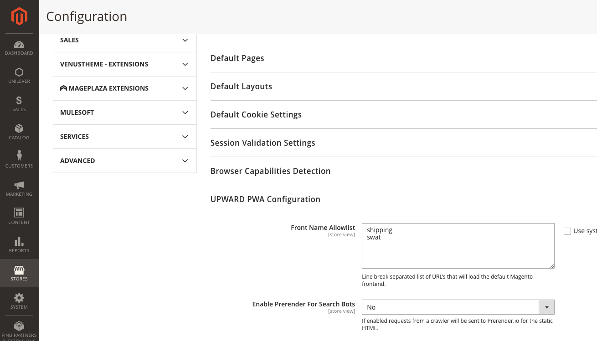

# 访问Adobe Commerce上的站点范围分析工具时出现403错误

针对在尝试访问Adobe Commerce上的站点范围分析工具时出现403错误的情况，本文提供了一个解决方案。

## 受影响的产品和版本

云基础架构2.4.1及更高版本上的Adobe Commerce 。

## 问题

尝试访问站点范围分析工具时出现403错误。

<u>重现问题的步骤：</u>

登录到Commerce管理面板，然后单击 **报表** > *系统分析* > **站点范围分析工具**.

<u>预期结果：</u>

您会看到站点范围分析工具。

<u>实际结果：</u>

您会看到： *错误403。*


## 解决方案

要确保全站点分析工具对应用程序具有正确的访问权限，请在CLI中运行以下命令。 替换 `<store URL>` 使用商店URL：

```cURL
curl -sIL -X GET <store URL>/swat/key/index | grep HTTP
HTTP/2 403
```

根据您获得的响应代码采取相应步骤。

### 403禁止响应代码

如果响应代码为403，则您可能具有阻止站点范围分析工具的Cloudflare机器人保护。 要访问该工具，请将其IP列入白名单：

* 107.23.33.174
* 3.225.9.244
* 3.88.83.85

### 更正200响应代码和JSON输出

如果响应的200代码和JSON输出正确， [提交支持服务单](/help/help-center-guide/help-center/magento-help-center-user-guide.md#submit-ticket) 使访问全站点分析工具的问题升级。


### 500（致命错误）响应代码

如果响应代码为500（严重错误），请安装MDVA-38526修补程序。 根据所需的补丁程序类型，使用以下链接之一下载补丁程序：

* Adobe Commerce on cloud基础架构修补程序： [MDVA-38526_EE_2.4.1-p1_v3.patch.zip](assets/MDVA-38526_EE_2.4.1-p1_v3.patch.zip)
* Adobe Commerce on cloud infrastructure composer修补程序： [MDVA-38526_EE_2.4.1-p1_COMPOSER_v3.patch.zip](assets/MDVA-38526_EE_2.4.1-p1_COMPOSER_v3.patch.zip)

该修补程序适用于Adobe Commerce on cloud infrastructure版本2.4.1及更高版本。

### 响应不是JSON

如果响应输出不是JSON，可能是因为PWA/Headless实施。 如果您使用的是Headless实施，请更新UPLOAD配置以绕过对Adobe Commerce Origin的请求。 为此，请在Adobe Commerce管理员中的 **商店** > **配置** > **常规** > **Web** > **向上PWA配置** > **列入允许列表前名**，添加 *swat*.



如果您仍然无法访问站点范围的分析工具，请在下次登录到Commerce管理面板并导航到 **报表** > *系统分析* > **站点范围分析工具**， [提交支持服务单](/help/help-center-guide/help-center/magento-help-center-user-guide.md#submit-ticket).

## 相关阅读

* [站点范围分析工具指南](https://experienceleague.adobe.com/docs/commerce-operations/tools/site-wide-analysis-tool/intro.html)
