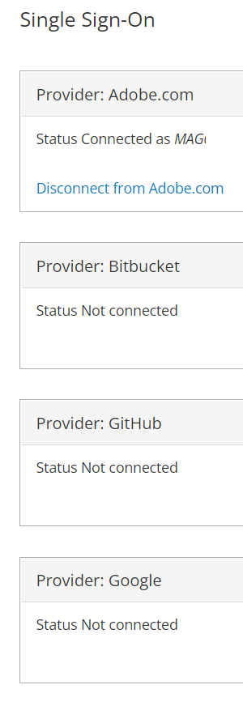
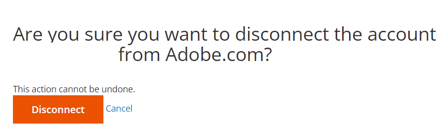
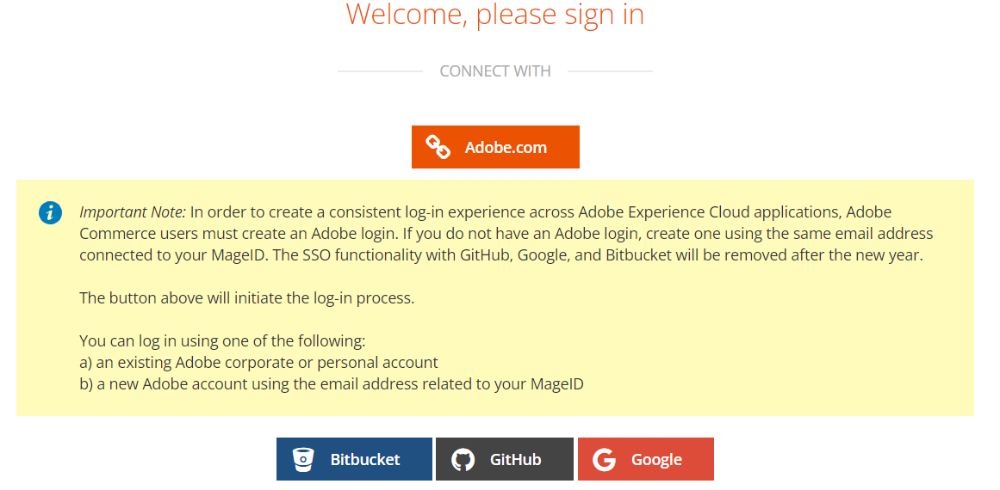

# 无法访问正确的云帐户/项目，或帐户中缺少该项目

在对帐户所有权或相关电子邮件地址进行更改后，本文修复了以下问题：

1. 您无法访问正确的云Adobe Commerce项目。
1. 您的帐户下未显示任何Adobe Commerce项目，地址为 [accounts.magento.cloud/user](https://accounts.magento.cloud/user).
1. 您正在查看另一个帐户（即前一个帐户所有者）的详细信息，请访问 [accounts.magento.cloud/user](https://accounts.magento.cloud/user).

## 问题

当所有权发生变化或电子邮件地址发生变化时，您无法访问正确的云Adobe Commerce项目。

## 受影响的产品和版本

* 云基础架构上的Adobe Commerce， [所有受支持的版本](https://www.adobe.com/content/dam/cc/en/legal/terms/enterprise/pdfs/Adobe-Commerce-Software-Lifecycle-Policy.pdf)

## 原因

通常，在以下情况之后，当之前的项目所有者的单点登录(SSO)仍与Adobe.com集成时，会发生此问题：

1. 云项目所有权已转移给您（用户），并且您会看到原始项目所有者的帐户。 单击此处查看 [解决方案](#solution-for-cause-one-and-two).

   或者

1. 您（用户）已移至其他公司，并且电子邮件地址和您有权访问的项目发生更改。 您会看到以前角色/公司向您授予访问权限的项目。 单击此处查看 [解决方案](#solution-for-cause-one-and-two).

   或者

1. 您已将您在https://account.adobe.com上的电子邮件地址更改为另一个当前未与云项目关联的电子邮件地址。 单击此处查看 [解决方案](#solution-for-cause-three).

## 原因一和二的解决方案 {#solution-for-cause-one-and-two}

如果问题的解决方法是一和两个导致的，那就是断开与Adobe.com的单点登录集成。 按照以下步骤断开连接：

1. 从https://accounts.magento.cloud/user中，展开 **[!UICONTROL Single Sign-On]** 部分。 单击 **[!UICONTROL Disconnect from Adobe.com]**，断开连接。

   

1. 单击 **[!UICONTROL Disconnect]**.

   

1. 注销。
1. 单击 **[!UICONTROL Adobe.com]** 按钮。

   

1. 现在，您应该能够查看正确的帐户并访问正确的云项目。

## 原因三的解决方案 {#solution-for-cause-three}

如果问题是由原因三引起的，请让项目中的现有超级用户将您的新电子邮件地址添加到项目中。 有关更多信息，请参阅 [管理用户访问权限](https://experienceleague.adobe.com/docs/commerce-cloud-service/user-guide/project/user-access.html).
