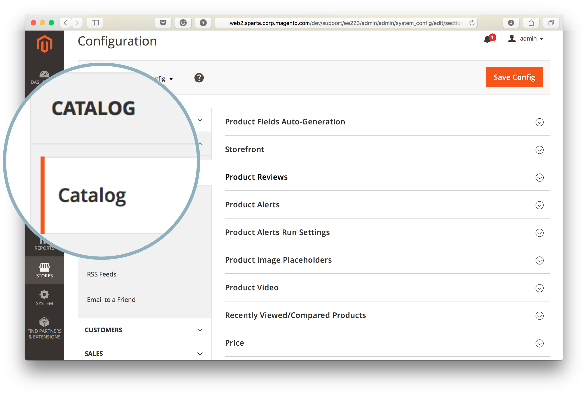
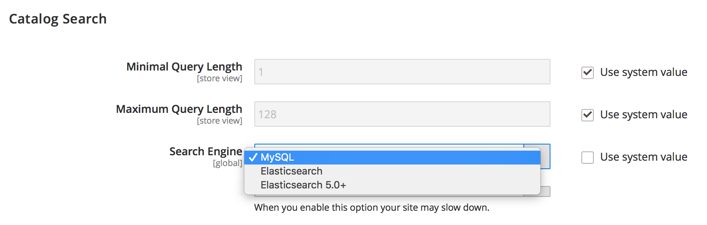
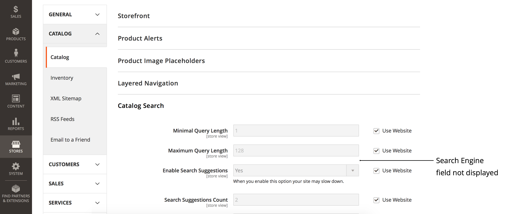
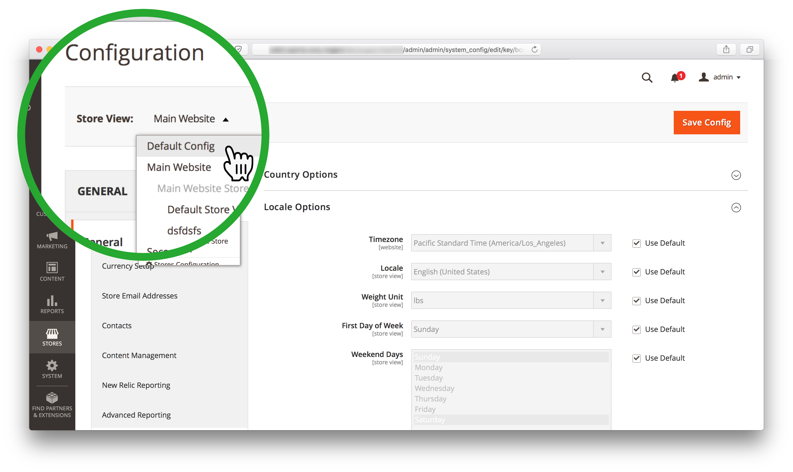

# 无法使用Commerce管理更改搜索引擎（搜索引擎菜单不可访问）

>[!WARNING]
>
> [Adobe Commerce 2.4.0中将删除MySQL目录搜索引擎](/help/announcements/adobe-commerce-announcements/mysql-catalog-search-engine-will-be-removed-in-magento-2-4-0.md). 在安装版本2.4.0之前，必须设置并配置Elasticsearch主机。
> 
> 请参阅：
> [安装和配置Elasticsearch](https://experienceleague.adobe.com/en/docs/commerce-cloud-service/user-guide/configure/service/elasticsearch).
> [安装和配置Opensearch](https://experienceleague.adobe.com/en/docs/commerce-cloud-service/user-guide/configure/service/opensearch)
> [安装和配置Live Search](https://experienceleague.adobe.com/en/docs/commerce-merchant-services/live-search/install)

在以下情况下，本文为使用Adobe Commerce管理员更改Commerce搜索引擎提供了解决方案： **搜索引擎** 字段未显示，或者 **使用系统值** 复选框灰显且不可访问。

在本文中：

* [受影响的版本](#affected-versions)
* [使用Commerce管理更改搜索引擎（步骤）](#change-search-engine-using-magento-admin-steps)
* [Adobe Commerce内部部署问题](#magento-commerce-on-premise)
* [云基础架构上的Adobe Commerce](#magento-commerce-cloud)

## 受影响的版本

* Adobe Commerce内部部署：2.4.X
* 云基础架构上的Adobe Commerce：
   * 版本：2.4.X
   * 入门和专业计划体系结构
* MySQL、Elasticsearch、Opensearch、Live Search：所有支持的版本

## 使用管理员更改搜索引擎（步骤）

1. 以管理员身份登录到管理员。
1. 在左侧的“管理员”侧边栏中，单击 **商店**. 然后，在下 **设置**，选择 **配置**.
1. 在左侧的面板中，位于 **目录，** 选择 **目录**.
1. 展开 **目录搜索** 部分。    
1. 转到 **搜索引擎** 字段，并从中移除选定内容 **使用系统值** 复选框。
1. 单击 **搜索引擎** 菜单并选择其中一个可用选项。    
1. 单击 **保存配置** 页面右上角的。

## Adobe Commerce内部部署问题

### 问题1：不显示搜索引擎字段

当您访问 **目录搜索** 部分， **搜索引擎** 菜单完全不显示。



### 原因：存储视图不是默认配置

管理员的“商店视图”已设置为除以外的任何值 *默认配置*.

搜索引擎是在应用程序级别设置的全局配置，而不是在存储范围中设置的全局配置。 Adobe Commerce应用程序中的商店不能使用其他搜索引擎。

### 解决方案：将存储视图设置为默认配置

1. 以管理员身份登录到管理员。
1. 在左侧的“管理员”侧边栏中，单击 **商店**. 然后，在下 **设置**，选择 **配置**.
1. 在左上角，单击 **商店视图** 选择器并选择 *默认配置*.
1. 单击 **确定** 在确认对话框中，批准商店视图更改。



**相关文档：** [更改范围](https://experienceleague.adobe.com/docs/commerce-admin/config/scope-change.html#set-the-scope) 在我们的用户指南中。

### 问题2：无法取消选中“使用系统值”

当您访问 **目录搜索** 部分， **使用系统值** 复选框呈灰显状态，因此您无法从复选框中删除选定内容以稍后更改搜索引擎。

### 原因

默认搜索引擎已在的应用程序配置级别上配置 `app/etc/env.php` 或 `app/etc/config.php` 文件，因此无法使用管理员进行更改。

具有默认搜索引擎配置的部分的示例：

```php
'system'=>
array (
'default'=>
array (
'catalog'=>
array (
'search'=>
array (
'engine'=>'mysql',
),
),
),
),
```

### 解决方案

从删除具有默认搜索引擎配置的部分 `app/etc/env.php` 或 `app/etc/config.php` 配置文件。

### 我们的开发人员文档中的相关文章

[Adobe Commerce配置文件](https://experienceleague.adobe.com/docs/commerce-operations/configuration-guide/files/deployment-files.html) 《Adobe Commerce配置指南》中的

## 云基础架构上的Adobe Commerce

由于云基础架构的组织方式，使用管理员切换搜索引擎在Adobe Commerce上不可用。

在部署过程中，Adobe Commerce on cloud infrastructure部署脚本会检查是否已在中声明了Elasticsearch `MAGENTO_CLOUD_RELATIONSHIPS` 变量。 如果已声明，则Elasticsearch被选为活动搜索引擎并自动配置； [MySQL搜索引擎](/help/announcements/adobe-commerce-announcements/mysql-catalog-search-engine-will-be-removed-in-magento-2-4-0.md) 在管理员中变得不可访问。 如果未声明Elasticsearch关系，则MySQL将设置为活动，并且Elasticsearch将无法访问。

不建议编辑 `app/etc/env.php` 或 `app/etc/config.php` 配置文件直接在您的云环境中；这就是为什么更改这些文件以使Elasticsearch引擎显示在管理员中（我们在上一节中推荐的解决方案）不适用于您的云项目。

### 在暂存和生产环境中更改搜索引擎

在将搜索引擎从MySQL切换到暂存环境和生产环境上的Elasticsearch之前，请确保您之前已执行以下操作 [已提交支持工单](/help/help-center-guide/help-center/magento-help-center-user-guide.md#submit-ticket) 请求在环境中启用Elasticsearch，并且已成功解析票证。

要更改暂存环境和生产环境中使用的搜索引擎，请更改 `SEARCH_CONFIGURATION` 中的环境变量 `.magento.env.yaml` 文件，然后将更改推送到集成和暂存/生产环境，以使更改生效。

如果要切换到Elasticsearch7，则生成的SEARCH\_CONFIGURATION变量为 `.magento.env.yaml` 文件可能如下所示：

```yaml
stage:
  deploy:
   SEARCH_CONFIGURATION:
     engine: elasticsearch7
     elasticsearch_server_hostname: hostname
     elasticsearch_server_port: '12345'
     elasticsearch_index_prefix: magento
     elasticsearch_server_timeout: '15'
```

如果您要切换到 [Opensearch（在2.4.6及更高版本中）](https://experienceleague.adobe.com/en/docs/commerce-knowledge-base/kb/troubleshooting/elasticsearch/search-engine-shown-elasticsearch-despite-open-search) 结果中的SEARCH\_CONFIGURATION变量 `.magento.env.yaml` 文件可能如下所示：

```yaml
stage:
  deploy:
   SEARCH_CONFIGURATION:
     engine: opensearch
     elasticsearch_server_hostname: hostname
     elasticsearch_server_port: '12345'
     elasticsearch_index_prefix: magento
     elasticsearch_server_timeout: '15'
```

如果您是 [切换到实时搜索](https://experienceleague.adobe.com/en/docs/commerce-knowledge-base/kb/troubleshooting/miscellaneous/error-opensearch-search-engine-doesnt-exist-falling-back-to-livesearch)，则为结果中的SEARCH\_CONFIGURATION变量 `.magento.env.yaml` 文件可能如下所示：

```yaml
stage:
  deploy:
   SEARCH_CONFIGURATION:
     engine: livesearch
```

### 相关文档

#### 支持知识库

* [在云中启用Elasticsearch](/help/how-to/general/enable-elasticsearch-on-cloud.md)

#### 开发人员文档

* [设置Elasticsearch服务](https://experienceleague.adobe.com/docs/commerce-cloud-service/user-guide/configure/service/elasticsearch.html)
* [生成和部署](https://experienceleague.adobe.com/docs/commerce-cloud-service/user-guide/configure/env/configure-env-yaml.html) (关于的文档 `.magento.env.yaml` 配置文件)
* [部署变量](https://experienceleague.adobe.com/docs/commerce-cloud-service/user-guide/configure/env/stage/variables-deploy.html) ([SEARCH\_CONFIGURATION部分](https://experienceleague.adobe.com/docs/commerce-cloud-service/user-guide/configure/env/stage/variables-deploy.html#search_configuration))
* [服务](https://experienceleague.adobe.com/docs/commerce-cloud-service/user-guide/configure/service/services-yaml.html) (关于的文档 `.magento/services.yaml` 配置文件)
* [实时搜索](https://experienceleague.adobe.com/en/docs/commerce-merchant-services/live-search/overview)
