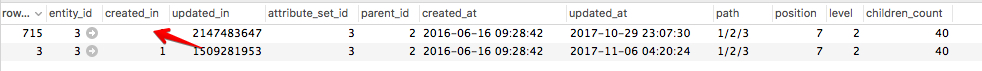

# 未保存对类别所做的更改

本文修复了在通过Commerce管理员更新产品类别时，更改不会显示在管理员和店面中的问题。 问题是由于 `catalog_category_entity` 表格。 要解决此问题，请修复或删除表中有问题的类别更新记录。 之后，您应该能够使用管理员更新产品类别。

## 问题

在管理员中对产品类别进行更改并保存后，新的更新既不会保存，也不会显示在管理员和店面中。

### 重现问题的步骤

1. 转到 **目录** > **类别**.
1. 选择类别。
1. 进行更改，然后单击 **保存**.
1. 将显示以下消息： *您已保存类别*.
1. 请注意，您所做的更改尚未保存。

## 可能的原因： `catalog_category_entity` 表

问题的导因是同一值出现在 `created_in` 数据库(DB)中受影响的类别记录的列。

详细信息：

* 此 `catalog_category_entity` 数据库表有两个或多个受影响类别的记录(这些记录具有相同的 `entity_id` 值)。
* 这些类别记录具有 **中的相同值 `created_in` 列**.

### 对于同一类别，第二个数据库条目（以及所有后续条目）如何显示在数据库中？

受影响类别的第二个DB记录（可能还有后续记录）表示已使用Magento\_Staging模块计划了类别更新。 模块对中的类别进行额外记录 `catalog_category_entity` 这是预期的应用程序行为；问题是这些记录的 `created_in` 列。

### 如何显示相同的值？

我们无法确切地说明数据损坏的原因。 可能的原因包括：

* 自定义项（代码、主题等）
* 数据迁移不正确
* 从备份还原的数据不正确

据我们所知，此类数据损坏不适用于“干净”（现成）Adobe Commerce实例，并且无法在没有自定义设置的Adobe Commerce安装中重现。

### 如何验证这是您的问题

此 `catalog_category_entity` 对于受影响的类别，表应有多个记录(记录应具有相同的 `entity_id` 值)，并且其中至少有两个记录应具有相同的 `created_in` 值。 这样，暂存计划更新将不会显示在Commerce管理员中；您只会看到空的“计划更改”块。

#### 验证步骤

1. 访问数据库中的catalog\_category\_entity表。
1. 按entity\_id筛选实体，其中entity\_id标识受影响的类别。
1. 如果created\_in列中的值对于具有相同entity\_id的不同条目是相同的，则就是这样。 通常， `created_in` 每个记录的值都不相同。

## 解决方案

您可以选择以下解决方案之一：

1. **删除** 有问题的类别更新记录
1. **修复** 有问题的类别更新记录

### 删除有问题的类别更新记录

在此解决方案中，您需要将 `updated_in` 初始类别记录的值，并删除此类别的所有其他记录。 这将删除所有计划的类别更新。

请按照以下步骤操作：

1. 使用查找数据库记录 `entity_id` 属于受影响的类别。
1. 选择具有最大整数的记录 `updated_in` 列。
1. 复制 `updated_in` 个值。
1. 使用以下方式选择记录 `row_id` = `entity_id` （初始类别记录）并将复制的值粘贴到 `updated_in` 此记录的列。
1. 删除行 `row_id` 不等于 `entity_id` .

### 修复有问题的类别更新记录

1. 查找具有相同的类别记录 `entity_id` 和相同 `created_in` 值。
1. 选择记录位置 `row_id` = `entity_id` 并复制 `updated_in` 值。
1. 选择记录位置 `row_id` 不等于 `entity_id` 并粘贴复制的 `updated_in` 值作为 `created_in` 值。 请参见下面的屏幕快照作为插图。    
1. 验证类别更新记录、 `created_in` （在步骤3中）的值存在于 `staging_update` 表格。 *例如：* 如果复制了 `created_in` 值为1509281953，则实体为 `row_id` =1509281953必须存在于 `staging_update` 表
