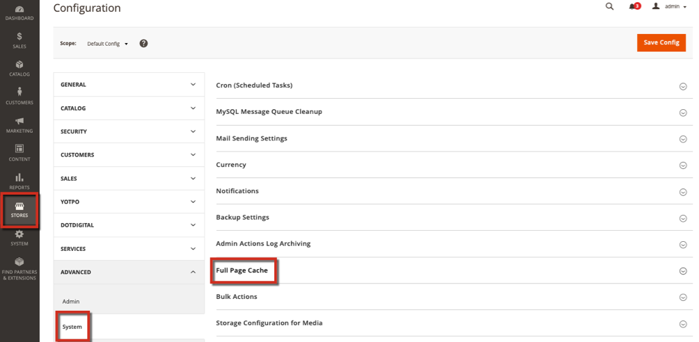

# 清除云上的Fastly缓存时出错（未成功处理清除请求）

本文修复了使用Fastly清除选项时出现的错误： *未成功处理清除请求*. Fastly是Adobe Commerce中包含的一项CDN和缓存服务，用于云基础架构计划和实施。 如果您尝试使用Fastly清除选项，但该选项无法处理，则您的环境中可能有不正确的Fastly凭据或遇到问题。

此信息可帮助您验证和测试实时网站和源服务器的Fastly标头。

## 受影响的版本

* 云基础架构上的Adobe Commerce 2.1.X及更高版本
* Fastly 1.2.27及更高版本

## 问题

缓存有效，但当您尝试清除时，您会收到错误或无法正常使用。 错误包括：“未成功处理清除请求。”

## 原因

您环境中设置的凭据可能不正确，或者需要上传VCL代码片段。

## 解决

### 检查Fastly凭据

验证您的环境中是否具有正确的Fastly服务ID和API令牌。 如果您在生产环境中使用暂存凭据，则清除可能无法正确处理或处理。

1. 以管理员身份登录到您的本地Commerce管理员。
1. 单击 **商店** >设置> **配置** > **高级** > **系统** 并展开 **全页缓存**.    
1. 展开Fastly配置并验证您环境的Fastly服务ID和API令牌。
1. 如果修改这些值，请单击“测试身份证明”。

### 检查VCL代码片段

如果凭据正确，则您的VCL可能会出现问题。 要列出并查看每个服务的VCL，请在终端中输入以下API调用：

```
curl -X GET -s https://api.fastly.com/service/<Service ID>/version/<Editable Version #>/snippet -H "Fastly-Key:FASTLY_API_TOKEN"
```

查看VCL列表。 如果您遇到来自Fastly的默认VCL的问题，则可以再次上传或验证内容 [快速默认VCL](https://github.com/fastly/fastly-magento2/tree/master/etc/vcl_snippets). 有关编辑定制VCL的信息，请参见 [自定义Fastly VCL片段](https://experienceleague.adobe.com/docs/commerce-cloud-service/user-guide/cdn/custom-vcl-snippets/fastly-vcl-custom-snippets.html) 《Commerce on Cloud Infrastructure指南》中的。

## 更多信息

在我们的开发人员文档中：

* [关于Fastly](https://experienceleague.adobe.com/docs/commerce-cloud-service/user-guide/cdn/fastly.html)
* [设置Fastly](https://experienceleague.adobe.com/docs/commerce-cloud-service/user-guide/cdn/setup-fastly/fastly-configuration.html)
* [自定义Fastly VCL片段](https://experienceleague.adobe.com/docs/commerce-cloud-service/user-guide/cdn/custom-vcl-snippets/fastly-vcl-custom-snippets.html)
