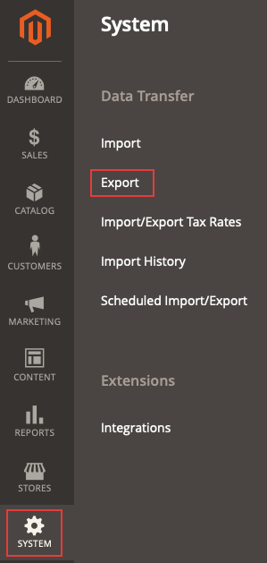

# 导出的产品.csv文件不显示

本文修复了以下问题：您尝试在Commerce管理员中将产品导出到.csv文件，但文件未显示。

## 受影响的产品和版本

* 云基础架构上的Adobe Commerce，全部 [支持的版本](https://magento.com/sites/default/files/magento-software-lifecycle-policy.pdf).

## 问题

<u>重现问题的步骤</u>

先决条件： **向URL添加密钥** 选项设置为 *是*. 该选项是在Commerce管理员中配置的，位于 **商店** > **配置** > **高级** > **管理员** > **安全性**.

1. 在管理员中，导航到 **系统** > **数据传输** > **导出**.

   

1. 选择
   * **实体类型**： *产品*
   * **导出文件格式**： *CSV*
   * **字段存储模块**：保持未选中状态。
1. 单击 **继续**.
1. 将显示以下消息： *“消息已添加到队列，请等待以尽快获取文件”*.

<u>预期结果</u>

几分钟后，网格中会显示包含导出产品的.csv文件。

<u>实际结果</u>

包含导出产品的.csv文件在10分钟或更长时间后不会显示在网格中。

## 原因

Adobe Commerce应用程序部件版本2.3.2中的导出功能存在的已知问题。

## 解决方案

对于此问题，有两种可能的解决方案：

* 禁用“将密钥添加到URL”选项。
* 运行 `bin/magento queue:consumers:start exportProcessor` 命令，并可选择将其配置为由cron运行。

请参阅以下段落中有关这两个选项的详细信息。

### 禁用“将密钥添加到URL”选项

1. 在管理员中，导航到 **商店** > **配置** > **高级** > **管理员** > **安全性**.
1. 设置 **向URL添加密钥** 选项至 *不适用。*
1. 单击 **保存配置**.
1. 清理下的缓存 **系统** > **工具** > **缓存管理** 或通过运行    ```bash    bin/magento cache:clean``` 或Admin中的。

### 手动运行导出命令，并可选择将其添加为cron作业

要获取导出文件，请运行 `bin/magento queue:consumers:start exportProcessor` 命令。 运行此操作后，文件应显示在网格中。


要选择性地将流程添加为cron作业，您必须添加 `CRON_CONSUMERS` 变量到 `.magento.env.yaml` 文件。

#### 将进程添加为cron作业（可选）

1. 确保已设置和配置您的cron。 请参阅 [设置cron作业](/docs/commerce-cloud-service/user-guide/configure/app/properties/crons-property.html) 以了解详细信息。
1. 运行以下命令以返回消息队列使用者的列表：     `./bin/magento queue:consumers:list`
1. 将以下内容添加到您的 `.magento.env.yaml` 文件，并包含要添加的使用者。 例如，以下是导出处理所需的使用者：

   ```yaml
   stage:
       deploy:
           CRON_CONSUMERS_RUNNER:
               cron_run: true
               max_messages: 1000
               consumers:
                   - exportProcessor
   ```

   然后，推送此更新文件并重新部署您的环境。 另请参阅 [将自定义cron作业添加到您的项目](/docs/commerce-cloud-service/user-guide/configure/app/properties/crons-property.html#add-custom-cron-jobs-to-your-project) 在我们的开发人员文档中。

>[!NOTE]
>
>如果您找不到 `.magento.env.yaml` 文件，如果您认为该文件已被删除，则需要创建一个 `.magento.env.yaml`. 最初可能为空，您可以根据需要在该处添加信息。 请参阅以下文章： [配置环境变量以进行部署](/docs/commerce-cloud-service/user-guide/configure/env/configure-env-yaml.html) 和 [环境变量](/docs/commerce-cloud-service/user-guide/configure/env/stage/variables-intro.html) 在我们的开发人员文档中。

>[!TIP]
>
>[YAML文件](https://experienceleague.adobe.com/docs/commerce-cloud-service/user-guide/configure/env/configure-env-yaml.html) 区分大小写，因此不允许使用制表符。 请注意在整个.magento.env.yaml文件中使用一致的缩进，否则您的配置可能无法按预期工作。 文档和示例文件中的示例使用双空格缩进。 使用ece-tools validate命令检查配置。

>[!NOTE]
>
>在Adobe Commerce on cloud infrastructure Pro项目中， [auto-crons功能](/docs/commerce-cloud-service/user-guide/configure/app/properties/crons-property.html?lang=en#crontab) 必须在云基础架构上的Adobe Commerce上启用，然后才能使用将自定义cron作业添加到暂存和生产环境 `.magento.app.yaml`. 如果未启用此功能， [创建支持票证](/help/help-center-guide/help-center/magento-help-center-user-guide.md#submit-ticket)，以便为您添加作业。
