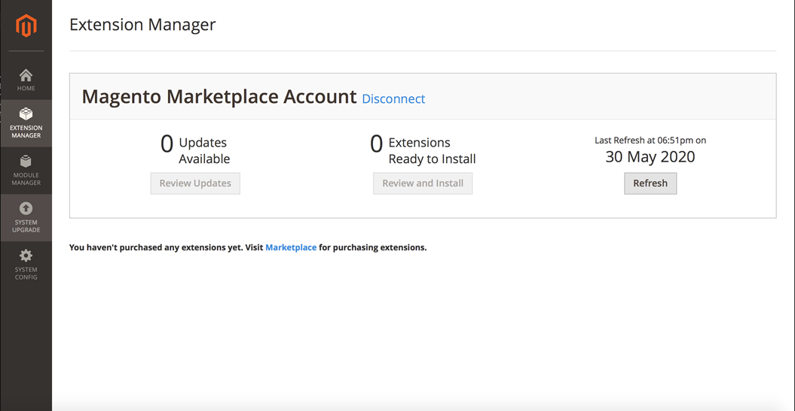

# Extension Manager在Adobe Commerce 2.3.x中不显示扩展

在通过Commerce Marketplace购买扩展后，本文为Adobe Commerce 2.3.x中的管理员Extension Manager中缺少扩展提供了解决方法。

## 受影响的产品和版本

* Adobe Commerce版本（所有部署方法）2.3.x

## 问题

当您通过Commerce Marketplace购买扩展时，无法使用核心Adobe CommerceExtension Manager安装它们。 当您添加访问密钥并同步到Marketplace时，Extension Manager不会显示任何扩展。

此 **解决方法** 对于此问题，是使用命令行Adobe Commerce安装，如中所示 [常规CLI安装](https://devdocs.magento.com/extensions/install/) 在我们的开发人员文档中。

<u>重现问题的步骤</u>：

1. 通过Commerce Marketplace购买扩展。
1. 添加扩展的访问密钥并同步到Marketplace。
1. 转到管理员的Extension Manager部分。

<u>预期结果</u>：

该扩展将显示在Commerce管理员的Extension Manager部分中。

<u>实际结果</u>：

**Commerce管理员的Extension Manager部分上不显示任何扩展，如下图所示：**

## 解决方法

使用命令行Adobe Commerce安装，如所示 [常规CLI安装](https://devdocs.magento.com/extensions/install/) 在我们的开发人员文档中。
