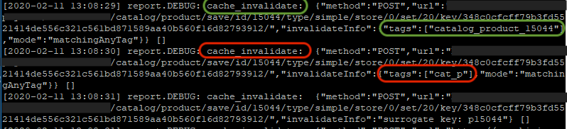

# 缓存失效导致响应时间降低

本文就如何避免可能会导致Adobe Commerce存储性能降低的缓存失效提供了解决方案。

受影响的产品和版本：

* Adobe Commerce内部部署2.2.x、2.3.x
* 云基础架构上的Adobe Commerce 2.2.x、2.3.x

## 问题

站点响应缓慢。

## 原因

缓存失效（刷新）可能导致响应时间过长。

缓存用于生成对网站访客请求的快速响应。 如果没有相应的缓存数据可用，Adobe Commerce应用程序将从数据库中提取数据，计算并聚合数据，然后将其存储在缓存中。 缓存生成过程需要额外的系统资源，从而导致总响应时间下降。

Adobe Commerce中有两种类型的缓存：

1. 内部：
   * 将数据存储在服务器上
   * 存储特定数据（配置、产品详细信息、类别详细信息等）
1. 外部：
   * CDN或Varnish(如果是Adobe Commerce on cloud infrastructure - Fastly CDN)
   * 存储已生成完整页面。 例如，目录/类别、目录/产品页面等。

### 检查您是否具有失效的缓存

有关失效缓存类型的信息，请参见 `<install_directory>/var/log/debug.log` 文件。

为此，请执行以下操作：

1. 打开 `<install_directory>/var/log/debug.log`
1. 搜索&quot; *cache\无效* ”消息。
1. 然后检查指定的标记。 它指示刷新了哪些缓存。 如果您看到未指定特定实体ID的标记，则可能会因缓存失效而出现问题，例如：
   * `cat_p`  — 表示目录产品缓存。
   * `cat_c`  — 目录类别缓存。
   * `FPC`  — 全页缓存。
   * `CONFIG`  — 配置缓存。

   即使其中一人刷新了数据，也会减慢网站响应速度。 如果标记包含实体ID，例如， `category_product_1258`，这将指示特定产品或类别的缓存，等等。 刷新特定产品或类别的缓存不会导致响应时间显着下降。

以下是 `debug.log` 包含有关以下内容的记录： `cat_p` 和 `category_product_15044` 缓存已刷新：

通常，缓存会由于以下原因失效：

* 完全重新索引。
* 手动或使用cron从CLI刷新缓存。

## 推荐

1. 避免从Commerce CLI刷新缓存。
1. 将索引器配置到 **按计划更新** 而不是 **在保存模式下更新** 因为后者会触发完全重新索引。 有关参考，请参阅 [管理索引器>配置索引器](https://devdocs.magento.com/guides/v2.3/config-guide/cli/config-cli-subcommands-index.html#configure-indexers) 在我们的开发人员文档中。
