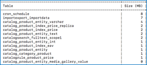
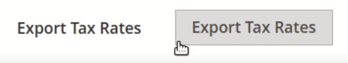

# Adobe Commerce 2.4.0已知问题 — 出口税率不起作用

本文为Adobe Commerce 2.4.0已知问题提供了一个解决方案，该问题中 **出口税率** 按钮不起作用。

## 受影响的产品和版本

* 云基础架构上的Adobe Commerce 2.4.0
* Adobe Commerce内部部署2.4.0

## 问题

<u>重现问题的步骤：</u>

1. 转到Commerce管理面板> **商店** > **税则**.
1. 单击 **添加新税则** 按钮。
1. 单击 **出口税率** 按钮。

   

<u>预期结果</u>：

A `tax_rates.csv` 下载包含税率的文件。

<u>实际结果</u>：

未下载.csv文件。

## 解决方案

解决方法：

单击 **出口税率** 按钮以导出 `tax_rates.csv` 文件。

计划在2.4.1补丁中解决此问题。

## 相关阅读

在我们的支持知识库中：

* [Adobe Commerce 2.4.0已知问题：Braintree支付方式未显示在多地址结账中](/help/troubleshooting/payments/magento-2-4-0-braintree-not-in-multiple-addresses-checkout.md).
* [Adobe Commerce 2.4.0中的配送标签创建已知问题](/help/troubleshooting/known-issues-patches-attached/shipping-labels-creation-known-issue-in-magento-2-4-0.md).
* [Adobe Commerce 2.4.0已知问题 — 无法刷新客户活动](/help/troubleshooting/miscellaneous/magento-2-4-0-refresh-on-customer-activities-does-not-work.md).
* [Adobe Commerce 2.4.0已知问题：店面中显示原始消息数据](/help/troubleshooting/storefront/magento-2-4-0-issue-storefront-raw-message-data-display.md).
* [Adobe Commerce 2.4.0已知问题：“将选定内容添加到购物车”按钮不起作用](/help/troubleshooting/miscellaneous/magento-2-4-0-add-selections-to-my-cart-does-not-work.md).
