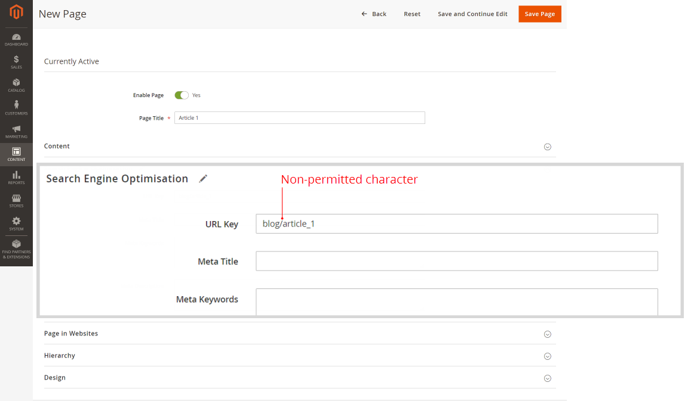
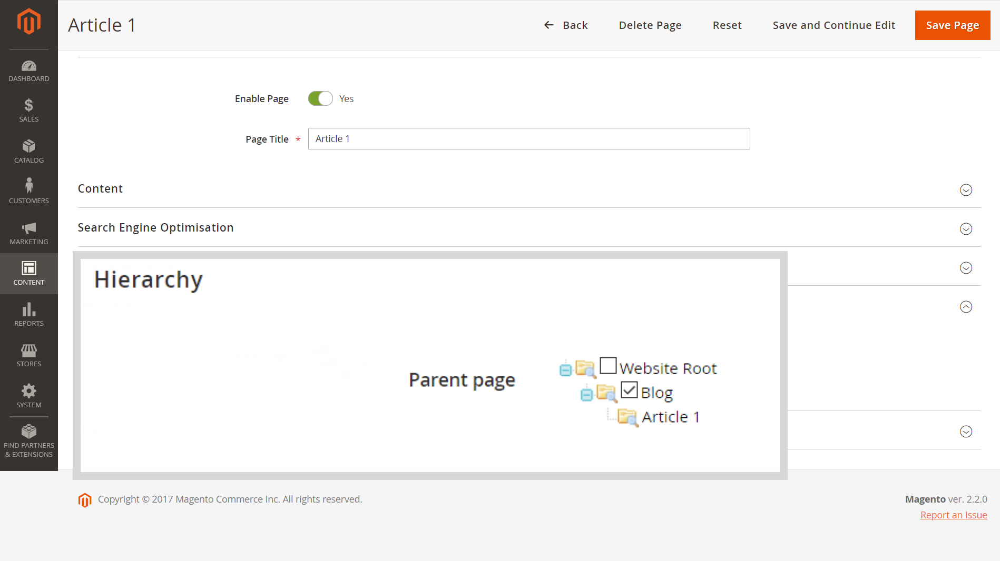

# 启用Fastly的子页面上不显示主菜单（类别）

本文修复了当主菜单(或 [类别顶部导航菜单](/docs/commerce-admin/catalog/catalog/navigation/navigation-top.html) 不会显示在子页面的店面上(例如， *博客/页面*)，但启用Fastly或Varnish。

**原因：** 不允许 `/` 字符（斜杠） *URL键* 参数（搜索引擎优化设置）。 该字符通常添加于 *URL路径* （包含整个页面位置）错误地指定了，而不是 *URL键*：例如， *博客/页面\_名称* 而不是只是 *page\_name*.

**解决方案：** 删除 `/` 字符（斜杠）；用于 *URL键* 参数，仅指定页面名称。

## 受影响的版本

* Adobe Commerce内部部署2.X.X
* 云基础架构上的Adobe Commerce 2.X.X
* Fastly或Varnish

## 问题

主菜单(也称为 [类别顶部导航菜单](/docs/commerce-admin/catalog/catalog/navigation/navigation-top.html) 启用Fastly或其他基于Varnish的服务时，不会显示在子页面的店面上。

## 原因

问题是由不允许的 `/` 字符（斜杠），添加到 *URL键* 参数（搜索引擎优化设置）。

该字符通常添加于 *URL路径* （包含整个页面位置，包括页面的父资源/目录）被错误地指定，而不是 *URL键*：例如， *博客/页面\_名称* 而不是只是 *page\_name*.

## 解决方案

删除 `/` 字符（斜杠） *URL键* 商店所有页面的参数。

换句话说，使用 *URL键* 而不是 *URL路径*：仅提及不含父资源/目录的页面名称。

### 页面层级和SEO上的Recommendations

要设置页面层次结构，请使用 **层级** 编辑页面菜单的部分。

您也可以使用 **内容** > **元素** > **层级** 菜单 — 适用于更复杂的层次结构解决方案。

对于产品页面上的SEO用途，请使用URL重写(**营销** > **SEO和搜索** > **URL重写**)。

## 我们用户指南中的更多信息

此 *URL键* seo的参数：

* [搜索引擎优化](/docs/commerce-admin/catalog/categories/create/categories-search-engine-optimization.html)
* [添加新页面](/docs/commerce-admin/content-design/elements/pages/page-add.html)

页面层次结构：

* [概述](/docs/commerce-admin/content-design/elements/pages/page-hierarchy.html)
* [添加节点](/docs/commerce-admin/content-design/elements/pages/page-hierarchy.html#add-a-hierarchy-node)
