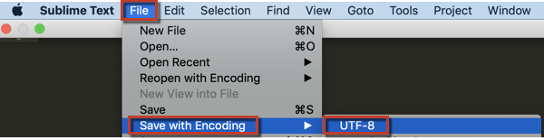

# 解决CSV文件上传的UTF-8错误

本文修复了您收到错误消息“CSV文件必须使用UTF-8编码”的问题。 此错误消息表示您尝试上传的文件包含非法字符或不允许使用的字符。 而UTF-8编码允许 [大多数字符](https://www.fileformat.info/info/charset/UTF-8/list.htm)，某些与MagentoBI不兼容。

要解决此问题，您需要更改文件的编码。 使用正确的编码重新保存文件通常可以解决此问题，但请注意，在执行此操作时，您可能会丢失一些信息（例如，可能会丢弃非法字符）。

我们建议使用 [高级文本](https://www.sublimetext.com/2) 以保存并编码文件。

1. 在Microsoft Excel、Google文档、Apple编号或您选择的项目中打开您的文件。
1. 单&#x200B; &#x200B;击 **文件** > **另存为** 并&#x200B;&#x200B;选择&#x200B;&#x200B; **逗号分隔值(.csv)** 格式以保存文件。
1. 以高级文本打开CSV文件。
1. 在高级文本中，导航&#x200B;到&#x200B; **文件** > **保存并编码** > **UTF-8\*&#x200B;** . 这将以UTF-8编码保存CSV文件。    
1. [上传数据](https://docs.magento.com/mbi/data-analyst/importing-data/connecting-data/using-file-uploader.html) （在我们的用户指南中）添加到MagentoBI中的新表。
