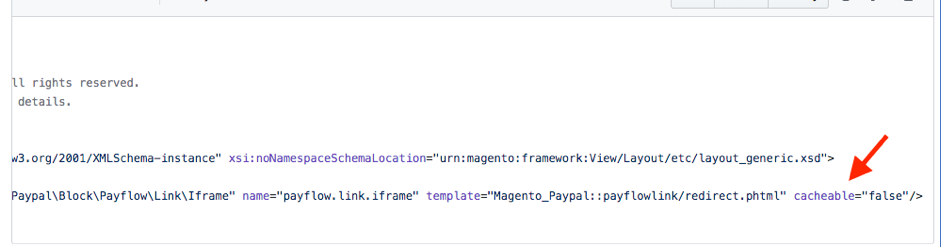

# 由于不可缓存的页面导致性能降低

本文提供了解决方案，可针对任何需要缓存的页面上的任何块禁用全页缓存（例如Fastly）而增加网站加载时间或中断情况。

## 受影响的产品和版本

* 云基础架构上的Adobe Commerce 2.x.x
* Adobe Commerce内部部署2.x.x

### 问题

由于页面上有需要缓存但已设置为的缓存块，网站性能会降低 `cacheable="false"` .

### 原因

有些页面需要由Adobe Commerce缓存。 这些页面的吞吐量最大。 对于这些类型的页面，每个请求都不会来自缓存，这会使Adobe Commerce执行速度变慢。

这些页面包括：

* 目录类别(PLP)
* 产品详细信息页面(PDP)
* 静态内容页面（主页、联系我们等）

Cacheable和uncacheable是用于指示是否应缓存页面的术语。 默认情况下，可缓存所有页面。 但是，如果布局中的任何块被指定为不可缓存，则整个页面都不可缓存。

下面的屏幕快照显示了具有设置的块 `cacheable="false”`  **创建不可缓存页面的**。

不可缓存页面的示例包括比较产品、购物车和结账页面。

不缓存以下页面列表（避免Fastly、Block和Layout缓存。） 出现这种情况是因为布局中的“可缓存”配置。

### 解决方案

检查上面指定的文件是否具有设置 `cacheable="false”` . 如果有，请检查是否需要此设置。

* 如果需要，请考虑将不可缓存块移动到 [私有内容机制](https://devdocs.magento.com/guides/v2.3/extension-dev-guide/cache/page-caching/private-content.html?itm_source=devdocs&amp;itm_medium=quick_search&amp;itm_campaign=federated_search&amp;itm_term=private%20co) 而是。
* 如果需要，请移除属性 `cacheable="false”` 并刷新布局缓存。

>[!NOTE]
>
>对于Adobe Commerce on cloud infrastructure 2.4.1及更高版本，您可以使用 [站点范围分析工具](https://docs.magento.com/user-guide/reports/site-wide-analysis-tool.html) 以自动检查完整页缓存配置是否正确。

### 相关阅读

[Adobe Commerce缓存概述](https://devdocs.magento.com/guides/v2.3/frontend-dev-guide/cache_for_frontdevs.html?itm_source=devdocs&amp;itm_medium=search_page&amp;itm_campaign=federated_search&amp;itm_term=cacheable%2) 在我们的开发人员文档中。
