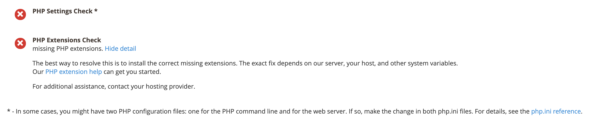

# cron疑难解答

本文提供了针对Adobe Commerce本地产品中cron问题的故障排除解决方案。

## 受影响的产品和版本

* Adobe Commerce内部部署2.2.x、2.3.x
* Magento Open Source2.2.x和2.3.x

## 问题

## 以下是cron问题的症状：

* 您的更新或升级永远不会运行；它保留在 `pending` 省/州。
* 有关以下内容的错误消息： [PHP](https://glossary.magento.com/php) 设置 `$HTTP_RAW_POST_DATA` 即使设置正确也会显示。
* cron就绪检查失败。 可能的错误包括不可写路径和未设置cron。 下面是一个示例：

  

* PHP准备情况检查不会显示PHP版本，如下图所示。

  

* Commerce管理中会显示以下错误：

  

要查看错误，您可能需要单击 **系统消息** ，如下所示：

## 调查以找出原因 {#check-your-existing-crontab}

本节讨论如何查看cron当前是否正在运行，以及验证其设置是否正确。

要验证是否已设置crontab，请执行以下步骤：

1. 以Magento服务器的身份登录，或切换到 [Magento的文件系统所有者](https://devdocs.magento.com/guides/v2.3/install-gde/prereq/file-sys-perms-over.html).
1. 查看以下文件是否存在：    `bash    ls -al <magento_root>/var/.setup_cronjob_status`. 如果文件存在，则cron过去已成功运行。 如果文件 *不会* 存在，表示您尚未安装Magento或cron未运行。 无论属于哪种情况，请继续执行下一步。
1. 获取有关cron的更多详细信息。 作为用户，具有 `root` 权限，请输入以下命令：    `bash    crontab -u <Magento file system owner name> -l`. 例如，在CentOS上 `bash    crontab -u magento_user -l`.  如果未为用户设置crontab，则会显示以下消息：    `terminal    no crontab for magento_user`. 您的crontab将告诉您以下信息：

   * 您正在使用的PHP二进制文件（在某些情况下，您有多个）
   * 您正在运行哪些Magentocron脚本（特别是这些脚本的路径）
   * cron日志的位置

请参阅以下部分之一，了解您的问题的解决方案。

## 解决方案

### 未设置crontab的解决方案 {#solution-crontab-not-set-up}

要验证您的cron作业是否设置正确，请参阅 [设置cron作业](https://devdocs.magento.com/guides/v2.3/install-gde/install/post-install-config.html#post-install-cron).

### 从不正确的PHP二进制文件运行的cron的解决方案 {#solution-cron-running-from-incorrect-php-binary}

如果cron作业使用的PHP二进制文件与Web服务器插件不同，则可能会显示PHP设置错误。 要解决此问题，请为PHP命令行和PHP Web服务器插件设置相同的PHP设置。

有关PHP设置的详细信息，请参见 [必需的PHP设置](https://devdocs.magento.com/guides/v2.3/install-gde/prereq/php-settings.html) 在我们的开发人员文档中。

### cron运行有错误的解决方案 {#solution-cron-running-with-errors}

尝试手动运行每个命令，因为该命令可能会显示有用的错误消息。 请参阅 [设置cron作业](https://devdocs.magento.com/guides/v2.3/install-gde/install/post-install-config.html#post-install-cron).

>[!NOTE]
>
>至少要运行cron *两次* 要执行的作业；第一次将作业排入队列，第二次执行作业。
