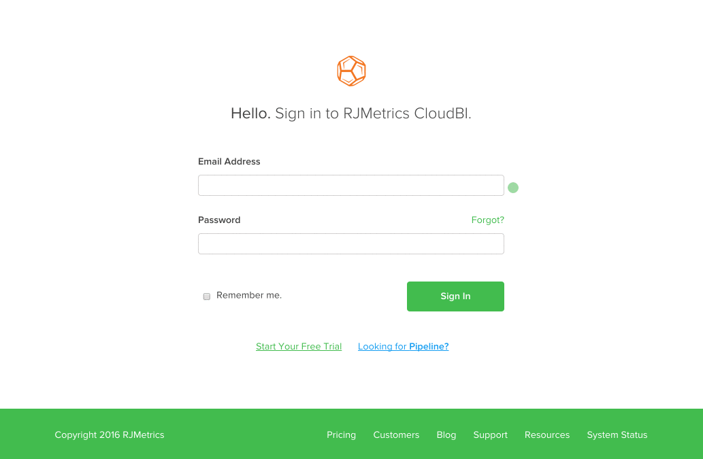

# Adobe Commerce Intelligence帐户锁定故障诊断

<!--
BOB: Is this in TOC?
-->

本文为Commerce Intelligence帐户锁定提供了解决方案。 我们首先需要确定这是缺陷、暂时故障还是其他问题。 执行以下步骤将有助于尽快让您重新访问帐户。

## 验证您的电子邮件地址是否正确

仔细检查您的电子邮件地址，确保您尝试用于登录的电子邮件地址与现有的Commerce Intelligence帐户关联。 您可能需要请求帐户管理员确认电子邮件地址中没有任何拼写错误。

确认电子邮件地址正确后，尝试使用重新登录 [此链接](https://dashboard.rjmetrics.com/v2/session/create#/).

## 尝试重置密码

如果您已验证您使用的电子邮件是否正确，请尝试重置密码。 您可以使用 **忘了？** 登录页面上上一部分的链接，以触发密码重置电子邮件。

如果您最初没有看到电子邮件，请务必查看您的垃圾邮件文件夹。 有时甚至是出于好意的电子邮件也会被误认为垃圾邮件。 **请注意，这些电子邮件中的临时访问链接只有效一次！**

如果您仍然被锁定，请确保您的电子邮件地址正确，并且您使用的是重置电子邮件中的正确链接。 我们建议尝试以下操作 **在请求再次重置并尝试再次登录之前：**

* 清除浏览器的缓存、Cookie和保存的密码
* 暂时关闭任何广告拦截软件

## 记录任何错误并联系支持团队

>[!NOTE]
>
>此步骤并非总是必需的，但主动完成此步骤可减少反复处理支持请求所花费的时间。

如果您仍无法访问您的帐户，我们建议您检查错误并将票证提交到我们的支持团队。 你怎么能这么做？ 打开浏览器的开发人员工具，并截取控制台或站点日志窗口中显示的任何错误的屏幕快照。 在以下GIF中，我将打开适用于Google Chrome的开发人员工具：

在上例中，我们使用了最常用的方法(**右键单击** > **Inspect**)以打开控制台。 如果您的浏览器没有此方法或您需要帮助，请使用下面的文档链接来访问您正在使用的Web浏览器：

<table>
<tbody>
<tr>
<td><a href="https://www.technipages.com/mac-os-x-enable-web-inspector-in-safari">Safari</a></td>
<td><a href="https://developer.mozilla.org/en-US/docs/Tools/Web_Console/Opening_the_Web_Console">Firefox</a></td>
<td><a href="https://developers.google.com/web/tools/chrome-devtools/?hl=en">铬黄</a></td>
<td><a href="https://www.opera.com/dragonfly/documentation/">Opera</a></td>
<td><a href="https://msdn.microsoft.com/en-us/library/gg589512(v=vs.85).aspx#OpeningTools">Internet Explorer</a></td>
</tr>
</tbody>
</table>

在某些浏览器中，打开开发人员工具可能不会自动显示控制台，网站代码可能会最先显示。 如果您遇到这种情况，请单击开发人员窗口中的Console选项，然后截取该窗口中显示的任何错误的屏幕截图。

向我们的支持团队提交工单，并提供 **错误屏幕截图** 和您的 **Commerce Intelligence帐户的电子邮件地址**.

## 没有看到任何错误或您刚刚迷路？

别担心！ 提交新的支持票证(请确保包含您的Commerce Intelligence帐户的电子邮件地址)，我们将会尽快让您返回帐户。

## 我们的支持知识库中的相关主题：

* [添加新用户和设置权限](https://experienceleague.adobe.com/docs/commerce-business-intelligence/mbi/administrator/user-mgmt/user-management.html)
* [如何更新我的电子邮件地址或密码？](https://experienceleague.adobe.com/docs/commerce-business-intelligence/mbi/administrator/user-mgmt/create-user.html)
* [如何重置密码？](https://experienceleague.adobe.com/docs/commerce-business-intelligence/mbi/administrator/user-mgmt/reset-password.html)
