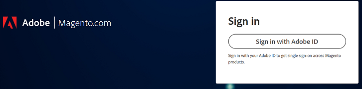
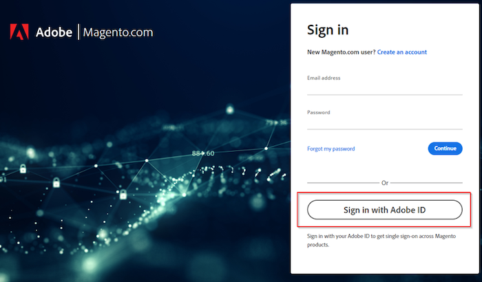

# 无法登录Adobe Commerce支持或云帐户

当您难以登录Adobe Commerce支持或云项目时，本文会为您提供解决方案。

## 受影响的产品和版本

Adobe Commerce（所有部署方法）所有 [支持的版本](https://www.adobe.com/content/dam/cc/en/legal/terms/enterprise/pdfs/Adobe-Commerce-Software-Lifecycle-Policy.pdf)

## 问题

当您访问 [https://account.magento.com/customer/account/login/](https://account.magento.com/customer/account/login/) 或 [https://accounts.magento.cloud/user](https://accounts.magento.cloud/user) 您可能会注意到，现在提供了统一的登录表单，您无法再像之前一样输入凭据。

<u>重现问题的步骤</u>：

尝试登录到您的Commerce帐户。

<u>预期结果</u>：

登录成功。

<u>实际结果</u>：

重定向到使用Adobe帐户登录的页面，但凭据不起作用。

## 原因

在我们将Adobe Commerce与其他Adobe解决方案集成的过程中，所有用户都将需要使用连接到其MageID的同一电子邮件地址来创建Adobe登录信息（如果没有）。

## 解决方案

您可以通过以下方式登录到帐户：

- 现有的Adobe公司/个人帐户。
- 如果您没有Adobe帐户，请创建具有相同电子邮件地址的帐户。

有关步骤，请参阅 [Commerce Identity管理器](https://experienceleague.adobe.com/docs/commerce-admin/start/commerce-account/commerce-identity-manager.html) 在Adobe Experience League中。

## 相关阅读

- [链接Magento.com和accounts.magento.cloud帐户登录](/help/faq/general/linking-magento-com-and-accounts-magento-cloud-account-logins.md)
