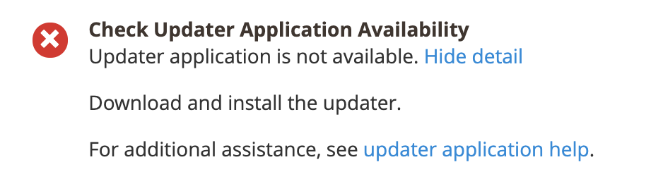

# “更新程序应用程序不可用”错误

本文介绍了在使用Web设置向导在本地更新/安装Adobe Commerce时，可能遇到的针对“更新程序应用程序不可用”问题的解决方案。

## 问题

准备情况检查中会显示以下消息：

## 受影响的产品/版本

* Adobe Commerce内部部署2.2.x、2.3.x
* Magento Open Source2.2.x和2.3.x

## 解决方案

要解决此问题，请查看是否存在 `<magento_root>/update` 包含文件和子目录的目录。 否则，请参阅 [设置更新程序](https://devdocs.magento.com/guides/v2.3/comp-mgr/updater/update-updater.html) 在我们的开发人员文档中。
