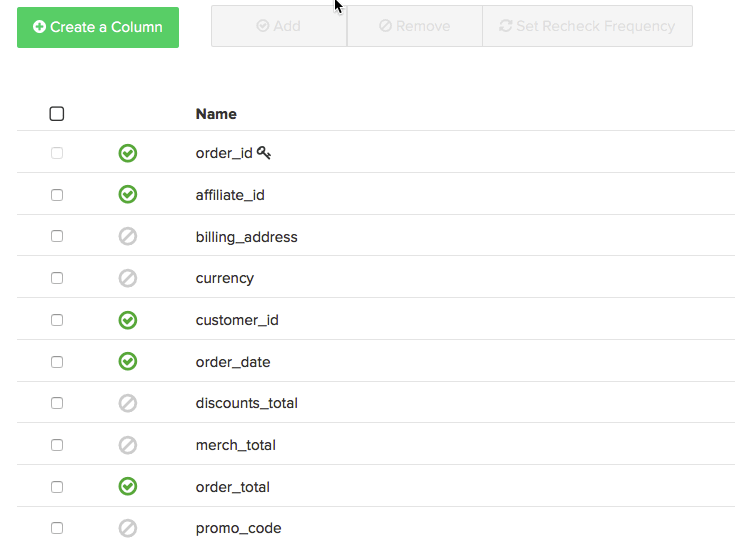

# 使用数据导出来查明差异

本文为排查MagentoBI数据中的差异提供了解决方案。 数据导出是一种将MagentoBI数据与源数据进行比较的有用工具，可以查明报表中的数据差异，尤其是当 [数据差异诊断核对清单](/help/troubleshooting/miscellaneous/diagnosing-a-data-discrepancy.md) 没有帮助你查明问题。 本文将带您了解如何使用Data Exports查明数据差异的实际示例。

以这种分析为例：

2014年11月出现了可疑的下降。 收入500,780.94美元？ 听起来不对。 您已确认源数据库中显示了2014年11月的更多收入，并且已仔细检查 **收入** 已正确定义此报表中使用的量度。 似乎MagentoBI数据仓库中的数据不完整，可以使用“数据导出”来确认。

## 导出数据 {#export}

要开始使用此功能，请单击图表右上角的齿轮，然后单击下拉菜单中的原始导出选项。 这将为您提供图表背后数据的原始导出。

在“原始数据导出”菜单中，可以选择要从中导出的表以及要包含在导出中的列。 过滤器也可以应用于结果集。

在我们的示例中， **收入** 此报告上使用的指标使用 **order\_total** 字段定义于 **订单** 表，使用 **日期** 作为其时间戳。 在我们的导出中，我们想要包含所有 **order\_id** 2014年11月的值及其 **order\_total** . 此 **收入** 量度不使用任何过滤器，但我们将为导出添加一个过滤器，以将结果集限制为仅在2014年11月。

以下是本示例中原始数据导出菜单的外观：

单击导出数据开始导出。 此时将显示一个窗口，其中包含导出的详细信息，包括状态。 准备导出需要几分钟时间，现在正是执行2014年11月源数据的类似提取的大好时机，包括 **日期，order\_id** ，和 **order\_total** . 我们将在Excel中打开此文件并保留它，因为我们将很快返回到它。

当“原始数据导出”窗口中出现“下载”按钮时，单击该按钮可下载包含CSV文件的zip文件。

此时，我们需要将所有数据放到一个工作表中，以找到问题。 我们将CSV文件(从MagentoBI导出)导入到包含源数据的其他Excel文件工作表中。

## 查明问题 {#pinpoint}

现在，所有数据都集中在一个位置，我们可以查找差异的来源。 比较每个工作表中的行数将有助于我们查明问题。 让我们更仔细地看一下每种情况。

### 两个工作表包含的行数相同

如果两个系统具有相同的行数和 **收入** 量度与源数据不匹配，则 **order\_total** 肯定在某个地方。 有可能 **order\_total** 字段已在源数据库中更新，MagentoBI无法接收这些更改。

要确认这一点，请查看 **order\_total** 正在重新检查列。 前往Data Warehouse管理器并单击“订单”表。 您将会看到 [重新检查频率](https://experienceleague.adobe.com/docs/commerce-business-intelligence/mbi/analyze/warehouse-manager/cfg-data-rechecks.html) 在“更改？”中列出 列。 此 **order\_total** 字段应设置为按预期更改的频率重新检查；如果没有，则将其设置为所需的重新检查频率。

### 

如果重新检查频率已正确设置，则表明存在其他问题。 请参阅 [联系支持部分](#support) ，以了解后续步骤。

## 源数据库的行数比MagentoBI多 {#morerows}

如果源数据库的行数大于MagentoBI的行数，并且间隔大于在更新周期期间可预期接收的订单数，则可能存在连接问题。 这意味着MagentoBI无法从源数据库中提取新数据，这可能由于多种原因而发生。

导航到“连接”页面，并查看包含订单表的数据源的状态：

1. **如果状态为“重新验证”** 时，连接未使用正确的凭据。 单击进入连接，输入正确的凭据，然后重试。
1. **如果状态为“失败”** 时，服务器端的连接设置可能会不正确。 连接失败通常是由于主机名不正确或目标服务器不接受指定端口上的连接造成的。单击连接并仔细检查主机名的拼写以及是否输入了正确的端口。 在服务器端，确保端口可以接受连接，并且防火墙具有允许的MagentoBI IP地址(54.88.76.97/32)。 **如果连接继续失败** ，请参阅 [联系支持部分](#support) ，以了解后续步骤。
1. **如果状态为“成功”** ，则连接不是问题，需要参与RJ支持。 请参阅 [联系支持部分](#support) ，以了解后续步骤。

## 源数据库的行数少于MagentoBI {#lessrows}

如果源数据库的行数少于MagentoBI，则可能正在从源数据库中删除行，并且MagentoBI不接收这些删除操作。 ** [删除数据](https://experienceleague.adobe.com/docs/commerce-business-intelligence/mbi/best-practices/data/opt-db-analysis.html) 可能会导致不一致、更新时间延长以及大量后勤问题**，因此我们强烈建议您不要删除数据，除非它确实必要。

但是，如果从表中删除了行，请查看主键上的重新检查频率。 重新选中主键表示将检查表中是否包含已删除的行。

在Data Warehouse管理器中，主键列用键符号标记。 在本例中，主键是 **order\_id** 列：

如果主键已设置为重新检查或从未从该表中删除行，则需要RJ支持来查明问题。 有关后续步骤，请参阅以下部分。

## 联系支持 {#support}

如果无法查明问题的根源，则需要在RJ支持中循环。 在提交票证之前，请执行以下操作：

* **如果源数据库和MagentoBI的行数相同** 并重新检查频率设置是否正确，在电子表格中执行VLOOKUP **查找MagentoBI和源数据库之间哪个order\_id值的order\_total值不同。** 在提交票证时包含这些值。
* **如果源数据库的行数大于MagentoBI** 连接显示为成功或继续失败，我们需要知道连接的名称和您看到的错误消息（如果有）。
* **如果源数据库的行数少于MagentoBI，** 不会从表中删除行，且重新检查频率设置正确，请在电子表格中执行VLOOKUP **查找MagentoBI中的order\_id值** 但源数据库中没有。 在提交票证时包含这些值。

## 相关

* [数据差异诊断核对清单](/help/troubleshooting/miscellaneous/diagnosing-a-data-discrepancy.md)
* [提交数据差异票证](https://support.magento.com/hc/en-us/articles/360016506472-Submitting-a-data-discrepancy-ticket)
