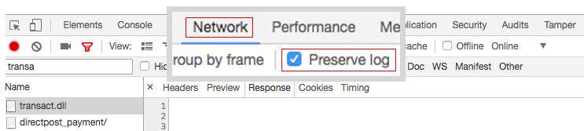
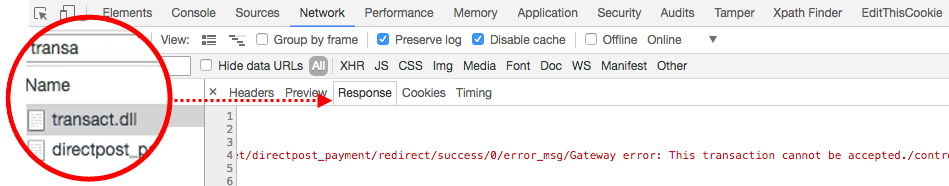

# 使用Authorize.net Sandbox帐户下订单时出错（服务器上出现错误）

本文修复了“*服务器上发生错误*“（使用Authorize.Net直邮下订单时）出现错误消息。

>[!WARNING]
>
>**弃用说明**
>
>由于支付服务指令 [PSD2](https://docs.magento.com/user-guide/v2.3/stores/compliance-payment-services-directive.html) 以及许多API的不断发展，Authorize.Net有过时和将来不再符合安全规范的风险。 因此，此插件现已弃用，我们建议您在Adobe Commerce配置中禁用此插件，并过渡到 [Commerce Marketplace扩展](https://marketplace.magento.com/extensions.html).
>
>**此集成已从Adobe Commerce 2.4.0版本中删除，并已在2.3的当前版本中弃用。**
>
>有关从已弃用的支付集成进行安全过渡的详细信息，请参阅我们的 [DevBlog](https://community.magento.com/t5/Magento-DevBlog/Deprecation-of-Magento-core-payment-integrations/ba-p/426445).

## 问题

下订单，使用 [Authorize.Net直邮](https://docs.magento.com/user-guide/v2.3/payment/authorize-net-direct-post.html) 沙盒帐户导致出现错误消息：

>>
“服务器上发生错误。 请尝试重新下单”

## 原因1：已启用测试模式

这看起来并不明显，但Authorize.net **测试模式** 设置必须设置为 **否** 即使使用沙盒帐户进行测试也是如此。

## 解决方案1：禁用测试模式

1. 转到 **商店** > **配置** > **销售** > **支付方式** > **其他支付方式** > **Authorize.net直邮**.
1. 设置 **测试模式** 更改为“否”（取消选中） **使用系统值**，然后在菜单中选择“否”。
1. 单击 **保存配置**.

## 原因2：错误的URL

Authorize.net设置可能包含关键Authorize.Net资源的不正确URL地址。

## 解决方案2：提供正确的URL

* **网关URL：**   `https://test.authorize.net/gateway/transact.dll`
* **事务详细信息URL：**   `https://apitest.authorize.net/xml/v1/request.api`
* **API引用：**   `https://developer.authorize.net/api/reference/`

## 如果没有任何帮助：获取调试信息

如果向Authorize.net下订单失败，且未提供信息 *“出现错误”* 错误，请检查Adobe Commerce `debug.log`.

### Transact.dll

如果 `debug.log` 为空，请查看 **transact.dll** Web浏览器控制台中的响应：

1. 打开控制台。
1. 下订单前，请前往 **网络** 选项卡并选择 **保留日志**.    
1. 过滤响应依据 **transact.dll** 查看响应消息，其中可能包含错误。    
