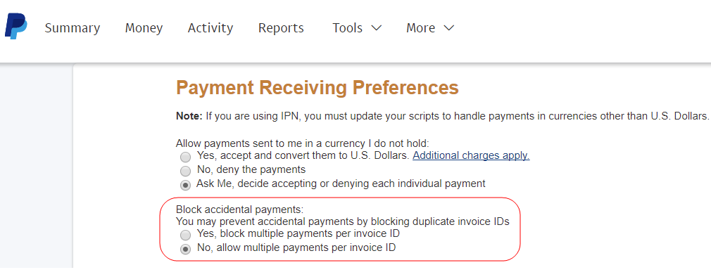

# PayPal网关已拒绝请求 — 重复发票问题

本文修复了PayPal网关被拒绝的请求 — 重复发票问题。

在提交付款时，客户可能会看到重复发票的错误：

>PayPal网关已拒绝请求。 已为此InvoiceID付款(\#10412：重复发票)

将具有相同ID的发票多次发送到PayPal时，会出现此问题。

要解决此问题，请在PayPal的付款接收首选项中允许每个发票ID进行多次付款。 更改后，PayPal接受付款且不会出现错误消息，即使发票具有重复的ID也是如此。

## 受影响的版本

* Adobe Commerce内部部署，所有版本
* 云基础架构上的Adobe Commerce，所有版本

## 问题

在提交付款时，客户会看到以下错误消息：

```
... main.CRITICAL: Exception message: PayPal gateway has rejected request. Payment has already been made for this InvoiceID (#10412: Duplicate invoice).
```

PayPal无法处理付款并完成订单。

## 原因

将具有相同ID的发票多次提交到PayPal时，将显示错误消息。

当在多个Adobe Commerce站点（甚至在本地和暂存环境中）中使用相同的凭据时，可能会发生这种情况。 特定情况可能如下：

* 多个商店将发票提交到PayPal并使用相同的发票ID
* 新存储发送发票，其ID先前已由旧存储提交

默认情况下，PayPal不允许对同一发票进行两次处理。

## 解决方案

更改您的PayPal配置文件以允许每个发票ID进行多项付款。 您需要通过PayPal进行这些更改。

1. 登录您的帐户，网址为 [https://www.paypal.com](https://www.paypal.com/).
1. 单击 **个人资料** > **配置文件和设置** （右上角）。
1. 转到 **我的销售工具**.
1. 导航到 **获得报酬并管理我的风险** > **阻止付款** 并单击 **更新**.
1. **销售首选项**，单击 **付款接收首选项**.
1. 下 **阻止意外支付**，选择 **否，允许每个发票ID进行多项付款**.    
1. 滚动到底部并单击 **保存**.

## 更多信息

* [阻止意外支付](https://developer.paypal.com/docs/admin/setup-account/#block-accidental-payments) 在PayPal开发人员文档上。
* 我们的用户指南中的PayPal支付：
   * [PayPal Express签出](/docs/commerce-admin/stores-sales/payments/paypal/paypal-express-checkout.html)
   * [其他PayPal解决方案](/docs/commerce-admin/stores-sales/payments/paypal/paypal.html)
* 在我们的开发人员文档中：
   * [在云基础架构上为Adobe Commerce设置PayPal支付方法](/docs/commerce-cloud-service/user-guide/configure-store/paypal.html)
   * [支付集成](https://developer.adobe.com/commerce/php/development/payments-integrations/)
