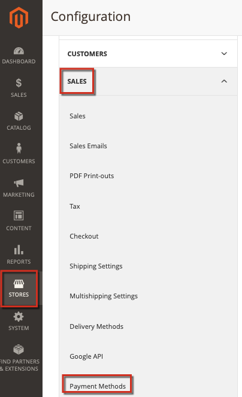

# Adobe Commerce上的PayPal故障排除

本文为通过PayPal处理支付相关问题提供了解决方案，特别是PayFlow Pro解决方案。 本文中的一些建议可能看似显而易见。 我们要求您尝试本知识库中列出的故障排除选项，并在您输入的任何票证中包含所有信息。 Adobe Commerce或PayPal支持工程师将要求您在诊断问题时执行这些步骤。

## 常见问题

PayPal付款的大多数问题都有类似的症状：在指定付款卡详细信息并继续结帐后，付款不会得到处理。 而是可能会出现错误消息、付款处理失败甚至空白页面。

## 验证您的凭据、加密密钥和许可证

可能的问题：帐户详细信息（用户名、密码）打印错误、帐户无效、许可证过期或未指定、公钥和个人密钥无效以及许多其他方面。 要查找这些问题，您可能还需要检查您的付款配置设置。

## 在Adobe Commerce和PayPal中应用一致的设置

请确保您应用了相同的设置并在Commerce管理员和PayPal帐户设置中启用了相同的功能。

### 设置问题示例

应用PayPal Express Checkout解决方案时，必须拒绝基于AVS/CSC响应的交易。 **PayPal管理器** （“服务设置”>“设置”>“安全选项”）和 **Commerce管理员** ( **商店** >配置> **销售** > **支付方式** ...)。

有关更多信息，请参阅文档： [PayPal](https://www.paypalobjects.com/en_US/vhelp/paypalmanager_help/setup.htm) 和 [Adobe Commerce](/docs/commerce-admin/stores-sales/payments/paypal/paypal-express-checkout.html) 在我们的用户指南中。

## 允许引用交易记录

如果您的PayPal付款方法涉及带有计费协议和参考交易的API，请确保在您的设置中正确启用和配置它们。

### 其他疑难解答

请参阅以下文章：

* [PayPal网关已拒绝请求 — 重复发票问题](/help/troubleshooting/payments/paypal-gateway-rejected-request-duplicate-invoice-issue.md) 在我们的支持知识库中。
* [更改新存储实体的增量ID](/help/how-to/general/change-increment-id-for-a-db-entity-order-invoice-credit-memo-etc-on-particular-store.md) 在我们的支持知识库中。

## 联系支持人员以收集高级付款日志

为了排除复杂的付款问题，Adobe Commerce支持团队可能会要求您应用专用修补程序以启用高级付款日志记录。 在这种情况下，您的步骤应如下所示：

[提交支持服务单](/help/help-center-guide/help-center/magento-help-center-user-guide.md#submit-ticket) 包含以下详细信息：

* 请尽可能多地指定您的问题。
* 列出您尝试从本文、知识库和其他资源中执行的步骤。 包括所有结果。
* 请求一个“高级付款记录”修补程序（参考号MDVA-4352）以及应用该修补程序的说明。

如果您收到了“高级付款记录”修补程序：

* 应用修补程序。
* 收集日志并将它们附加到您的 [支持服务单](/help/help-center-guide/help-center/magento-help-center-user-guide.md#submit-ticket).
* 等待Adobe Commerce支持团队提出进一步的建议。
