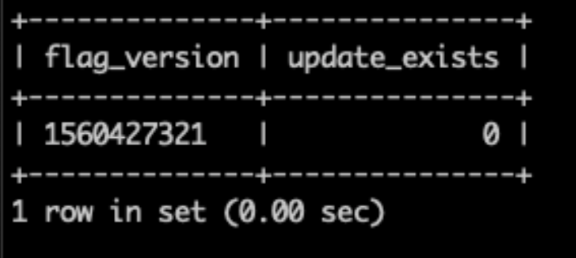

# 由于内容暂存问题，所有页面均显示错误404

本文修复了Adobe Commerce内部部署和Adobe Commerce on Cloud基础架构问题，该问题导致您在访问任何店面页面或Commerce管理员时出现404错误。

## 受影响的产品和版本

* Adobe Commerce内部部署2.2.x、2.3.x
* 云基础架构上的Adobe Commerce 2.2.x、2.3.x

## 问题

>[!NOTE]
>
>本文不适用于尝试发送404错误的情况 [预览暂存更新](https://docs.magento.com/user-guide/cms/content-staging-scheduled-update.html#preview-the-scheduled-change). 如果您遇到此问题，请打开 [支持服务单](/help/help-center-guide/help-center/magento-help-center-user-guide.md#submit-ticket).

使用对商店内容资产执行计划更新操作后，访问任何店面页面或管理员会导致404错误（“糟糕，我们的不好……”页面） [内容暂存](https://experienceleague.adobe.com/docs/commerce-admin/content-design/staging/content-staging.html) (使用计划的存储内容资产的更新 [Magento\_Staging模块](https://developer.adobe.com/commerce/php/module-reference/))。 例如，您可能已删除了计划更新的产品，或删除了计划更新的结束日期。

商店内容资产包括：

* 产品
* 类别
* 目录价格规则
* 购物车价格规则
* CMS页面
* CMS块
* 构件

下面的“原因”一节将讨论一些情形。

## 原因

此 `flag` 数据库(DB)中的表包含指向 `staging_update` 表格。

该问题与内容暂存相关。 以下是两种特定情况；请注意，可能有更多情况会触发该问题。

**场景1：** 删除符合以下条件的商店内容资源：

* 已计划内容暂存的更新
* 更新具有结束日期（即更新的资产恢复到其先前版本的到期日期）
* 更新的结束日期是过去的时间

同时，如果删除的资产没有计划更新的结束日期，则可能不会发生问题。

**场景2：** 删除计划更新的结束日期/时间。

### 确定您的问题是否相关

要确定您遇到的问题是否为本文所述的问题，请运行以下数据库查询：

```sql
   SELECT f.flag_data >'$.current_version' as flag_version, (su.id IS NOT NULL) as update_exists
   -> FROM flag f
   -> LEFT JOIN staging_update su
   -> ON su.id = f.flag_data >'$.current_version'
   -> WHERE flag_code = 'staging';
```

如果查询返回表，其中 `update_exists` 值为“0”，则指向的链接无效 `staging_update` 表中存在的数据，以及 [解决方案部分](#solution) 会帮助解决这个问题。 以下是查询结果的示例 `update_exists` 等于“0”的值：



如果查询返回表，其中 `update_exists` 值为“1”或为空结果，这意味着您的问题与暂存更新无关。 以下是查询结果的示例 `update_exists` 等于“1”的值：


在这种情况下，您可以参考 [Site Down疑难解答程序](/help/troubleshooting/site-down-or-unresponsive/magento-site-down-troubleshooter.md) 以获取有关疑难解答的想法。

## 解决方案

1. 运行以下查询以删除指向 `staging_update` 表：

   ```sql
   DELETE FROM flag WHERE flag_code = 'staging';
   ```

1. 等待cron作业运行（如果设置正确，最多可在五分钟后运行），或者如果未设置cron，请手动运行该作业。

该问题应在修复无效链接后立即解决。 如果问题仍然存在， [提交支持服务单](/help/help-center-guide/help-center/magento-help-center-user-guide.md#submit-ticket).
