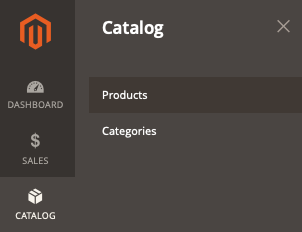

# 店面未显示产品

本文提供了当产品未显示在店面时解决方案。

## 受影响的产品和版本

* Adobe Commerce内部部署X.X.X
* 云基础架构X.X.X上的Adobe Commerce

## 问题

<u>重现问题的步骤</u>：

1. 登录到Commerce管理员。
1. 转到 **目录** > **产品**.

   

1. 单击 **添加产品** 并完成产品创建过程。 或从CSV文件导入产品。

<u>预期结果</u>：

店面有商品。

<u>实际结果</u>：

不显示产品。

## 原因

导致这种情况的原因有很多。 请按照以下步骤检查有助于识别和解决问题的要点。

## 解决方案

以下几点都可以解决此问题。

* 在“管理员”中查看产品设置。 转到 **目录** > **产品**，打开产品页面，并确保已正确配置以下字段：
   * **启用产品** = *是的。*
   * **库存状态**： *有货*. 或者 *缺货* 是正确的值，确保 **显示缺货产品** (**商店** > **设置** > **配置** > **目录** > **库存** > **股票期权** > **显示缺货产品**)设置为 *是* （在全局级别配置）。
   * **类别**：如果您尝试在类别页面上查找产品，请验证产品是否已分配给类别。 要简化疑难解答，请从当前页面创建一个新类别并为其分配产品。
   * **可见性** = *目录，搜索。*
   * 在 **网站中的产品** 部分，确保将产品分配到正确的网站。
   * 将范围选择器切换到商店视图，尝试在店面中找到您的产品，并验证相同的设置。
* 通过运行，执行完整重新索引 `bin/magento indexer:reindex` ，并刷新“管理员”中位于下的所有缓存 **系统** > **工具** > **缓存管理**，或从控制台中运行 `bin/magento cache:clean`.
* 如果上述操作不起作用，您可以通过检查中的日志开始进一步调查 `var/log` 目录。

## 我们的支持知识库中的相关阅读

* [记录Pro架构的位置（目录）](/help/how-to/general/log-locations-directories-for-pro-plan-integration-staging-production.md)
* [记录入门级架构的位置（目录）](/help/how-to/general/log-locations-directories-for-starter-plan.md)
